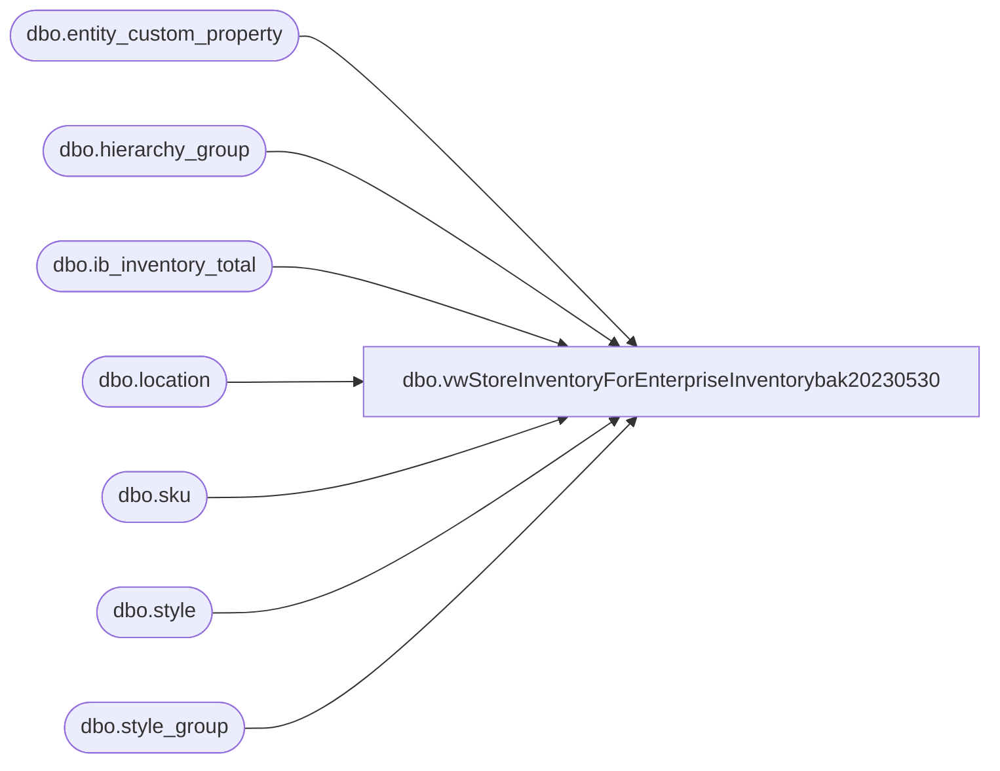

# dbo.vwStoreInventoryForEnterpriseInventorybak20230530

**Database:** me_01  
**Server:** bedrockdb02  

## Architecture Diagram



## Table Dependencies

| Referenced Table |
|---|
| dbo.entity_custom_property |
| dbo.hierarchy_group |
| dbo.ib_inventory_total |
| dbo.location |
| dbo.sku |
| dbo.style |
| dbo.style_group |

## View Code

```sql
CREATE view [dbo].[vwStoreInventoryForEnterpriseInventorybak20230530]

as

select  cast(l.location_code as varchar(4)) as location_code, ---NEED TO USE LOCATION CODE
		cast(l.gl_location_number as varchar(4)) as gl_location_number,
		cast(s.style_code as varchar(6)) as style_code,
		--case when ecp.custom_property_value is not null and substring(hg.hierarchy_group_code,7,2)='60'
		--then sum(iit.total_on_hand_units * ecp.custom_property_value)
		--else sum(iit.total_on_hand_units)
		--end "Units"
		case 
			when cast(sum(iit.total_on_hand_units) as int) < 0 
			then 0
			else cast(sum(iit.total_on_hand_units) as int)
		end as StoreInventory
from ib_inventory_total iit with (nolock)
join location l with (nolock) 
	on iit.location_id=l.location_id 
	and l.location_type=2 --store
inner join	sku sk with (nolock)
	on		iit.sku_id = sk.sku_id
	and		iit.inventory_status_id = 1
inner join	style s with (nolock) on sk.style_id = s.style_id
join style_group sg with (nolock) on s.style_id = sg.style_id
join hierarchy_group hg with (nolock) on hg.hierarchy_group_id = sg.hierarchy_group_id
left join 	entity_custom_property ecp with (nolock)  
	on 		ecp.parent_id = s.style_id
	and 		ecp.custom_property_id = 2 -- FRCSTM
	and		parent_type = 1
where s.active_flag = 1
and substring(hg.hierarchy_group_code,7,2)<>'60'
group by l.location_code, l.gl_location_number, s.style_code
```

