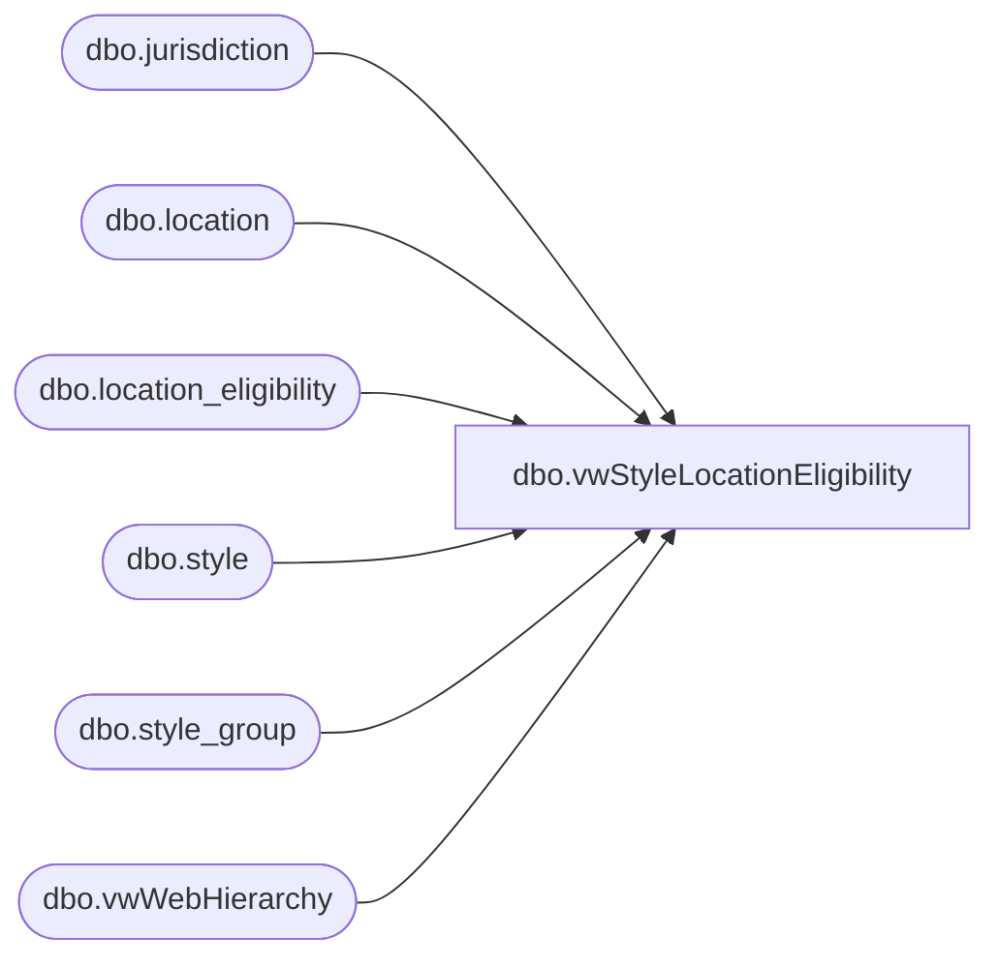

# dbo.vwStyleLocationEligibility

**Database:** me_01  
**Server:** bedrockdb02  

## Architecture Diagram



## Table Dependencies

| Referenced Table |
|---|
| dbo.jurisdiction |
| dbo.location |
| dbo.location_eligibility |
| dbo.style |
| dbo.style_group |
| dbo.vwWebHierarchy |

## View Code

```sql
CREATE view [dbo].[vwStyleLocationEligibility] 
as 

WITH
StyleDepartment as
	(
		select 
			s.style_code as StyleCode,
			s.long_desc as StyleDescription,
			h.Department as Department,
			s.style_id
		from style s with (nolock)
		join style_group sg with (nolock) on s.style_id=sg.style_id
		join vwWebHierarchy h on sg.hierarchy_group_id=h.SubClassHierarchyGroupID
		where s.active_flag = 1
	),
LocationJurisdiction as
	(
		select 
			l.location_code as LocationCode,
			l.location_name as LocationName,
			j.jurisdiction_code as JurisdictionCode,
			l.location_id
		from location l with (nolock)
		join jurisdiction j with (nolock) on l.jurisdiction_id=j.jurisdiction_id
		where l.active_flag = 1
	),
StyleLocation as
	(
		select 
			style_id,
			location_id,
			eligibility_flag
		from location_eligibility with (nolock)
		where eligibility_flag = 1
	)
select
		lj.JurisdictionCode,
		lj.LocationCode,
		lj.LocationName,
		sl.eligibility_flag,
		sd.Department,
		sd.StyleCode,
		sd.StyleDescription
from StyleLocation sl
join StyleDepartment sd on sl.style_id=sd.style_id
join LocationJurisdiction lj on sl.location_id=lj.location_id
```

