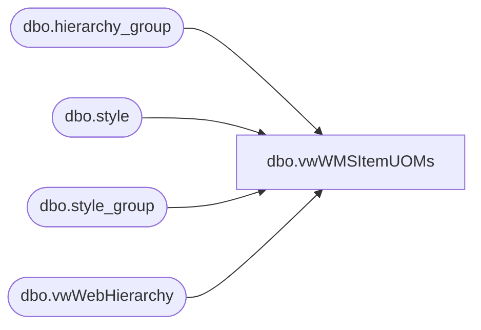

# dbo.vwWMSItemUOMs

**Database:** me_01  
**Server:** bedrockdb02  

## Architecture Diagram



## Table Dependencies

| Referenced Table |
|---|
| dbo.hierarchy_group |
| dbo.style |
| dbo.style_group |
| dbo.vwWebHierarchy |

## View Code

```sql
CREATE view [dbo].[vwWMSItemUOMs]

as

with 
HierarchyGroup as
	(
		select
			s.style_code,
			concat(h.Department, ' (', h.SubClassCode, ')') as HierarchyGroup,
			case when h.Department in ('CAN Gift Cards','Gift Cards','UK-Gift Cards') then 1 else 0 end as GiftCard
		from style s with (nolock)
		join style_group sg with (nolock) on s.style_id = sg.style_id
		join vwWebHierarchy h on sg.hierarchy_group_id = h.SubClassHierarchyGroupID
		where s.active_flag = 1 
		group by 
			s.style_code,
			concat(h.Department, ' (', h.SubClassCode, ')'),
			case when h.Department in ('CAN Gift Cards','Gift Cards','UK-Gift Cards') then 1 else 0 end
	),
Styles as
	(
		select
			cast(s.style_code as nvarchar(6)) as style_code,
			order_multiple,
			distribution_multiple
		from style s with (nolock)
		join style_group sg with (nolock) on s.style_id = sg.style_id
		join hierarchy_group hg with (nolock) on sg.hierarchy_group_id = hg.hierarchy_group_id
		join HierarchyGroup h on s.style_code=h.style_code
		where s.active_flag=1
		and (
				substring(hg.hierarchy_group_code,7,2) <> 60 --EXCLUDES SUPPLIES
				OR
				h.GiftCard=1 --includes giftcards that may be supplies
			)
		and left(s.style_code, 1) <> '9'
		--and s.style_code='029351'
		UNION
		select
			cast(cast('9' as varchar)  + cast(RIGHT(s.style_code,5) as varchar) as nvarchar(6)) as style_code,
			order_multiple,
			distribution_multiple
		from style s with (nolock)
		join style_group sg with (nolock) on s.style_id = sg.style_id
		join hierarchy_group hg with (nolock) on sg.hierarchy_group_id = hg.hierarchy_group_id
		join HierarchyGroup h on s.style_code=h.style_code
		where s.active_flag=1
		and (
				substring(hg.hierarchy_group_code,7,2) <> 60 --EXCLUDES SUPPLIES
				OR
				h.GiftCard=1 --includes giftcards that may be supplies
			)
		and s.style_code between '800000' and '899999' -- China
	),
OuterNoInner as
	(
		select 
			style_code,
			order_multiple,
			distribution_multiple,
			'CS' as FromUnitSymbol,
			'EA' as ToUnitSymbol,
			1 as Denominator,
			order_multiple as Factor
		from styles
		where order_multiple=distribution_multiple
		UNION
		select 
			style_code,
			order_multiple,
			distribution_multiple,
			'EA' as FromUnitSymbol,
			'WMEA' as ToUnitSymbol,
			1 as Denominator,
			order_multiple / distribution_multiple as Factor
		from styles
		where order_multiple=distribution_multiple
	),
OuterInner as
	(
		select 
			style_code,
			order_multiple,
			distribution_multiple,
			'CS' as FromUnitSymbol,
			'EA' as ToUnitSymbol,
			1 as Denominator,
			order_multiple as Factor
		from styles
		where order_multiple<>distribution_multiple
		UNION
		select 
			style_code,
			order_multiple,
			distribution_multiple,
			'CS' as FromUnitSymbol,
			'IP' as ToUnitSymbol,
			1 as Denominator,
			order_multiple / distribution_multiple as Factor
		from styles
		where order_multiple<>distribution_multiple
		UNION
		select 
			style_code,
			order_multiple,
			distribution_multiple,
			'IP' as FromUnitSymbol,
			'EA' as ToUnitSymbol,
			1 as Denominator,
			distribution_multiple as Factor
		from styles
		where order_multiple<>distribution_multiple
		UNION
		select 
			style_code,
			order_multiple,
			distribution_multiple,
			'EA' as FromUnitSymbol,
			'WMEA' as ToUnitSymbol,
			1 as Denominator,
			1 as Factor
		from styles
		where order_multiple<>distribution_multiple
	),
Unions as
	(
		select *
		from OuterNoInner
		Union
		select *
		from OuterInner
		
	)
select *
from Unions
--where style_code='428916'
```

