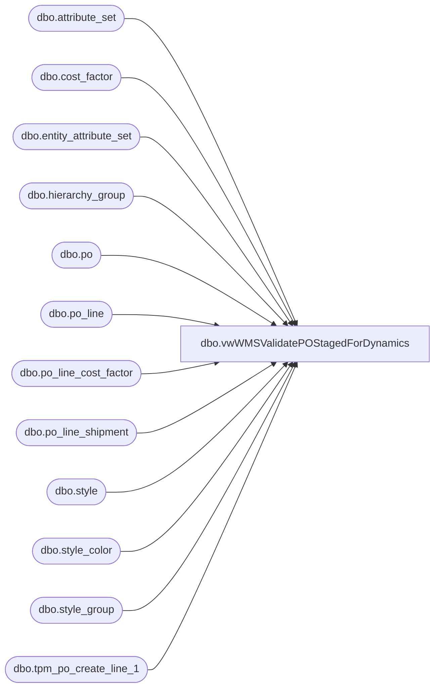

# dbo.vwWMSValidatePOStagedForDynamics

**Database:** me_01  
**Server:** bedrockdb02  

## Architecture Diagram



## Table Dependencies

| Referenced Table |
|---|
| dbo.attribute_set |
| dbo.cost_factor |
| dbo.entity_attribute_set |
| dbo.hierarchy_group |
| dbo.po |
| dbo.po_line |
| dbo.po_line_cost_factor |
| dbo.po_line_shipment |
| dbo.style |
| dbo.style_color |
| dbo.style_group |
| dbo.tpm_po_create_line_1 |

## View Code

```sql
CREATE view [dbo].[vwWMSValidatePOStagedForDynamics]

as


-------------------------------------------------------------------------------------------------------------------------
--	Dan Tweedie	2019-11-06	Created view to be used during runtime of processing po's to D365, only good during runtime
-------------------------------------------------------------------------------------------------------------------------


with 
POLineNetFinalPrice as
	(
		select DISTINCT
			cast(po.po_no as varchar) as po_no,
			cast(pl.line_no as int) as POMainLine,
			cast (pl.net_final_cost as decimal (18,2)) as NetFinalPrice
		from po with (nolock)
		join po_line pl with (nolock) on po.po_id=pl.po_id
		join po_line_shipment pls with (nolock) on pls.po_id=po.po_id and pls.po_line_id=pl.po_line_id
		join po_line_cost_factor pcf with (nolock) on pcf.po_id=po.po_id and pl.po_line_id=pcf.po_line_id
		join cost_factor cf with (nolock) on cf.cost_factor_id=pcf.cost_factor_id
		join style_color sc with (nolock) on sc.style_color_id=pl.style_color_id
		join style s with (nolock) on s.style_id=sc.style_id
		where 1=1
		--and pcf.factor_amount > 0
	),
StyleFactoryCodes as
	(
		select 
			s.style_code,
			cast(attribute_set_code as varchar(10)) as FactoryCode
		from style s with (nolock)
		join entity_attribute_set easfact (nolock) 
			on s.style_id=easfact.parent_id
			and easfact.attribute_id = 122 
		join attribute_set ats on easfact.attribute_set_id = ats.attribute_set_id
	),
GiftCards as
	(
		select
			cast(s.style_code as varchar(6)) as Style
		from style s with (nolock)
		join style_group sg with (nolock) on s.style_id = sg.style_id
		join hierarchy_group hg with (nolock) on sg.hierarchy_group_id=hg.hierarchy_group_id
		where s.active_flag = 1
		--and substring(hg.hierarchy_group_code, 1,8) in ('R-B-D-80','R-B-U-80')
		and substring(hg.hierarchy_group_code, 1,8) in ('R-B-D-80')
	)
select distinct
	po.po_no as PONumber,
	cast(po.OrderLine as int) as POLineNumber,
	cast(po.ShipFromID as varchar(10)) as VendorCode,
	sfc.FactoryCode
from tpm_po_create_line_1 po
left join StyleFactoryCodes sfc on po.ItemID=sfc.Style_Code
left join POLineNetFinalPrice nfp 
	on po.po_no=nfp.po_no
	and po.line_no=nfp.POMainLine
where po.ShipToID=980
and po.ItemID not in (select Style from GiftCards) --excludes giftcards from going to Dynamics
```

