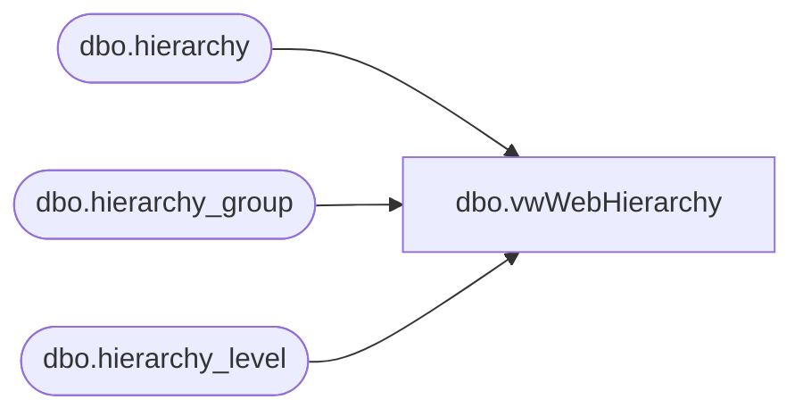

# dbo.vwWebHierarchy

**Database:** me_01  
**Server:** bedrockdb02  

## Architecture Diagram



## Table Dependencies

| Referenced Table |
|---|
| dbo.hierarchy |
| dbo.hierarchy_group |
| dbo.hierarchy_level |

## View Code

```sql
CREATE view [dbo].[vwWebHierarchy]

as
--------------------------------------------------------------------------------------------------
-- vwWebHierarchy - Captures product hierarchy from Department to Sub-Class 
--								- to join style: 
--									select s.style_code
--									from style s with (nolock)
--									join style_group sg with (nolock) on s.style_id = sg.style_id
--									join join vwWebDeptClassSubClassStyle v on sg.hierarchy_group_id = v.SubClassHierarchyGroupID
--
--- 2017-05-23 - Dan Tweedie - Created View
--------------------------------------------------------------------------------------------------

WITH
Hier as
	(
		select 
			h.hierarchy_label,
			hl.hierarchy_level_label,
			hg.hierarchy_group_code, 
			hg.hierarchy_group_label,
			hg.hierarchy_group_short_label,
			hg.hierarchy_group_id,
			hg.parent_group_id
		from hierarchy h with (nolock)
		join hierarchy_level hl with (nolock) on h.hierarchy_id = hl.hierarchy_id
		join hierarchy_group hg with (nolock) on h.hierarchy_id = hg.hierarchy_id and hl.hierarchy_level_id = hg.hierarchy_level_id
		where h.hierarchy_id = 1 --product hierarchy
		and left(hg.hierarchy_group_code,1) in ('W', 'R') 
	),
Department as
	(
		select *
		from Hier 
		where hierarchy_level_label = 'Department'
	), 
Class as
	(
		select *
		from Hier 
		where hierarchy_level_label = 'Class'
	), 
SubClass as
	(
		select *
		from Hier 
		where hierarchy_level_label = 'Sub-Class'
	)
select 
	d.hierarchy_group_label as Department,
	c.hierarchy_group_label as Class, 
	sc.hierarchy_group_label as SubClass,
	d.hierarchy_group_code as DepartmentCode,
	c.hierarchy_group_code as ClassCode,
	sc.hierarchy_group_code as SubClassCode,
	sc.hierarchy_group_id SubClassHierarchyGroupID
from SubClass sc
join Class c on sc.parent_group_id = c.hierarchy_group_id
join Department d on c.parent_group_id = d.hierarchy_group_id
```

