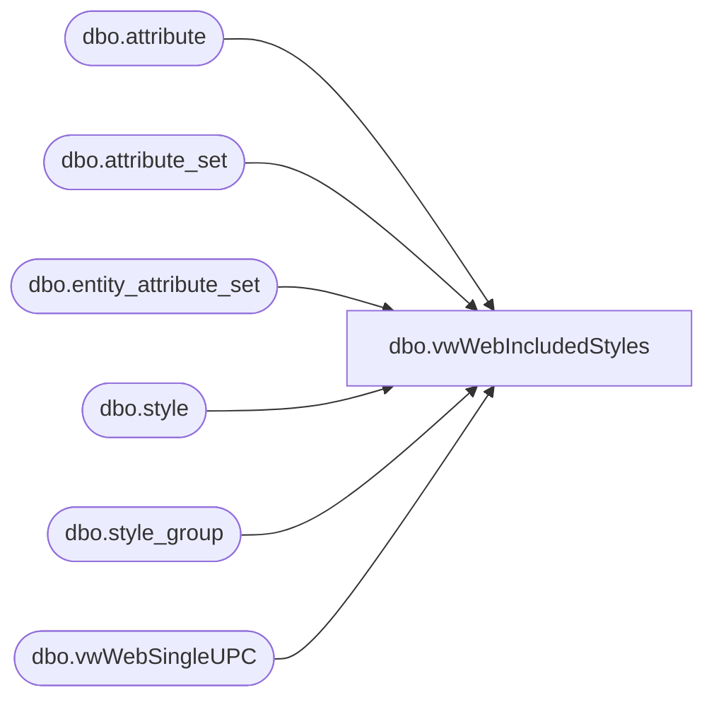

# dbo.vwWebIncludedStyles

**Database:** me_01  
**Server:** bedrockdb02  

## Architecture Diagram



## Table Dependencies

| Referenced Table |
|---|
| dbo.attribute |
| dbo.attribute_set |
| dbo.entity_attribute_set |
| dbo.style |
| dbo.style_group |
| dbo.vwWebSingleUPC |

## View Code

```sql
CREATE view [dbo].[vwWebIncludedStyles]

as

--------------------------------------------------------------------------------------------------
-- vwWebIncludedStyles - Captures style, description and UPC for products which will be included in eCommerce integration.
--						Included style criteria:
--						Does not have WEBNO style attribute
--						Does have AVAILB style attribute set to one of these values:  ('US', 'USWEB', 'DINO', 'UK', 'UKWEB')
--						Logically captures UPC based on being either one of our purchased UPCs (GS1), having max(date) or max(upc)
--- 2017-05-16 - Dan Tweedie - Created View
--------------------------------------------------------------------------------------------------

WITH
Styles as
	(
		select
			s.style_id,
			s.style_code,
			s.long_desc,
			sg.hierarchy_group_id
		from style s with (nolock)
		join style_group sg with (nolock) on s.style_id = sg.style_id
		where s.active_flag = 1
	),
ExcludedStyles as
	(
		SELECT distinct 
			s.style_id
		FROM styles s with (nolock) 
		join entity_attribute_set eas with (nolock) on eas.parent_id = s.style_id
		join attribute_set ats with (nolock) on eas.attribute_set_id = ats.attribute_set_id
		join attribute a with (nolock) on ats.attribute_id = a.attribute_id and a.parent_type = 1
		where 
			(
				a.attribute_label = 'WEB STATUS' 
				and ats.attribute_set_code = 'WEBNO'
			)
	),
IncludedStyles as
	(
		SELECT distinct 
			s.style_id,
			case when ats.attribute_set_code in ('US', 'USWEB', 'DINO')
					then 'US'
				 else 'UK'
			end as SellingGeography
		FROM styles s with (nolock) 
		join style_group sg with (nolock) on s.style_id = sg.style_id
		join entity_attribute_set eas with (nolock) on eas.parent_id = s.style_id
		join attribute_set ats with (nolock) on eas.attribute_set_id = ats.attribute_set_id
		join attribute a with (nolock) on ats.attribute_id = a.attribute_id and a.parent_type = 1
		where a.attribute_code = 'AVAILB' 
		and ats.attribute_set_code in ('US', 'USWEB', 'DINO', 'UK', 'UKWEB')
		and not exists (select e.style_id from ExcludedStyles e where e.style_id = s.style_id)
	), 
UPCs as
	(
		select
			u.sku_id,
			u.style_code,
			u.Color,
			u.UPC
		from vwWebSingleUPC u
		where exists (select s.style_id from IncludedStyles s where s.style_id = u.style_id)
	),
OWNRSP as 
	(
		SELECT distinct
			s.style_id
		FROM Styles s 
		join entity_attribute_set eas with (nolock) on eas.parent_id = s.style_id
		join attribute_set ats with (nolock) on eas.attribute_set_id = ats.attribute_set_id
		join attribute a with (nolock) on ats.attribute_id = a.attribute_id and a.parent_type = 1
		where a.attribute_code = 'OWNRSP'
		and ats.attribute_set_code not in ('CN', 'CAN')
		and not exists (select i.style_id from IncludedStyles i where i.style_id = s.style_id)
	),
StoreFrontEligible as
	(
		select 
			s.style_id,
			s.hierarchy_group_id,
			cast(u.sku_id as nvarchar(24)) as SKU,
			cast(s.style_code as varchar(6)) as style_code,
			cast(s.long_desc as varchar(120)) as SKUDescription,
			u.Color,
			cast(u.UPC as varchar(20)) as UPC,
			i.SellingGeography,
			1 as StoreFrontEligible
		from styles s
		join UPCs u on s.style_code = u.style_code
		join IncludedStyles i on s.style_id = i.style_id
	),
NotStoreFrontEligible as
	(
		select 
			s.style_id,
			s.hierarchy_group_id,
			NULL as SKU,
			cast(s.style_code as varchar(6)) as style_code,
			cast(s.long_desc as varchar(120)) as SKUDescription,
			NULL as Color,
			NULL as UPC,
			NULL as SellingGeography,
			0 as StoreFrontEligible
		from styles s
		join OWNRSP O on s.style_id = O.style_id
		where not exists (select i.style_id from StoreFrontEligible i where i.style_id = s.style_id)
	),
UNIONS as
	(
		select * from StoreFrontEligible
		UNION
		select * from NotStoreFrontEligible
	)
select * 
from UNIONS
```

