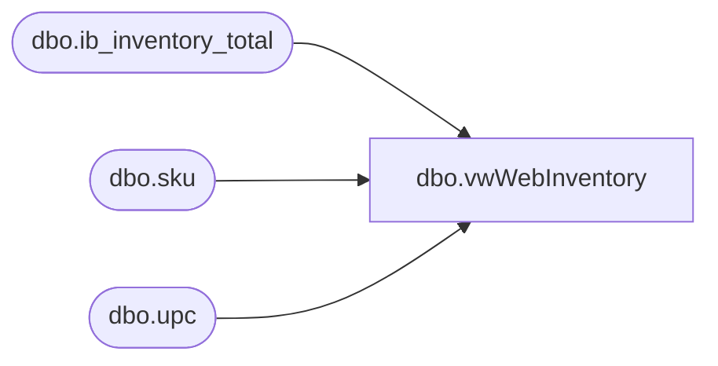

# dbo.vwWebInventory

**Database:** me_01  
**Server:** bedrockdb02  

## Architecture Diagram



## Table Dependencies

| Referenced Table |
|---|
| dbo.ib_inventory_total |
| dbo.sku |
| dbo.upc |

## View Code

```sql
CREATE view [dbo].[vwWebInventory]

as

--------------------------------------------------------------------------------------------------
-- vwWebInventory - Captures WEB inventory for the Ecommerce system - 
--						Original query found here: bearwebdb\sql2008.eCommerce.feed_DeltaInventoryLoad (stored proc)
--- 2017-04-10 - Dan Tweedie - Created View
--------------------------------------------------------------------------------------------------

select 
	'Merch' as Source,
	right(cast('000000' as varchar(6)) + cast(right(u.upc_number, 6) as varchar(6)),6) as SKU,
	--cast(right(u.upc_number, 6) as varchar(6)) SKU,
	cast(case 
			when isnull(inv.total_on_hand_units,0) < 0
				then 0
			else isnull(inv.total_on_hand_units,0) 
		 end 
		as int) as QUANTITY
FROM me_01.dbo.upc u with (nolock)
	join me_01.dbo.sku sku with (nolock) ON u.sku_id=sku.sku_id 
	join me_01.dbo.ib_inventory_total inv with (nolock) ON inv.sku_id=u.sku_id
WHERE 1=1 
	and inv.inventory_status_id = 1
	and len(cast(u.upc_number as bigint)) < 9
	and (
			(inv.location_id = 78 and right(u.upc_number, 6) between 400000 and 499999) --2013
			OR
			(inv.location_id = 115 and right(u.upc_number, 6) in (418936,418747,418763)) --2970
		)
```

