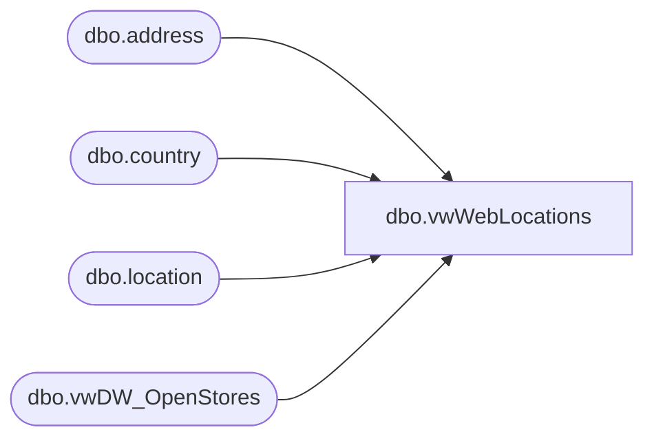

# dbo.vwWebLocations

**Database:** me_01  
**Server:** bedrockdb02  

## Architecture Diagram



## Table Dependencies

| Referenced Table |
|---|
| dbo.address |
| dbo.country |
| dbo.location |
| dbo.vwDW_OpenStores |

## View Code

```sql
CREATE view [dbo].[vwWebLocations]

as

--------------------------------------------------------------------------------------------------
-- vwWebLocations - Captures store and web locations for ecommerce integration
--- 2017-05-16 - Dan Tweedie - Created View
--------------------------------------------------------------------------------------------------
with OpenStores as
	(--this view returns open stores, based on open/close dates in Store MDM
		select StoreID
		from kodiak.babwmstrdata.dbo.vwDW_OpenStores
	)
select 
	cast(l.location_name as varchar(60)) as LocationName,
	cast(a.address_zip_code as nvarchar(15)) as ZipCode,
	cast(l.location_code as varchar(4)) as Code,
	case when c.country_code in ('ca', 'caf', 'can', 'mx', 'pr', 'us', 'usa') 
		then 'US' 
		else 'UK'
	end as SiteID,
	case when l.location_code in ('0013', '2013') 
		then 'Warehouse'
		else 'Store'
	end as LocationType
from location l with (nolock)
join address a on l.location_id = a.parent_id and a.parent_type = 2 and a.address_type_id = 1
join country c (nolock) on a.country_id = c.country_id
join OpenStores os on cast(l.location_code as int) = os.StoreID 
where c.country_code <> 'CN'
```

