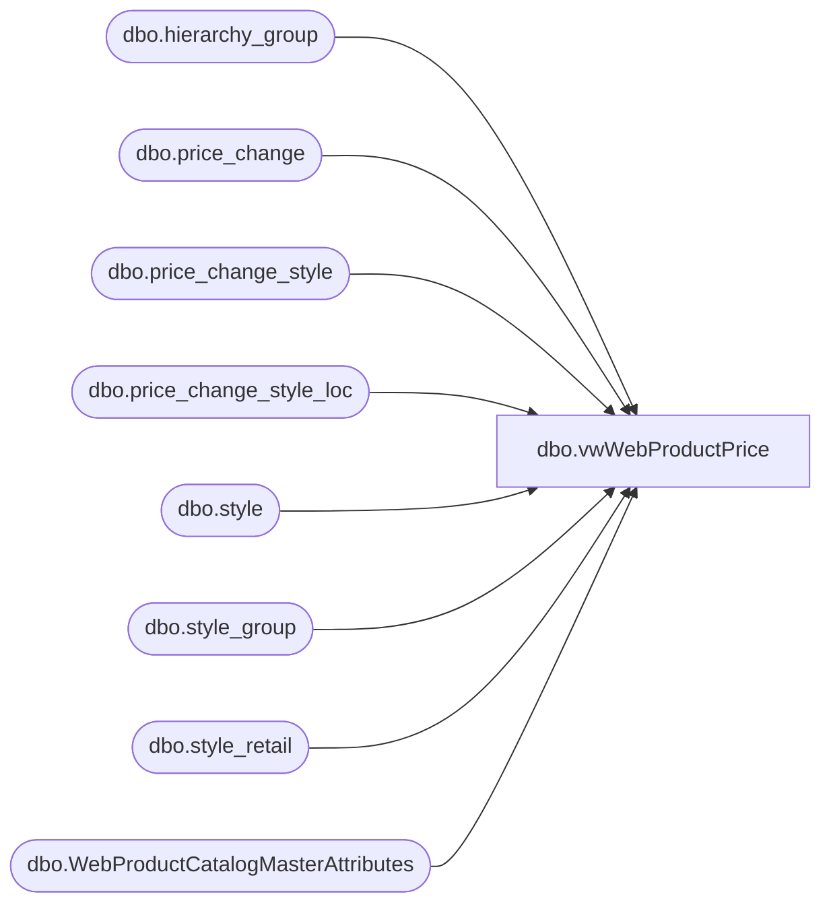

# dbo.vwWebProductPrice

**Database:** me_01  
**Server:** bedrockdb02  

## Architecture Diagram



## Table Dependencies

| Referenced Table |
|---|
| dbo.hierarchy_group |
| dbo.price_change |
| dbo.price_change_style |
| dbo.price_change_style_loc |
| dbo.style |
| dbo.style_group |
| dbo.style_retail |
| dbo.WebProductCatalogMasterAttributes |

## View Code

```sql
CREATE view [dbo].[vwWebProductPrice]

as 


--------------------------------------------------------------------------------------------------
-- vwWebProductPrice - Captures WEB prices for the Ecommerce system - 
--						Original query found here: bearwebdb\sql2008.eCommerce.feed_DeltaPriceLoad (stored proc)
--- 2017-05-01 - Dan Tweedie - Created View
--	2018-01-26	 Updated SalePrices CTE SalePrice column, reversing the order of the isnull(column1,column2) 
--	2018-08-07	 Changed SalePrice CTE to use the min(SalePrice) instead of using the SalePrice for the max(ChangeNumber)
--------------------------------------------------------------------------------------------------


WITH 

Styles as 
	(
		select style_code, ProductSellingGeography
		from WebProductCatalogMasterAttributes
		where StoreFrontEligible = 1
	),
Prices as
	(
		SELECT 
			sc.style_code, 
			SUBSTRING(hg.hierarchy_group_code,1,5) AS GroupCode,
			UK.original_selling_retail AS UK_ListPrice,
			US.original_selling_retail AS US_ListPrice,
			0 as CA_ListPrice,
			case when UK.current_selling_retail < UK.original_selling_retail
				then UK.current_selling_retail 
				else NULL 
			end as UK_SalePrice,
			case when US.current_selling_retail < US.original_selling_retail
				then US.current_selling_retail 
				else NULL
			end as US_SalePrice,
			0 as CA_SalePrice
		FROM style sc (NOLOCK) 
		join style_group sg (NOLOCK) ON sc.style_id=sg.style_id
		join hierarchy_group hg (NOLOCK)ON sg.hierarchy_group_id=hg.hierarchy_group_id
		join style_retail US (NOLOCK) ON sc.style_id=US.style_id
		join style_retail UK (NOLOCK) ON sc.style_id=UK.style_id
		WHERE US.jurisdiction_id = 1 --US
		AND UK.jurisdiction_id = 2 --UK
		and US.original_selling_retail is not null
		and UK.original_selling_retail is not null
		and exists (select vw.style_code from Styles vw where vw.style_code = sc.style_code)
	),
ListPrices as
	(
		select
			style_code,
			GroupCode,
			CASE 
				WHEN GroupCode = 'R-B-C' or (GroupCode in ('R-B-Z','W-C-J','W-C-K','W-C-M','W-C-N','W-D-J','W-D-K','W-D-M','W-D-N','W-E-J','W-E-K','W-E-M','W-E-N','W-F-J','W-F-K','W-F-M','W-F-N') and style_code between 100000 and 199999)
					THEN CA_ListPrice
				WHEN GroupCode = 'R-B-U' or (GroupCode in ('R-B-Z','W-C-J','W-C-K','W-C-M','W-C-N','W-D-J','W-D-K','W-D-M','W-D-N','W-E-J','W-E-K','W-E-M','W-E-N','W-F-J','W-F-K','W-F-M','W-F-N') and style_code between 400000 and 499999)
					THEN UK_ListPrice
				ELSE US_ListPrice
			END AS ListPrice,
			CASE 
				WHEN GroupCode = 'R-B-C' or (GroupCode in ('R-B-Z','W-C-J','W-C-K','W-C-M','W-C-N','W-D-J','W-D-K','W-D-M','W-D-N','W-E-J','W-E-K','W-E-M','W-E-N','W-F-J','W-F-K','W-F-M','W-F-N') and style_code between 100000 and 199999)
					THEN CA_SalePrice
				WHEN GroupCode = 'R-B-U' or (GroupCode in ('R-B-Z','W-C-J','W-C-K','W-C-M','W-C-N','W-D-J','W-D-K','W-D-M','W-D-N','W-E-J','W-E-K','W-E-M','W-E-N','W-F-J','W-F-K','W-F-M','W-F-N') and style_code between 400000 and 499999)
					THEN UK_SalePrice
				ELSE US_SalePrice
			END AS SalePrice,
			CASE 
				WHEN GroupCode = 'R-B-C' or (GroupCode in ('R-B-Z','W-C-J','W-C-K','W-C-M','W-C-N','W-D-J','W-D-K','W-D-M','W-D-N','W-E-J','W-E-K','W-E-M','W-E-N','W-F-J','W-F-K','W-F-M','W-F-N') and style_code between 100000 and 199999)
					THEN 3 --CA
				WHEN GroupCode = 'R-B-U' or (GroupCode in ('R-B-Z','W-C-J','W-C-K','W-C-M','W-C-N','W-D-J','W-D-K','W-D-M','W-D-N','W-E-J','W-E-K','W-E-M','W-E-N','W-F-J','W-F-K','W-F-M','W-F-N') and style_code between 400000 and 499999)
					THEN 2 --UK
				ELSE 1 --US
			END AS JurisdictionId	
		FROM Prices
	),
ExcludedPriceChanges as
	(
		select distinct pc.price_change_no, ps.style_id, pl.location_id
		from price_change_style_loc pl
		join price_change pc on pl.price_change_id = pc.price_change_id
		join price_change_style ps on pl.price_change_style_id = ps.price_change_style_id
		where pl.location_id in (167,78)
		and pl.new_valuation_price = pl.current_selling_retail
	),
SalePrices as
	(
		SELECT 
			s.style_code,
			s.style_id AS StyleId,
			ISNULL
				(	
					( 
						SELECT locations.new_price 
						FROM price_change_style_loc locations (NOLOCK)
						WHERE locations.location_id in ('167','78') -- 167 US, corresponds to 0013 / 78 UK, corresponds to 2013
							AND locations.price_change_id = pricechange.price_change_id
    						AND styles.price_change_style_id = locations.price_change_style_id    			
					)	
					,styles.new_price		
				) AS SalePrice,
			pricechange.price_change_no AS ChangeNumber,
			pricechange.price_change_description AS Details,
			pricechange.create_date AS CreateDate,
			pricechange.effective_from_date AS EffectiveFrom,
			pricechange.effective_to_date AS EffectiveTo,
			pricechange.jurisdiction_id AS JurisdictionId
		FROM style s with (NOLOCK)
		join price_change_style styles (NOLOCK) ON styles.style_id = s.style_id
		join price_change pricechange (NOLOCK) ON styles.price_change_id = pricechange.price_change_id
		join styles ss on s.style_code = ss.style_code
		WHERE pricechange.approval_status = 2
			and	pricechange.price_change_status <> 5
			AND pricechange.jurisdiction_id IN (1,2,3)
			AND	pricechange.price_change_id NOT IN ('1388','2136','2396','2865','2884','2912','3078','3080','3099','3115','3122','3117','3119','3111','3112','3113','3114','3141','3143','3163','3283','3284','3285','3314','3374','3375','3376','3394','3396','3526','3528','3533','3535','3552','3629','3630','3632','3550','3761','3764','3767','3769','3772','3774','3781','3789','3791')
		and 
			(
					(
						ss.ProductSellingGeography ='US' 
						and 
						isnull(cast(pricechange.effective_from_date as date), '3030-12-31') 
							<= 
								case when datepart(hh, getdate()) >= 23 
									then cast(dateadd(hh, +12, getdate()) as date)--cast(getdate() as date)	
									else cast(getdate() as date)
								end
						and
						isnull(cast(pricechange.effective_to_date as date), '3030-12-31') 
							>= 
								case when datepart(hh, getdate()) >= 23 
									then cast(dateadd(hh, +12, getdate()) as date)--cast(getdate() as date)
									else cast(getdate() as date)
								end
					)	
				OR
					(
						ss.ProductSellingGeography ='UK' 
						and	 
						isnull(cast(pricechange.effective_from_date as date), '3030-12-31') <= cast(dateadd(hh, +18, getdate()) as date)	--if the job runs any time past noon BQ time, it should catch the UK's price changes that take effect at midnight BQ time
						and																												
						isnull(cast(pricechange.effective_to_date as date), '3030-12-31') >= cast(dateadd(hh, +18, getdate()) as date)
					)
			)
		and cast(pricechange.price_change_no as int) <> 5470 --added per Bryce's request
		--and not exists --commented out 2017-12-08
		--	(select e.price_change_no 
		--		from ExcludedPriceChanges e 
		--		where pricechange.price_change_no = e.price_change_no 
		--			and s.style_id = e.style_id
		--			and e.location_id = case when ss.ProductSellingGeography = 'US' then 167 else 78 end
		--	)
	),
MaxChange as 
	(
		select style_code, max(ChangeNumber) MaxChange
		from SalePrices
		group by style_code
	),
--SalePrice as
--	(
--		select np.style_code, np.SalePrice
--		from SalePrices np
--		join MaxChange mc on np.style_code = mc.style_code and np.ChangeNumber = mc.MaxChange
--	)
SalePrice as
	(
		select np.style_code, min(np.SalePrice) SalePrice
		from SalePrices np
		group by np.style_code 
	)
select
	cast(l.style_code as varchar(6)) style_code,
	l.ListPrice as CurrentPrice,
	l.ListPrice as OriginalPrice,
	case --takes promo price first, then defaults to current_selling_retail
		when isnull(s.SalePrice,l.SalePrice) < l.ListPrice
			then isnull(s.SalePrice,l.SalePrice)
			else NULL
	end as SalePrice, 
	case 
		when l.JurisdictionId = 2 
		then 'UK'
		else 'US'
	end as Catalog

from 
	ListPrices l
left join SalePrice s on l.style_code = s.style_code
```

