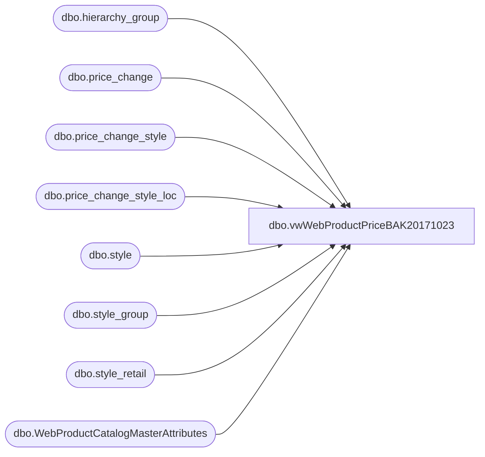

# dbo.vwWebProductPriceBAK20171023

**Database:** me_01  
**Server:** bedrockdb02  

## Architecture Diagram



## Table Dependencies

| Referenced Table |
|---|
| dbo.hierarchy_group |
| dbo.price_change |
| dbo.price_change_style |
| dbo.price_change_style_loc |
| dbo.style |
| dbo.style_group |
| dbo.style_retail |
| dbo.WebProductCatalogMasterAttributes |

## View Code

```sql
CREATE view [dbo].[vwWebProductPriceBAK20171023]

as 


--------------------------------------------------------------------------------------------------
-- vwWebProductPrice - Captures WEB prices for the Ecommerce system - 
--						Original query found here: bearwebdb\sql2008.eCommerce.feed_DeltaPriceLoad (stored proc)
--- 2017-05-01 - Dan Tweedie - Created View
--------------------------------------------------------------------------------------------------


WITH 
--Styles as 
--	(
--		select style_code
--		from vwWebIncludedStyles
--		where StoreFrontEligible = 1
--	),
Styles as 
	(
		select style_code, ProductSellingGeography
		from WebProductCatalogMasterAttributes
		where StoreFrontEligible = 1
	),
Prices as
	(
		SELECT 
			sc.style_code, 
			SUBSTRING(hg.hierarchy_group_code,1,5) AS GroupCode,
			UK.original_selling_retail AS UK_ListPrice,
			US.original_selling_retail AS US_ListPrice,
			0 as CA_ListPrice,
			case when UK.current_selling_retail < UK.original_selling_retail
				then UK.current_selling_retail 
				else NULL 
			end as UK_SalePrice,
			case when US.current_selling_retail < US.original_selling_retail
				then US.current_selling_retail 
				else NULL
			end as US_SalePrice,
			0 as CA_SalePrice
		FROM style sc (NOLOCK) 
		join style_group sg (NOLOCK) ON sc.style_id=sg.style_id
		join hierarchy_group hg (NOLOCK)ON sg.hierarchy_group_id=hg.hierarchy_group_id
		join style_retail US (NOLOCK) ON sc.style_id=US.style_id
		join style_retail UK (NOLOCK) ON sc.style_id=UK.style_id
		WHERE US.jurisdiction_id = 1 --US
		AND UK.jurisdiction_id = 2 --UK
		and US.original_selling_retail is not null
		and UK.original_selling_retail is not null
		and exists (select vw.style_code from Styles vw where vw.style_code = sc.style_code)
	),
ListPrices as
	(
		select
			style_code,
			GroupCode,
			CASE 
				WHEN GroupCode = 'R-B-C' or (GroupCode in ('R-B-Z','W-C-J','W-C-K','W-C-M','W-C-N','W-D-J','W-D-K','W-D-M','W-D-N','W-E-J','W-E-K','W-E-M','W-E-N','W-F-J','W-F-K','W-F-M','W-F-N') and style_code between 100000 and 199999)
					THEN CA_ListPrice
				WHEN GroupCode = 'R-B-U' or (GroupCode in ('R-B-Z','W-C-J','W-C-K','W-C-M','W-C-N','W-D-J','W-D-K','W-D-M','W-D-N','W-E-J','W-E-K','W-E-M','W-E-N','W-F-J','W-F-K','W-F-M','W-F-N') and style_code between 400000 and 499999)
					THEN UK_ListPrice
				ELSE US_ListPrice
			END AS ListPrice,
			CASE 
				WHEN GroupCode = 'R-B-C' or (GroupCode in ('R-B-Z','W-C-J','W-C-K','W-C-M','W-C-N','W-D-J','W-D-K','W-D-M','W-D-N','W-E-J','W-E-K','W-E-M','W-E-N','W-F-J','W-F-K','W-F-M','W-F-N') and style_code between 100000 and 199999)
					THEN CA_SalePrice
				WHEN GroupCode = 'R-B-U' or (GroupCode in ('R-B-Z','W-C-J','W-C-K','W-C-M','W-C-N','W-D-J','W-D-K','W-D-M','W-D-N','W-E-J','W-E-K','W-E-M','W-E-N','W-F-J','W-F-K','W-F-M','W-F-N') and style_code between 400000 and 499999)
					THEN UK_SalePrice
				ELSE US_SalePrice
			END AS SalePrice,
			CASE 
				WHEN GroupCode = 'R-B-C' or (GroupCode in ('R-B-Z','W-C-J','W-C-K','W-C-M','W-C-N','W-D-J','W-D-K','W-D-M','W-D-N','W-E-J','W-E-K','W-E-M','W-E-N','W-F-J','W-F-K','W-F-M','W-F-N') and style_code between 100000 and 199999)
					THEN 3 --CA
				WHEN GroupCode = 'R-B-U' or (GroupCode in ('R-B-Z','W-C-J','W-C-K','W-C-M','W-C-N','W-D-J','W-D-K','W-D-M','W-D-N','W-E-J','W-E-K','W-E-M','W-E-N','W-F-J','W-F-K','W-F-M','W-F-N') and style_code between 400000 and 499999)
					THEN 2 --UK
				ELSE 1 --US
			END AS JurisdictionId	
		FROM Prices
	),
SalePrices as
	(
		SELECT 
			s.style_code,
			s.style_id AS StyleId,
			ISNULL
				(styles.new_price,
					( 
						SELECT locations.new_price 
						FROM price_change_style_loc locations (NOLOCK)
						WHERE locations.location_id in ('167','78') -- 167 US, corresponds to 0013 / 78 UK, corresponds to 2013
							AND locations.price_change_id = pricechange.price_change_id
    						AND styles.price_change_style_id = locations.price_change_style_id    			
					)			
				) AS SalePrice,
			pricechange.price_change_no AS ChangeNumber,
			pricechange.price_change_description AS Details,
			pricechange.create_date AS CreateDate,
			pricechange.effective_from_date AS EffectiveFrom,
			pricechange.effective_to_date AS EffectiveTo,
			pricechange.jurisdiction_id AS JurisdictionId
		FROM style s with (NOLOCK)
		join price_change_style styles (NOLOCK) ON styles.style_id = s.style_id
		join price_change pricechange (NOLOCK) ON styles.price_change_id = pricechange.price_change_id
		join styles ss on s.style_code = ss.style_code
		WHERE pricechange.approval_status = 2
			and	pricechange.price_change_status <> 5
			AND pricechange.jurisdiction_id IN (1,2,3)
			AND	pricechange.price_change_id NOT IN ('1388','2136','2396','2865','2884','2912','3078','3080','3099','3115','3122','3117','3119','3111','3112','3113','3114','3141','3143','3163','3283','3284','3285','3314','3374','3375','3376','3394','3396','3526','3528','3533','3535','3552','3629','3630','3632','3550','3761','3764','3767','3769','3772','3774','3781','3789','3791')
		and 
			(
					(
						ss.ProductSellingGeography ='US' 
						and 
						isnull(cast(pricechange.effective_from_date as date), '3030-12-31') <= cast(getdate() as date)	
						and
						isnull(cast(pricechange.effective_to_date as date), '3030-12-31') >= cast(getdate() as date)
					)	
				OR
					(
						ss.ProductSellingGeography ='UK' 
						and	 
						isnull(cast(pricechange.effective_from_date as date), '3030-12-31') <= cast(dateadd(hh, +12, getdate()) as date)	--if the job runs any time past noon BQ time, it should catch the UK's price changes that take effect at midnight BQ time
						and																												
						isnull(cast(pricechange.effective_to_date as date), '3030-12-31') >= cast(dateadd(hh, +12, getdate()) as date)
					)
				OR
					( ---ADDED 2017-10-19 BY REQUEST FROM BRYCE TO FORCE A PRICECHANGE THROUGH EARLY
						cast(getdate() as date) = '2017-10-19'
						AND
						cast(price_change_no as int) = 5479
					)
				
			)
		and cast(price_change_no as int) <> 5470 --added per Bryce's request
	),
MaxChange as 
	(
		select style_code, max(ChangeNumber) MaxChange
		from SalePrices
		group by style_code
	),
SalePrice as
	(
		select np.style_code, np.SalePrice
		from SalePrices np
		join MaxChange mc on np.style_code = mc.style_code and np.ChangeNumber = mc.MaxChange
	)
select
	cast(l.style_code as varchar(6)) style_code,
	l.ListPrice as CurrentPrice,
	l.ListPrice as OriginalPrice,
	case --takes promo price first, then defaults to current_selling_retail
		when isnull(s.SalePrice,l.SalePrice) < l.ListPrice
			then isnull(s.SalePrice,l.SalePrice)
			else NULL
	end as SalePrice, 
	case 
		when l.JurisdictionId = 2 
		then 'UK'
		else 'US'
	end as Catalog

from 
	ListPrices l
left join SalePrice s on l.style_code = s.style_code		


----------NEWEST VIEW --DISABLED 08-24-2017
----------WITH 
----------Styles as 
----------	(
----------		select style_code 
----------		from vwWebIncludedStyles
----------	),
----------PriceLookup as
----------	(
----------		select 
----------			bv.style_id, 
----------			bv.style_code,
----------			'US' as Country,
----------			bv.original_local_price,
----------			isnull(case when isnull(bv.promo_local_price, bv.current_local_price) > bv.current_local_price
----------				then bv.current_local_price
----------				else isnull(bv.promo_local_price, bv.current_local_price) 
----------			end,0) as current_local_price,
----------			bv.promo_local_price
----------		from vwPriceLookup_KL bv with (nolock)
----------		join entity_attribute_set eas (nolock) on bv.style_id = eas.parent_id
----------		join attribute_set att (nolock) on eas.attribute_set_id = att.attribute_set_id
----------		join attribute a (nolock) on att.attribute_id = a.attribute_id and a.parent_type = 1
----------		where a.attribute_code = 'OWNRSP'
----------		and bv.location_code  = '0013' 
----------		and att.attribute_set_code in ('US','CN')
----------		UNION
----------		select  
----------			bv.style_id, 
----------			bv.style_code,
----------			'UK' as Country,
----------			bv.original_local_price,
----------			isnull(case when isnull(bv.promo_local_price, bv.current_local_price) > bv.current_local_price
----------				then bv.current_local_price
----------				else isnull(bv.promo_local_price, bv.current_local_price) 
----------			end,0) as current_local_price,
----------			bv.promo_local_price
----------		from vwPriceLookup_KL bv with (nolock)
----------		join entity_attribute_set eas (nolock) on bv.style_id = eas.parent_id
----------		join attribute_set att (nolock) on eas.attribute_set_id = att.attribute_set_id
----------		join attribute a (nolock) on att.attribute_id = a.attribute_id and a.parent_type = 1
----------		where a.attribute_code = 'OWNRSP'
----------		and bv.location_code  = '2013' 
----------		and att.attribute_set_code = 'UK'
----------	)
----------select 
----------	cast(style_code as varchar(6)) as style_code,
----------	isnull(current_local_price, original_local_price)  as CurrentPrice,
----------	original_local_price as OriginalPrice,
----------	case 
----------		when promo_local_price is not NULL 
----------				and promo_local_price <> original_local_price 
----------			then promo_local_price
----------		else NULL
----------	end as SalePrice,
----------	Country as Catalog
----------from PriceLookup


---------------------------------------------------------------------------------------------------
---------------------------------------------------------------------------------------------------

--------WITH 
--------Styles as 
--------	(
--------		select style_code 
--------		from vwWebIncludedStyles
--------	),
--------PriceLookup as
--------	(
--------		select 
--------			p.style_id,
--------			v.style_code,
--------			case 
--------				when p.location_code = '2013' 
--------					then 'UK' 
--------					else 'US' 
--------				end as Country,
--------			p.original_local_price,
--------			case when isnull(p.promo_local_price, p.current_local_price) > p.current_local_price
--------				then p.current_local_price
--------				else isnull(p.promo_local_price, p.current_local_price) 
--------			end as current_local_price,
--------			p.promo_local_price
--------		from vwWebIncludedStyles v
--------		join vwPriceLookup_KL p on v.style_code = p.style_code
--------		where p.location_code in ('2013', '0013')
--------	),
--------PrePivot as
--------	(
--------		select 
--------			style_id,
--------			style_code,
--------			case 
--------				when country = 'US' 
--------					then original_local_price
--------					else NULL
--------				end as US_original_local_price,
--------			case
--------				when country = 'US'
--------					then current_local_price
--------					else NULL
--------				end as US_current_local_price,
--------			case 
--------				when country = 'US'
--------					then promo_local_price
--------					else NULL
--------				end as US_promo_local_price,
--------			case 
--------				when country = 'UK' 
--------					then original_local_price
--------					else NULL
--------				end as UK_original_local_price,
--------			case
--------				when country = 'UK'
--------					then current_local_price
--------					else NULL
--------				end as UK_current_local_price,
--------			case 
--------				when country = 'UK'
--------					then promo_local_price
--------					else NULL
--------				end as UK_promo_local_price
--------		from 
--------			PriceLookup
--------	),
--------Pivoted as 
--------	(
--------		select 
--------			style_id,
--------			style_code,
--------			sum(US_original_local_price) US_original_local_price,
--------			sum(US_current_local_price) US_current_local_price,
--------			sum(US_promo_local_price) US_promo_local_price,
--------			sum(UK_original_local_price) UK_original_local_price,
--------			sum(UK_current_local_price) UK_current_local_price,
--------			sum(UK_promo_local_price) UK_promo_local_price
--------		from PrePivot
--------		group by style_id, style_code
--------	),
--------Prices as 
--------	(
--------		select
--------			s.style_code,
--------			SUBSTRING(hg.hierarchy_group_code,1,5) AS GroupCode,
--------			case 
--------				when substring(hg.hierarchy_group_code,1,11) in ('R-B-D-53-02', 'R-B-D-53-03', 'R-B-D-53-04', 'R-B-D-53-05', 'R-B-D-53-06', 'R-B-D-53-07','R-B-E-53-01') 
--------				then US_original_local_price
--------				else US_current_local_price
--------			end as US_Price,
--------			case
--------				when substring(hg.hierarchy_group_code,1,11) in ('R-B-D-53-02', 'R-B-D-53-03', 'R-B-D-53-04', 'R-B-D-53-05', 'R-B-D-53-06', 'R-B-D-53-07','R-B-E-53-01') 
--------				then UK_original_local_price 
--------				else UK_current_local_price
--------			end as UK_Price
--------		FROM Pivoted s with (NOLOCK) 
--------		join style_group sg (NOLOCK) ON s.style_id=sg.style_id
--------		join hierarchy_group hg (NOLOCK) ON sg.hierarchy_group_id=hg.hierarchy_group_id
--------		join style_retail US (NOLOCK) ON s.style_id = US.style_id and US.current_selling_retail is not null and US.jurisdiction_id = 1 --US 
--------		join style_retail UK (NOLOCK) ON s.style_id = UK.style_id and UK.current_selling_retail is not null and UK.jurisdiction_id = 2 --UK
--------	),
--------PriceBreakout as
--------	(
--------		SELECT 
--------			style_code,
--------			GroupCode,
--------			CASE 
--------				WHEN GroupCode = 'R-B-U' or (GroupCode in ('R-B-Z','W-C-J','W-C-K','W-C-M','W-C-N','W-D-J','W-D-K','W-D-M','W-D-N','W-E-J','W-E-K','W-E-M','W-E-N','W-F-J','W-F-K','W-F-M','W-F-N') and style_code between 400000 and 499999)
--------					THEN UK_Price
--------				ELSE
--------					US_Price
--------				END AS OriginalPrice,
--------			CASE 
--------				WHEN GroupCode = 'R-B-U' or (GroupCode in ('R-B-Z','W-C-J','W-C-K','W-C-M','W-C-N','W-D-J','W-D-K','W-D-M','W-D-N','W-E-J','W-E-K','W-E-M','W-E-N','W-F-J','W-F-K','W-F-M','W-F-N') and style_code between 400000 and 499999)
--------					THEN 2 --UK
--------				ELSE
--------					1 --US
--------				END AS JurisdictionId	
--------		FROM Prices
--------	),
--------PriceChanges as
--------	(
--------		SELECT 
--------			s.style_code,
--------			s.style_id AS StyleId,
--------			ISNULL(styles.new_price,
--------				( 
--------					SELECT locations.new_price 
--------					FROM price_change_style_loc locations (NOLOCK)
--------					WHERE locations.location_id in ('167','78') -- 167 US / 78 UK
--------						AND locations.price_change_id = pc.price_change_id
--------    					AND styles.price_change_style_id = locations.price_change_style_id    			
--------				)			
--------			) AS NewPrice,
--------			pc.price_change_no AS ChangeNumber,
--------			pc.price_change_description AS Details,
--------			pc.create_date AS CreateDate,
--------			pc.effective_from_date AS EffectiveFrom,
--------			pc.effective_to_date AS EffectiveTo,
--------			pc.jurisdiction_id AS JurisdictionId
--------		FROM 
--------			style s with (NOLOCK)
--------		join price_change_style styles with (NOLOCK) ON styles.style_id = s.style_id
--------		join price_change pc with (NOLOCK) ON styles.price_change_id = pc.price_change_id
--------		WHERE pc.approval_status = 2
--------			and	pc.price_change_status <> 5
--------			AND pc.jurisdiction_id IN (1,2,3)
--------			AND	pc.price_change_id NOT IN ('1388','2136','2396','2865','2884','2912','3078','3080','3099','3115','3122','3117','3119','3111','3112','3113','3114','3141','3143','3163','3283','3284','3285','3314','3374','3375','3376','3394','3396','3526','3528','3533','3535','3552','3629','3630','3632','3550','3761','3764','3767','3769','3772','3774','3781','3789','3791')
--------	),
--------MaxChange as
--------	(
--------		select 
--------			style_code, 
--------			JurisdictionId, 
--------			max(ChangeNumber) MaxChange
--------		from PriceChanges
--------		WHERE 
--------			NewPrice IS NOT NULL
--------		AND EffectiveFrom <= GETDATE()
--------		AND ( 
--------				EffectiveTo IS NULL
--------				OR CAST((CONVERT(VARCHAR,EffectiveTo,101)+' 23:59:59') AS DATETIME) >= GETDATE()
--------			)
--------		AND JurisdictionId IN ('1','2') 
--------		group by style_code, JurisdictionId
--------	),
--------MaxPriceChange as
--------	(
--------		select pc.*
--------		from PriceChanges pc
--------		join MaxChange mc on pc.style_code = mc.style_code 
--------			and pc.JurisdictionId = mc.JurisdictionId
--------			and pc.ChangeNumber = mc.MaxChange
--------	)
--------select
--------	cast(a.style_code as varchar(6)) as style_code,
--------	--isnull(b.NewPrice, a.OriginalPrice) as CurrentPrice,
--------	a.OriginalPrice as OriginalPrice,--need to get rid of this column...
--------	a.OriginalPrice AS CurrentPrice,
--------	case 
--------		when b.NewPrice is not NULL and b.NewPrice <> a.OriginalPrice 
--------			then b.NewPrice
--------		else NULL
--------	end as SalePrice,
--------	case 
--------		when isnull(b.JurisdictionId, a.JurisdictionId) = 1 
--------			then 'US' 
--------		else 'UK' 
--------	end as Catalog
--------from
--------	PriceBreakout a
--------left join MaxPriceChange b on a.style_code = b.style_code and a.JurisdictionId = b.JurisdictionId


---------------------------------------------------------------------------------------------------
---------------------------------------------------------------------------------------------------
---------------------------------------------------------------------------------------------------
---------------------------------------------------------------------------------------------------
---------------------------------------------------------------------------------------------------
----------ORIGINAL VIEW -- CHAIN PRICING INSTEAD OF BY LOCATION 
--------/*
--------WITH 
--------Prices as 
--------	(
--------		select
--------			s.style_code,
--------			SUBSTRING(hg.hierarchy_group_code,1,5) AS GroupCode,
--------			case 
--------				when substring(hg.hierarchy_group_code,1,11) in ('R-B-D-53-02', 'R-B-D-53-03', 'R-B-D-53-04', 'R-B-D-53-05', 'R-B-D-53-06', 'R-B-D-53-07','R-B-E-53-01') 
--------				then US.original_selling_retail 
--------				else US.current_selling_retail
--------			end as US_Price,
--------			case
--------				when substring(hg.hierarchy_group_code,1,11) in ('R-B-D-53-02', 'R-B-D-53-03', 'R-B-D-53-04', 'R-B-D-53-05', 'R-B-D-53-06', 'R-B-D-53-07','R-B-E-53-01') 
--------				then UK.original_selling_retail 
--------				else UK.current_selling_retail
--------			end as UK_Price
--------		FROM style s with (NOLOCK) 
--------		join style_group sg (NOLOCK) ON s.style_id=sg.style_id
--------		join hierarchy_group hg (NOLOCK) ON sg.hierarchy_group_id=hg.hierarchy_group_id
--------		join style_retail US (NOLOCK) ON s.style_id = US.style_id and US.current_selling_retail is not null and US.jurisdiction_id = 1 --US 
--------		join style_retail UK (NOLOCK) ON s.style_id = UK.style_id and UK.current_selling_retail is not null and UK.jurisdiction_id = 2 --UK
--------	),
--------PriceBreakout as
--------	(
--------		SELECT 
--------			style_code,
--------			GroupCode,
--------			CASE 
--------				WHEN GroupCode = 'R-B-U' or (GroupCode in ('R-B-Z','W-C-J','W-C-K','W-C-M','W-C-N','W-D-J','W-D-K','W-D-M','W-D-N','W-E-J','W-E-K','W-E-M','W-E-N','W-F-J','W-F-K','W-F-M','W-F-N') and style_code between 400000 and 499999)
--------					THEN UK_Price
--------				ELSE
--------					US_Price
--------				END AS OriginalPrice,
--------			CASE 
--------				WHEN GroupCode = 'R-B-U' or (GroupCode in ('R-B-Z','W-C-J','W-C-K','W-C-M','W-C-N','W-D-J','W-D-K','W-D-M','W-D-N','W-E-J','W-E-K','W-E-M','W-E-N','W-F-J','W-F-K','W-F-M','W-F-N') and style_code between 400000 and 499999)
--------					THEN 2 --UK
--------				ELSE
--------					1 --US
--------				END AS JurisdictionId	
--------		FROM Prices
--------	),
--------PriceChanges as
--------	(
--------		SELECT 
--------			s.style_code,
--------			s.style_id AS StyleId,
--------			ISNULL(styles.new_price,
--------				( 
--------					SELECT locations.new_price 
--------					FROM price_change_style_loc locations (NOLOCK)
--------					WHERE locations.location_id in ('167','78') -- 167 US / 78 UK
--------						AND locations.price_change_id = pc.price_change_id
--------    					AND styles.price_change_style_id = locations.price_change_style_id    			
--------				)			
--------			) AS NewPrice,
--------			pc.price_change_no AS ChangeNumber,
--------			pc.price_change_description AS Details,
--------			pc.create_date AS CreateDate,
--------			pc.effective_from_date AS EffectiveFrom,
--------			pc.effective_to_date AS EffectiveTo,
--------			pc.jurisdiction_id AS JurisdictionId
--------		FROM 
--------			style s with (NOLOCK)
--------		join price_change_style styles with (NOLOCK) ON styles.style_id = s.style_id
--------		join price_change pc with (NOLOCK) ON styles.price_change_id = pc.price_change_id
--------		WHERE pc.approval_status = 2
--------			and	pc.price_change_status <> 5
--------			AND pc.jurisdiction_id IN (1,2,3)
--------			AND	pc.price_change_id NOT IN ('1388','2136','2396','2865','2884','2912','3078','3080','3099','3115','3122','3117','3119','3111','3112','3113','3114','3141','3143','3163','3283','3284','3285','3314','3374','3375','3376','3394','3396','3526','3528','3533','3535','3552','3629','3630','3632','3550','3761','3764','3767','3769','3772','3774','3781','3789','3791')
--------	),
--------MaxChange as
--------	(
--------		select 
--------			style_code, 
--------			JurisdictionId, 
--------			max(ChangeNumber) MaxChange
--------		from PriceChanges
--------		WHERE 
--------			NewPrice IS NOT NULL
--------		AND EffectiveFrom <= GETDATE()
--------		AND ( 
--------				EffectiveTo IS NULL
--------				OR CAST((CONVERT(VARCHAR,EffectiveTo,101)+' 23:59:59') AS DATETIME) >= GETDATE()
--------			)
--------		AND JurisdictionId IN ('1','2') 
--------		group by style_code, JurisdictionId
--------	),
--------MaxPriceChange as
--------	(
--------		select pc.*
--------		from PriceChanges pc
--------		join MaxChange mc on pc.style_code = mc.style_code 
--------			and pc.JurisdictionId = mc.JurisdictionId
--------			and pc.ChangeNumber = mc.MaxChange
--------	)
--------select
--------	cast(a.style_code as varchar(6)) as style_code,
--------	isnull(b.NewPrice, a.OriginalPrice) as CurrentPrice,
--------	a.OriginalPrice,
--------	case 
--------		when b.NewPrice is not NULL and b.NewPrice <> a.OriginalPrice 
--------			then b.NewPrice
--------		else NULL
--------	end as SalePrice,
--------	case 
--------		when isnull(b.JurisdictionId, a.JurisdictionId) = 1 
--------			then 'US' 
--------		else 'UK' 
--------	end as Catalog
--------from
--------	PriceBreakout a
--------left join MaxPriceChange b on a.style_code = b.style_code and a.JurisdictionId = b.JurisdictionId
----------where exists (select s.style_code from vwWebIncludedStyles s where a.style_code = s.style_code)

--------*/


--------GO
```

