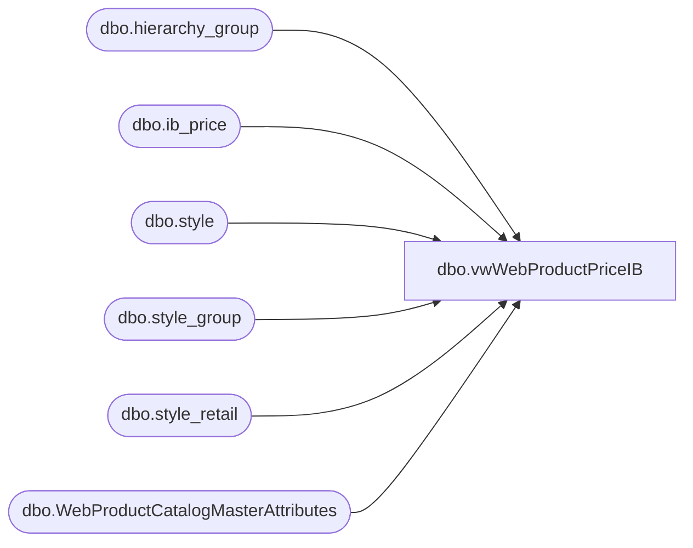

# dbo.vwWebProductPriceIB

**Database:** me_01  
**Server:** bedrockdb02  

## Architecture Diagram



## Table Dependencies

| Referenced Table |
|---|
| dbo.hierarchy_group |
| dbo.ib_price |
| dbo.style |
| dbo.style_group |
| dbo.style_retail |
| dbo.WebProductCatalogMasterAttributes |

## View Code

```sql
CREATE view [dbo].[vwWebProductPriceIB]

as 

--------------------------------------------------------------------------------------------------
-- vwWebProductPriceIB - Captures WEB prices for the Ecommerce system - 
--						Original query found here: bearwebdb\sql2008.eCommerce.feed_DeltaPriceLoad (stored proc)
--- 2021-02-15 - Tim Callahan - Created View based off vwWebProductPrice, the difference being the sale price is based off the IB_Price table
--				This was created to serve as a source for an exception report where the Pricebook price being fed to Deck does not match what we see in the IB_Price table in me_01

--------------------------------------------------------------------------------------------------


WITH 

Styles as 
	(
		select distinct style_code, ProductSellingGeography
		from WebProductCatalogMasterAttributes
		where StoreFrontEligible = 1 
	),
Prices as
	(
		SELECT 
			sc.style_code, 
			SUBSTRING(hg.hierarchy_group_code,1,5) AS GroupCode,
			UK.original_selling_retail AS UK_ListPrice,
			US.original_selling_retail AS US_ListPrice,
			0 as CA_ListPrice,
			case when UK.current_selling_retail < UK.original_selling_retail
				then UK.current_selling_retail 
				else NULL 
			end as UK_SalePrice,
			case when US.current_selling_retail < US.original_selling_retail
				then US.current_selling_retail 
				else NULL
			end as US_SalePrice,
			0 as CA_SalePrice
		FROM style sc (NOLOCK) 
		join style_group sg (NOLOCK) ON sc.style_id=sg.style_id
		join hierarchy_group hg (NOLOCK)ON sg.hierarchy_group_id=hg.hierarchy_group_id
		join style_retail US (NOLOCK) ON sc.style_id=US.style_id
		join style_retail UK (NOLOCK) ON sc.style_id=UK.style_id
		WHERE US.jurisdiction_id = 1 --US
		AND UK.jurisdiction_id = 2 --UK
		and US.original_selling_retail is not null
		and UK.original_selling_retail is not null
		and exists (select vw.style_code from Styles vw where vw.style_code = sc.style_code)
	),
ListPrices as
	(
		select
			style_code,
			GroupCode,
			CASE 
				WHEN GroupCode = 'R-B-C' or (GroupCode in ('R-B-Z','W-C-J','W-C-K','W-C-M','W-C-N','W-D-J','W-D-K','W-D-M','W-D-N','W-E-J','W-E-K','W-E-M','W-E-N','W-F-J','W-F-K','W-F-M','W-F-N') and style_code between 100000 and 199999)
					THEN CA_ListPrice
				WHEN GroupCode = 'R-B-U' or (GroupCode in ('R-B-Z','W-C-J','W-C-K','W-C-M','W-C-N','W-D-J','W-D-K','W-D-M','W-D-N','W-E-J','W-E-K','W-E-M','W-E-N','W-F-J','W-F-K','W-F-M','W-F-N') and style_code between 400000 and 499999)
					THEN UK_ListPrice
				ELSE US_ListPrice
			END AS ListPrice,
			CASE 
				WHEN GroupCode = 'R-B-C' or (GroupCode in ('R-B-Z','W-C-J','W-C-K','W-C-M','W-C-N','W-D-J','W-D-K','W-D-M','W-D-N','W-E-J','W-E-K','W-E-M','W-E-N','W-F-J','W-F-K','W-F-M','W-F-N') and style_code between 100000 and 199999)
					THEN CA_SalePrice
				WHEN GroupCode = 'R-B-U' or (GroupCode in ('R-B-Z','W-C-J','W-C-K','W-C-M','W-C-N','W-D-J','W-D-K','W-D-M','W-D-N','W-E-J','W-E-K','W-E-M','W-E-N','W-F-J','W-F-K','W-F-M','W-F-N') and style_code between 400000 and 499999)
					THEN UK_SalePrice
				ELSE US_SalePrice
			END AS SalePrice,
			CASE 
				WHEN GroupCode = 'R-B-C' or (GroupCode in ('R-B-Z','W-C-J','W-C-K','W-C-M','W-C-N','W-D-J','W-D-K','W-D-M','W-D-N','W-E-J','W-E-K','W-E-M','W-E-N','W-F-J','W-F-K','W-F-M','W-F-N') and style_code between 100000 and 199999)
					THEN 3 --CA
				WHEN GroupCode = 'R-B-U' or (GroupCode in ('R-B-Z','W-C-J','W-C-K','W-C-M','W-C-N','W-D-J','W-D-K','W-D-M','W-D-N','W-E-J','W-E-K','W-E-M','W-E-N','W-F-J','W-F-K','W-F-M','W-F-N') and style_code between 400000 and 499999)
					THEN 2 --UK
				ELSE 1 --US
			END AS JurisdictionId	
		FROM Prices
	),

MaxEntry as (

select s.style_code, ib.jurisdiction_id, Max(ib.ib_price_id) as MaxEntry
from ib_price ib (nolock)
join style s on s.style_id=ib.style_id
where (cast (ib.End_Date as date)  >= cast (getdate () as date) or ib.End_DAte is null) -- Exclude Expired Promotional Discounts
and ( (ib.location_id = 167 or (ib.location_id is null and ib.jurisdiction_id  = 1)) or (ib.location_id = 78 or (ib.location_id is null and ib.jurisdiction_id = 2)))
and  ib.cancel_promo_flag <> 1 -- Exclude Cancelled Promo Lines 
group by s.style_code, ib.jurisdiction_id
),

IB_Prices as ( 

select s.style_code,
ib.selling_retail_price, 
ib.ib_price_id,
ib.jurisdiction_id, 
ib.location_id, 
ib.end_date
from ib_price ib (nolock)
join style s on s.style_id=ib.style_id
where (ib.location_id = 167 or (ib.location_id is null and ib.jurisdiction_id  = 1)
		and (
				(cast(ib.End_Date as date) >= cast(getdate() as date))
				or
				(ib.End_DAte is null)			
			)
		)

or (ib.location_id = 78 or (ib.location_id is null and ib.jurisdiction_id = 2)
	and (
				(cast(ib.End_Date as date) >= cast (DATEADD (hh,18,getdate())as date))
				or
				(ib.End_DAte is null)	
		)
)
and  ib.cancel_promo_flag <> 1 -- Exclude Cancelled Promo Lines 
), 

MaxIBPrice as (
select i.style_code, i.jurisdiction_id, i.selling_retail_price
from IB_Prices i 
join MaxEntry m on i.jurisdiction_id=m.jurisdiction_id 
				and i.style_code=m.style_code 
				and m.MaxEntry=i.ib_price_id
join StyleS s on s.Style_Code=i.style_code
where (i.location_id = 167 or (i.location_id is null and i.jurisdiction_id  = 1)
		and (
				(cast(i.End_Date as date) >= cast(getdate() as date))
				or
				(i.End_DAte is null)			
			)
		)

or (i.location_id = 78 or (i.location_id is null and i.jurisdiction_id = 2)
	and (
				(cast(i.End_Date as date) >= cast (DATEADD (hh,18,getdate())as date))
				or
				(i.End_DAte is null)	
		)
)


)

select l.style_code, 
l.ListPrice as CurrentPrice, 
l.ListPrice as OriginalPrice,
case when isnull(i.selling_retail_price,0) < l.ListPrice
            then isnull(i.selling_retail_price,0)
        else null
        end as IbSalePrice, 
case when l.JurisdictionId = 2 
		then 'UK'
		else 'US'
	end as Catalog
--into ##tcC
from  ListPrices l
left join MaxIBPrice i on i.style_code=l.style_code 
					  and i.jurisdiction_id=l.JurisdictionId
--order by 1
```

