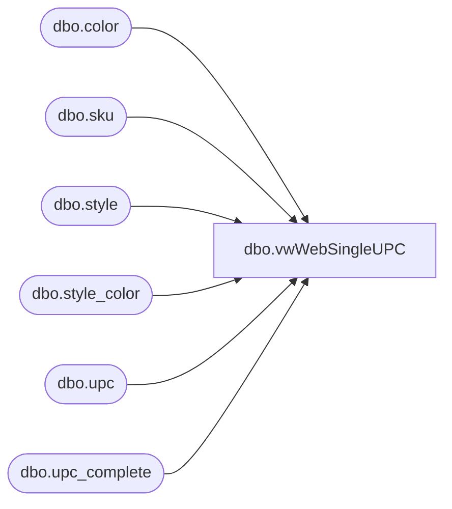

# dbo.vwWebSingleUPC

**Database:** me_01  
**Server:** bedrockdb02  

## Architecture Diagram



## Table Dependencies

| Referenced Table |
|---|
| dbo.color |
| dbo.sku |
| dbo.style |
| dbo.style_color |
| dbo.upc |
| dbo.upc_complete |

## View Code

```sql
CREATE view [dbo].[vwWebSingleUPC]

as 

--------------------------------------------------------------------------------------------------
-- vwWebSingleUPC - Returns Style and UPC, where only one record allowed per style, so we have one UPC.
--					UPC used is based on following factors
--					Use the UPC with the most recent Last Activity Date.
--					OR if there are multiple UPCs sharing the same date, then
--					Use the UPC from our purchased GS1 UPC's, which start with 8 and are in our lookup table
--					OR if there are multiple GS1 UPC's, 
--					Use the max(upc number)
--- 2017-05-17 - Dan Tweedie - Created View
--------------------------------------------------------------------------------------------------

WITH
UPCs as
	( --31957 --multiple UPCs per style
		select 
			sku.sku_id,
			s.style_id,
			s.style_code,
			upc.upc_number,
			cast(upc.last_activity_date as date) last_activity_date,
			c.color_long_description as Color
		from style s with (nolock)
		join style_color sc with (nolock) on s.style_id = sc.style_id and sc.reorder_flag = 1
		join color c with (nolock) on sc.color_id = c.color_id and c.active_flag = 1
		join sku with (nolock) on sc.style_color_id = sku.style_color_id and s.style_id = sku.style_id
		join upc with (nolock) on sku.sku_id = upc.sku_id
		where s.active_flag = 1
	),
LastActivityDate as
	(
		select --27289 distinct styles and their most recent last activity date
			style_code,
			max(last_activity_date) LastActivityDate
		from UPCs
		group by style_code
	),
LAD_UPC as
	(
		select --29681 --- multiple UPC's per style with same LastActivityDate
			u.style_code,
			u.upc_number
		from UPCs u
		where exists (select lad.style_code from LastActivityDate lad where u.style_code = lad.style_code and u.last_activity_date = lad.LastActivityDate)
	),
GS1 as
	(
		select --GS1 purchased UPC database table
			style_code,
			max(UPC_Complete) UPC
		from upc_complete
		group by style_code
	),
--GS1_Lookup as
--	(
--		select --2700 styles with GS1 UPCs
--			LAD_UPC.style_code,
--			max(LAD_UPC.upc_number) upc_number
--		from LAD_UPC
--		where exists (select g.UPC from GS1 g where g.UPC = LAD_UPC.upc_number) --and g.style_code = LAD_UPC.style_code)
--		group by LAD_UPC.style_code
	--),
GS1_Lookup as
	(
		select --2700 styles with GS1 UPCs
			style_code,
			max(UPC) upc_number
		from GS1
		group by style_code
	),
SingleUPC as
	(
		select --27289 distinct styles, takes either the GS1 UPC, if null it takes the max upc number from the UPCs with multiple activity date
			lu.style_code, 
			max(isnull(g.upc_number, lu.upc_number)) as upc_number
		from LAD_UPC lu
		left join GS1_Lookup g on lu.style_code = g.style_code --and lu.upc_number = g.upc_number
		group by lu.style_code
	) 
select  --27289 --final output
	u.style_id,
	u.sku_id,
	u.style_code,
	u.color,
	su.upc_number UPC
from UPCs u
join SingleUPC su on u.style_code = su.style_code and u.upc_number = su.upc_number
```

