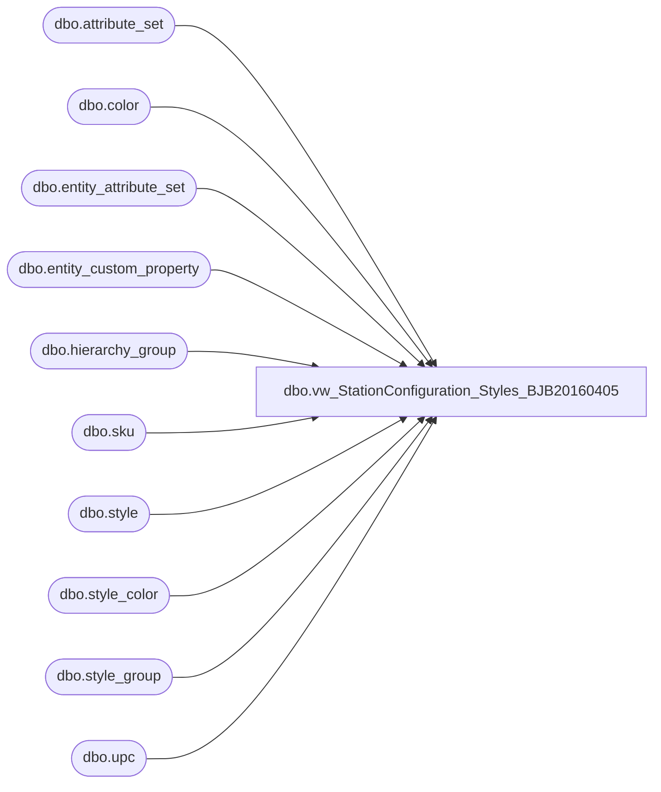

# dbo.vw_StationConfiguration_Styles_BJB20160405

**Database:** me_01  
**Server:** bedrockdb02  

## Architecture Diagram



## Table Dependencies

| Referenced Table |
|---|
| dbo.attribute_set |
| dbo.color |
| dbo.entity_attribute_set |
| dbo.entity_custom_property |
| dbo.hierarchy_group |
| dbo.sku |
| dbo.style |
| dbo.style_color |
| dbo.style_group |
| dbo.upc |

## View Code

```sql
CREATE VIEW [dbo].[vw_StationConfiguration_Styles_BJB20160405]
AS
/*This view is used for the population of KODIAK.StationMaster.dbo.tblStationConfiguration_ActiveProducts in the SSIS package UpdateActiveProducts.dtsx


MikeP		20130409		Added sounds group code 'R-%-%-20%' logic and changed name of view from vw_NameMeStyles
MikeP		20130514		Changed the default date from 1/1/2500 for null IDATE to 1/1/2000
And modified the ELSE portion of the IDATE to currentdate -2
Mike P	20131114		ADDED hg.hierarchy_group_code R-B-D-55 for corp animals
Mike P	20131211		ADDED hg.hierarchy_group_code LIKE 'R-B-_-12 for sports
Mike P	20140721		ADDED hg.hierarchy_group_code like 'R-B-_-21 for sounds
?		?				Hierarchy Group chaged to include Ws
Mike P	20150204		ADDED UNION ALL for Box Sets, gifts to go. 
Mike P	20150320		Added ProductTypeID logic, dino stopped working
*/

SELECT     TOP (100) PERCENT s.style_code AS STYLE_CD, s.short_desc AS SHORT_DESCR, s.long_desc AS LONG_DESCR, u.upc_number AS UPC, 
                      ecpan.custom_property_value AS ANIMAL_NM, REPLACE(ecpw.custom_property_value, ' oz', '') AS WEIGHT, ecph.custom_property_value AS HEIGHT, 
                      CASE WHEN ecpid.custom_property_value IS NULL THEN '1/1/2000' WHEN ecpid.custom_property_value LIKE '%JANUARY%' THEN '1/1/' + CAST(DATEPART(YEAR, 
                      GETDATE()) AS VARCHAR) WHEN ecpid.custom_property_value LIKE '%FEBRUARY%' THEN '2/1/' + CAST(DATEPART(YEAR, GETDATE()) AS VARCHAR) 
                      WHEN ecpid.custom_property_value LIKE '%MARCH%' THEN '3/1/' + CAST(DATEPART(YEAR, GETDATE()) AS VARCHAR) 
                      WHEN ecpid.custom_property_value LIKE '%APRIL%' THEN '4/1/' + CAST(DATEPART(YEAR, GETDATE()) AS VARCHAR) 
                      WHEN ecpid.custom_property_value LIKE '%MAY%' THEN '5/1/' + CAST(DATEPART(YEAR, GETDATE()) AS VARCHAR) 
                      WHEN ecpid.custom_property_value LIKE '%JUNE%' THEN '6/1/' + CAST(DATEPART(YEAR, GETDATE()) AS VARCHAR) 
                      WHEN ecpid.custom_property_value LIKE '%JULY%' THEN '7/1/' + CAST(DATEPART(YEAR, GETDATE()) AS VARCHAR) 
                      WHEN ecpid.custom_property_value LIKE '%AUGUST%' THEN '8/1/' + CAST(DATEPART(YEAR, GETDATE()) AS VARCHAR) 
                      WHEN ecpid.custom_property_value LIKE '%SEPTEMBER%' THEN '9/1/' + CAST(DATEPART(YEAR, GETDATE()) AS VARCHAR) 
                      WHEN ecpid.custom_property_value LIKE '%OCTOBER%' THEN '10/1/' + CAST(DATEPART(YEAR, GETDATE()) AS VARCHAR) 
                      WHEN ecpid.custom_property_value LIKE '%NOVEMBER%' THEN '11/1/' + CAST(DATEPART(YEAR, GETDATE()) AS VARCHAR) 
                      WHEN ecpid.custom_property_value LIKE '%DECEMBER%' THEN '12/1/' + CAST(DATEPART(YEAR, GETDATE()) AS VARCHAR) 
                      WHEN ISDATE(REPLACE(ecpid.custom_property_value, '//', '/')) = 1 THEN REPLACE(ecpid.custom_property_value, '//', '/') ELSE '1/1/2000' END AS INSTORE_DT, 
                      attat.attribute_set_label AS ANIMAL_TYPE, attec.attribute_set_label AS EYE_COLOR, c.color_long_description AS FUR_COLOR, 
                      hg.hierarchy_group_code AS HIERARCHY_GROUP_CD, 
					  CASE WHEN ISNULL(eas.parent_id, 0) > 0 THEN 2 --Dino
					  WHEN LEFT(hg.hierarchy_group_code,3) = 'R-B-Z' THEN 3 --Licensed product
					  ELSE 1 END ProductTypeID
	
	
	

FROM         dbo.style AS s INNER JOIN
                      dbo.style_group AS sg ON s.style_id = sg.style_id INNER JOIN
                      dbo.hierarchy_group AS hg ON sg.hierarchy_group_id = hg.hierarchy_group_id LEFT OUTER JOIN
                      dbo.entity_custom_property AS ecpan ON s.style_id = ecpan.parent_id AND ecpan.custom_property_id = 43 LEFT OUTER JOIN
                      dbo.entity_custom_property AS ecpw ON s.style_id = ecpw.parent_id AND ecpw.custom_property_id = 44 LEFT OUTER JOIN
                      dbo.entity_custom_property AS ecph ON s.style_id = ecph.parent_id AND ecph.custom_property_id = 45 LEFT OUTER JOIN
                      dbo.entity_custom_property AS ecpid ON s.style_id = ecpid.parent_id AND ecpid.custom_property_id = 5 LEFT OUTER JOIN
                      dbo.entity_attribute_set AS easat ON s.style_id = easat.parent_id AND easat.attribute_id = 335 LEFT OUTER JOIN
                      dbo.attribute_set AS attat ON easat.attribute_set_id = attat.attribute_set_id LEFT OUTER JOIN
                      dbo.entity_attribute_set AS easec ON s.style_id = easec.parent_id AND easec.attribute_id = 333 LEFT OUTER JOIN
                      dbo.attribute_set AS attec ON easec.attribute_set_id = attec.attribute_set_id 
					  LEFT JOIN me_01.dbo.entity_attribute_set eas (nolock) on s.style_id = eas.parent_id AND eas.attribute_id = 572 AND eas.attribute_set_id = 57200008 --DINO
					  LEFT OUTER JOIN
                      dbo.style_color AS sc ON s.style_id = sc.style_id AND sc.reorder_flag = 1 LEFT OUTER JOIN
                      dbo.color AS c ON sc.color_id = c.color_id LEFT OUTER JOIN
                      dbo.sku AS sk ON s.style_id = sk.style_id AND sc.style_color_id = sk.style_color_id INNER JOIN
                      dbo.upc AS u ON sk.sku_id = u.sku_id AND u.upc_number < '000001000000' AND u.upc_number IS NOT NULL LEFT OUTER JOIN
                          (SELECT     b.style_code
                            FROM          dbo.style AS a INNER JOIN
                                                   dbo.style AS b ON RIGHT(a.style_code, 5) = RIGHT(b.style_code, 5) AND a.style_code < b.style_code
                            WHERE      (LEFT(a.style_code, 1) = '0') AND (LEFT(b.style_code, 1) = '1' OR
                                                   LEFT(b.style_code, 1) = '4')) AS dup1 ON s.style_code = dup1.style_code LEFT OUTER JOIN
                          (SELECT     b.style_code
                            FROM          dbo.style AS a INNER JOIN
                                                   dbo.style AS b ON RIGHT(a.style_code, 5) = RIGHT(b.style_code, 5) AND a.style_code < b.style_code
                            WHERE      (LEFT(a.style_code, 1) = '1') AND (LEFT(b.style_code, 1) = '4')) AS dup2 ON s.style_code = dup2.style_code
WHERE     (hg.hierarchy_group_code LIKE 'R-%-%-25%' OR
                      hg.hierarchy_group_code LIKE 'R-_-_-30%' OR
                      hg.hierarchy_group_code LIKE 'R-_-_-20-07%' OR
                      hg.hierarchy_group_code LIKE 'R-B-_-21%' OR
                      hg.hierarchy_group_code LIKE 'R-B-D-55%' OR
                      hg.hierarchy_group_code LIKE 'R-B-_-12%' OR
					  hg.hierarchy_group_code LIKE 'W-_-_-02%' OR  -- Animals
					  hg.hierarchy_group_code LIKE 'W-_-_-04-02%' OR -- Prestuffed
					  hg.hierarchy_group_code LIKE 'W-_-_-12-01%' OR -- Sounds
					  hg.hierarchy_group_code LIKE 'W-_-_-12_02%' OR -- Scents
					  hg.hierarchy_group_code LIKE 'W-_-_-06_07%' -- Sports
					  ) AND (sc.reorder_flag = 1) AND (dup1.style_code IS NULL) AND (dup2.style_code IS NULL)
UNION ALL
--BOXED GIFT SETS
SELECT     TOP (100) PERCENT s.style_code AS STYLE_CD, s.short_desc AS SHORT_DESCR, s.long_desc AS LONG_DESCR, u.upc_number AS UPC, 
                      ecpan.custom_property_value AS ANIMAL_NM, REPLACE(ecpw.custom_property_value, ' oz', '') AS WEIGHT, ecph.custom_property_value AS HEIGHT, 
                      CASE WHEN ecpid.custom_property_value IS NULL THEN '1/1/2000' WHEN ecpid.custom_property_value LIKE '%JANUARY%' THEN '1/1/' + CAST(DATEPART(YEAR, 
                      GETDATE()) AS VARCHAR) WHEN ecpid.custom_property_value LIKE '%FEBRUARY%' THEN '2/1/' + CAST(DATEPART(YEAR, GETDATE()) AS VARCHAR) 
                      WHEN ecpid.custom_property_value LIKE '%MARCH%' THEN '3/1/' + CAST(DATEPART(YEAR, GETDATE()) AS VARCHAR) 
                      WHEN ecpid.custom_property_value LIKE '%APRIL%' THEN '4/1/' + CAST(DATEPART(YEAR, GETDATE()) AS VARCHAR) 
                      WHEN ecpid.custom_property_value LIKE '%MAY%' THEN '5/1/' + CAST(DATEPART(YEAR, GETDATE()) AS VARCHAR) 
                      WHEN ecpid.custom_property_value LIKE '%JUNE%' THEN '6/1/' + CAST(DATEPART(YEAR, GETDATE()) AS VARCHAR) 
                      WHEN ecpid.custom_property_value LIKE '%JULY%' THEN '7/1/' + CAST(DATEPART(YEAR, GETDATE()) AS VARCHAR) 
                      WHEN ecpid.custom_property_value LIKE '%AUGUST%' THEN '8/1/' + CAST(DATEPART(YEAR, GETDATE()) AS VARCHAR) 
                      WHEN ecpid.custom_property_value LIKE '%SEPTEMBER%' THEN '9/1/' + CAST(DATEPART(YEAR, GETDATE()) AS VARCHAR) 
                      WHEN ecpid.custom_property_value LIKE '%OCTOBER%' THEN '10/1/' + CAST(DATEPART(YEAR, GETDATE()) AS VARCHAR) 
                      WHEN ecpid.custom_property_value LIKE '%NOVEMBER%' THEN '11/1/' + CAST(DATEPART(YEAR, GETDATE()) AS VARCHAR) 
                      WHEN ecpid.custom_property_value LIKE '%DECEMBER%' THEN '12/1/' + CAST(DATEPART(YEAR, GETDATE()) AS VARCHAR) 
                      WHEN ISDATE(REPLACE(ecpid.custom_property_value, '//', '/')) = 1 THEN REPLACE(ecpid.custom_property_value, '//', '/') ELSE '1/1/2000' END AS INSTORE_DT, 
                      attat.attribute_set_label AS ANIMAL_TYPE, attec.attribute_set_label AS EYE_COLOR, c.color_long_description AS FUR_COLOR, 
                      hg.hierarchy_group_code AS HIERARCHY_GROUP_CD, 
					  CASE WHEN ISNULL(eas.parent_id, 0) > 0 THEN 2 --Dino
					  WHEN LEFT(hg.hierarchy_group_code,3) = 'R-B-Z' THEN 3 --Licensed product
					  ELSE 1 END ProductTypeID
FROM         dbo.style AS s INNER JOIN
                      dbo.style_group AS sg ON s.style_id = sg.style_id INNER JOIN
                      dbo.hierarchy_group AS hg ON sg.hierarchy_group_id = hg.hierarchy_group_id LEFT OUTER JOIN
                      dbo.entity_custom_property AS ecpan ON s.style_id = ecpan.parent_id AND ecpan.custom_property_id = 43 LEFT OUTER JOIN
                      dbo.entity_custom_property AS ecpw ON s.style_id = ecpw.parent_id AND ecpw.custom_property_id = 44 LEFT OUTER JOIN
                      dbo.entity_custom_property AS ecph ON s.style_id = ecph.parent_id AND ecph.custom_property_id = 45 LEFT OUTER JOIN
                      dbo.entity_custom_property AS ecpid ON s.style_id = ecpid.parent_id AND ecpid.custom_property_id = 5 LEFT OUTER JOIN
                      dbo.entity_attribute_set AS easat ON s.style_id = easat.parent_id AND easat.attribute_id = 335 LEFT OUTER JOIN
                      dbo.attribute_set AS attat ON easat.attribute_set_id = attat.attribute_set_id LEFT OUTER JOIN
                      dbo.entity_attribute_set AS easec ON s.style_id = easec.parent_id AND easec.attribute_id = 333 LEFT OUTER JOIN
                      dbo.attribute_set AS attec ON easec.attribute_set_id = attec.attribute_set_id 
					  LEFT JOIN me_01.dbo.entity_attribute_set eas (nolock) on s.style_id = eas.parent_id AND eas.attribute_id = 572 AND eas.attribute_set_id = 57200008 --DINO
					  LEFT OUTER JOIN
                      dbo.style_color AS sc ON s.style_id = sc.style_id AND sc.reorder_flag = 1 LEFT OUTER JOIN
                      dbo.color AS c ON sc.color_id = c.color_id LEFT OUTER JOIN
                      dbo.sku AS sk ON s.style_id = sk.style_id AND sc.style_color_id = sk.style_color_id INNER JOIN
                      dbo.upc AS u ON sk.sku_id = u.sku_id AND u.upc_number < '000001000000' AND u.upc_number IS NOT NULL LEFT OUTER JOIN
                          (SELECT     b.style_code
                            FROM          dbo.style AS a INNER JOIN
                                                   dbo.style AS b ON RIGHT(a.style_code, 5) = RIGHT(b.style_code, 5) AND a.style_code < b.style_code
                            WHERE      (LEFT(a.style_code, 1) = '0') AND (LEFT(b.style_code, 1) = '1' OR
                                                   LEFT(b.style_code, 1) = '4')) AS dup1 ON s.style_code = dup1.style_code LEFT OUTER JOIN
                          (SELECT     b.style_code
                            FROM          dbo.style AS a INNER JOIN
                                                   dbo.style AS b ON RIGHT(a.style_code, 5) = RIGHT(b.style_code, 5) AND a.style_code < b.style_code
                            WHERE      (LEFT(a.style_code, 1) = '1') AND (LEFT(b.style_code, 1) = '4')) AS dup2 ON s.style_code = dup2.style_code
WHERE     (hg.hierarchy_group_code LIKE 'R-B-D-47-01%'
					  ) AND (sc.reorder_flag = 1) AND (dup1.style_code IS NULL) AND (dup2.style_code IS NULL)
					  AND ecpan.custom_property_value IS NOT NULL
ORDER BY STYLE_CD
```

