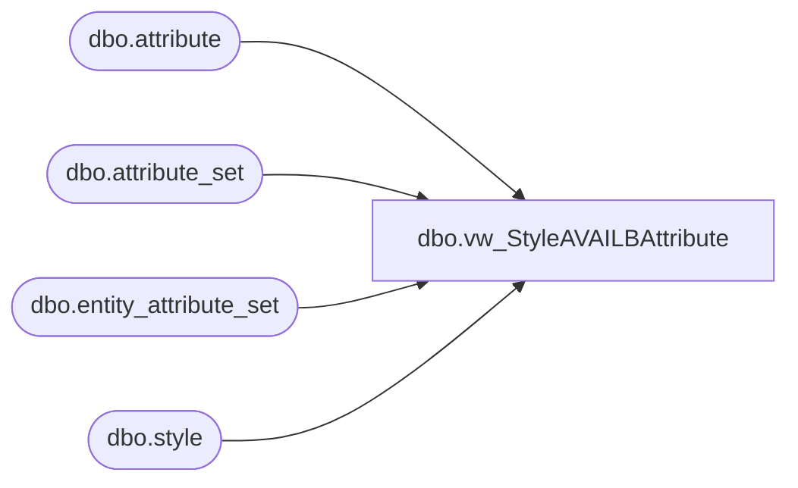

# dbo.vw_StyleAVAILBAttribute

**Database:** me_01  
**Server:** bedrockdb02  

## Architecture Diagram



## Table Dependencies

| Referenced Table |
|---|
| dbo.attribute |
| dbo.attribute_set |
| dbo.entity_attribute_set |
| dbo.style |

## View Code

```sql
CREATE view [dbo].[vw_StyleAVAILBAttribute]
as
select A.style_code, 
	   max(A.US) AVAILB_US,
	   max(A.CA) AVAILB_CA,
	   max(A.UK) AVAILB_UK,
	   max(A.INTL) AVAILB_INTL,
	   max(A.USWEB) AVAILB_USWEB,
	   max(A.UKWEB) AVAILB_UKWEB,
	   max(A.DINO) AVAILB_DINO
FROM (
		select s.style_code, 
		case when att.attribute_set_code = 'US' then 1 else 0 end as US,
		case when att.attribute_set_code = 'CA' then 1 else 0 end as CA,
		case when att.attribute_set_code = 'UK' then 1 else 0 end as UK,
		case when att.attribute_set_code = 'INTL' then 1 else 0 end as INTL,
		case when att.attribute_set_code = 'USWEB' then 1 else 0 end as USWEB,
		case when att.attribute_set_code = 'UKWEB' then 1 else 0 end as UKWEB,
		case when att.attribute_set_code = 'DINO' then 1 else 0 end as DINO
		from style s (nolock)
		join entity_attribute_set eas (nolock) on s.style_id = eas.parent_id
		join attribute_set att (nolock) on eas.attribute_set_id = att.attribute_set_id
		join attribute a (nolock) on att.attribute_id = a.attribute_id and a.parent_type = 1
		where a.attribute_code = 'AVAILB'
	) A
GROUP BY A.style_code
```

