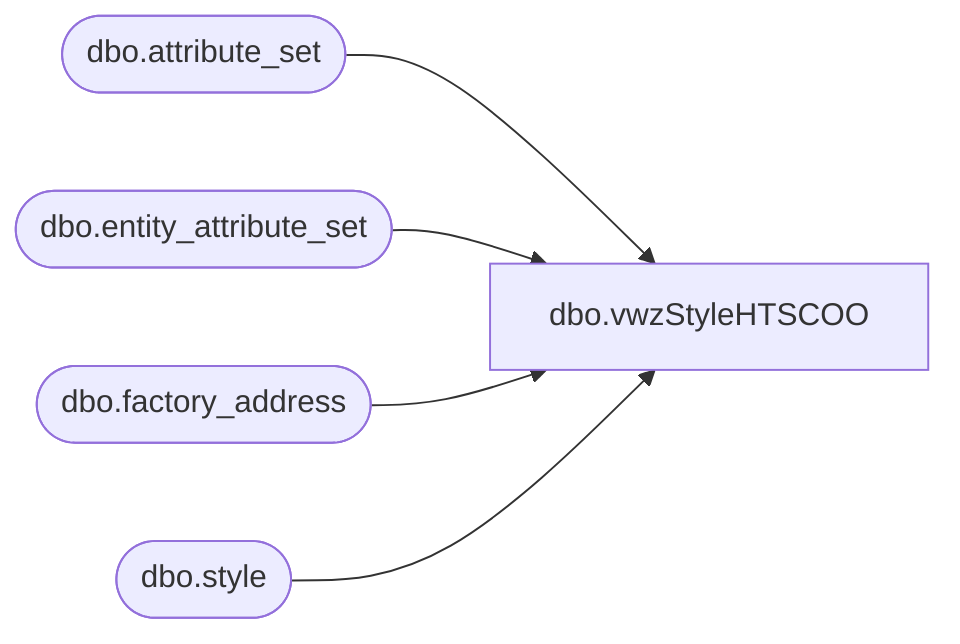

# dbo.vwzStyleHTSCOO

**Database:** me_01  
**Server:** bedrockdb02  

## Architecture Diagram



## Table Dependencies

| Referenced Table |
|---|
| dbo.attribute_set |
| dbo.entity_attribute_set |
| dbo.factory_address |
| dbo.style |

## View Code

```sql
CREATE view [dbo].[vwzStyleHTSCOO]
as

with
HTS as
	(
		select 
			s.style_code,
			ats.attribute_set_label as HTS
		from style s with (nolock)
		join entity_attribute_set eas with (nolock)
			on s.style_id=eas.parent_id
			and eas.attribute_id=156
		join attribute_set ats with (nolock) on eas.attribute_set_id=ats.attribute_set_id
		where s.active_flag=1
		and s.style_code between '400000' and '499999'
	),
COO as
	(
		select 
			s.style_code,
			fa.Country
		from style s with (nolock)
		join entity_attribute_set easfact (nolock) 
			on s.style_id=easfact.parent_id
			and easfact.attribute_id = 122 
		join attribute_set ats with (nolock) on easfact.attribute_set_id = ats.attribute_set_id
		join factory_address fa with (nolock) on ats.attribute_set_code = fa.attribute_set_code
		where s.active_flag=1
		and s.style_code between '400000' and '499999'
	)
select
	s.style_code,
	s.short_desc,
	h.HTS,
	c.Country
from style s with (nolock)
left join HTS h on s.style_code=h.style_code
left join COO c on s.style_code=c.style_code
where s.active_flag=1
and s.style_code between '400000' and '499999'
--and (h.hts is not null OR c.country is not null)
```

