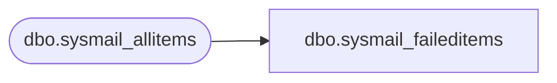

# dbo.sysmail_faileditems

**Database:** msdb  
**Server:** bedrockdb02  

## Architecture Diagram



## Table Dependencies

| Referenced Table |
|---|
| dbo.sysmail_allitems |

## View Code

```sql
CREATE VIEW sysmail_faileditems
AS
SELECT * FROM msdb.dbo.sysmail_allitems WHERE sent_status = 'failed'
```

