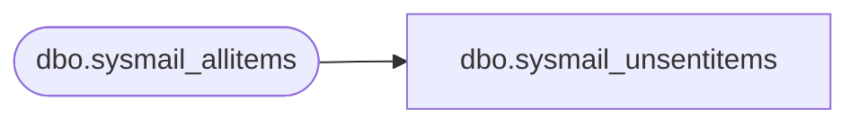

# dbo.sysmail_unsentitems

**Database:** msdb  
**Server:** bedrockdb02  

## Architecture Diagram



## Table Dependencies

| Referenced Table |
|---|
| dbo.sysmail_allitems |

## View Code

```sql
CREATE VIEW sysmail_unsentitems
AS
SELECT * FROM msdb.dbo.sysmail_allitems WHERE (sent_status = 'unsent' OR sent_status = 'retrying')


dbo,sysmaintplan_plans,CREATE VIEW sysmaintplan_plans
AS
   SELECT
   s.name AS [name],
   s.id AS [id],
   s.description AS [description],
   s.createdate AS [create_date],
   suser_sname(s.ownersid) AS [owner],
   s.vermajor AS [version_major],
   s.verminor AS [version_minor],
   s.verbuild AS [version_build],
   s.vercomments AS [version_comments],
   ISNULL((select TOP 1 msx_plan from sysmaintplan_subplans where plan_id = s.id), 0) AS [from_msx],
   CASE WHEN (NOT EXISTS (select TOP 1 msx_job_id 
                          from sysmaintplan_subplans subplans, sysjobservers jobservers
                          where plan_id = s.id 
                          and msx_job_id is not null
                          and subplans.msx_job_id = jobservers.job_id
                          and server_id != 0)) 
        then 0 
        else 1 END AS [has_targets]
   FROM
   msdb.dbo.sysssispackages AS s
   WHERE
   (s.folderid = '08aa12d5-8f98-4dab-a4fc-980b150a5dc8' and s.packagetype = 6)

dbo,sysmanagement_shared_registered_servers,CREATE VIEW [dbo].[sysmanagement_shared_registered_servers]
AS
(
    SELECT server_id, server_group_id, name, server_name, description, server_type
    FROM [msdb].[dbo].[sysmanagement_shared_registered_servers_internal]
)

dbo,sysmanagement_shared_server_groups,CREATE VIEW [dbo].[sysmanagement_shared_server_groups]
AS
(
    SELECT server_group_id, name, description, server_type, parent_id, is_system_object,
    (select COUNT(*) from [msdb].[dbo].[sysmanagement_shared_server_groups_internal] sgChild where sgChild.parent_id = sg.server_group_id) as num_server_group_children,
    (select COUNT(*) from [msdb].[dbo].[sysmanagement_shared_registered_servers_internal] rsChild where rsChild.server_group_id = sg.server_group_id) as num_registered_server_children
    FROM [msdb].[dbo].[sysmanagement_shared_server_groups_internal] sg
)

dbo,sysoriginatingservers_view,CREATE VIEW dbo.sysoriginatingservers_view(originating_server_id, originating_server, master_server)
AS 
   SELECT
      0 AS originating_server_id, 
      UPPER(CONVERT(sysname, SERVERPROPERTY('ServerName'))) AS originating_server,
      0 AS master_server
   UNION
   SELECT 
      originating_server_id,
      originating_server,
      master_server
   FROM
      dbo.sysoriginatingservers

dbo,syspolicy_conditions,CREATE VIEW [dbo].[syspolicy_conditions]
AS
    SELECT
        c.condition_id, c.name, c.date_created, c.description, c.created_by, 
        c.modified_by, c.date_modified, c.is_name_condition, mf.name AS facet, c.expression, c.obj_name, c.is_system 
    FROM [dbo].[syspolicy_conditions_internal] c 
    LEFT OUTER JOIN [dbo].[syspolicy_management_facets] mf ON c.facet_id = mf.management_facet_id

dbo,syspolicy_configuration,CREATE VIEW [dbo].[syspolicy_configuration]
AS
    SELECT 
        name,
        CASE WHEN name = N'Enabled' and SERVERPROPERTY('EngineEdition') = 4 THEN 0 ELSE current_value END AS current_value
    FROM [dbo].[syspolicy_configuration_internal] 

dbo,syspolicy_object_sets,CREATE VIEW [dbo].[syspolicy_object_sets]
AS
    SELECT     
        os.object_set_id,
        os.object_set_name,
        os.facet_id,
        facet.name as facet_name,
        os.is_system
    FROM [dbo].[syspolicy_object_sets_internal] AS os INNER JOIN [dbo].[syspolicy_management_facets] AS facet
    ON os.facet_id = facet.management_facet_id

dbo,syspolicy_policies,CREATE VIEW [dbo].[syspolicy_policies]
AS
    SELECT     
        policy_id,
        name,
        condition_id,
        root_condition_id,
        date_created,
        execution_mode,
        policy_category_id,
        schedule_uid,
        description,
        help_text,
        help_link,
        object_set_id,
        is_enabled,
        job_id,
        created_by,
        modified_by,
        date_modified,
        is_system
    FROM [dbo].[syspolicy_policies_internal]

dbo,syspolicy_policy_categories,CREATE VIEW [dbo].[syspolicy_policy_categories]
AS
    SELECT     
        policy_category_id,
        name,
        mandate_database_subscriptions
    FROM [dbo].[syspolicy_policy_categories_internal]

dbo,syspolicy_policy_category_subscriptions,CREATE VIEW [dbo].[syspolicy_policy_category_subscriptions]
AS
    SELECT     
        policy_category_subscription_id,
        target_type,
        target_object,
        policy_category_id
    FROM [dbo].[syspolicy_policy_category_subscriptions_internal]
```

