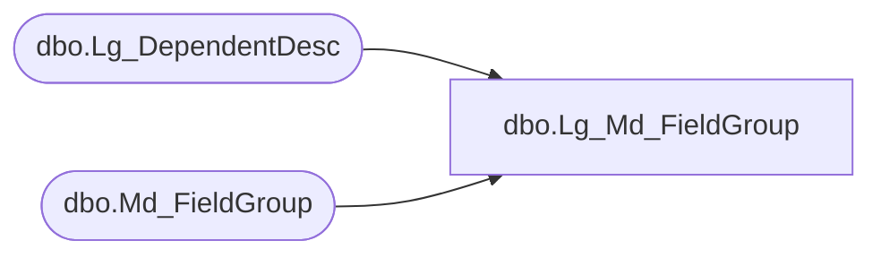

# dbo.Lg_Md_FieldGroup

**Database:** smartlook_01  
**Server:** bedrockdb02  

## Architecture Diagram



## Table Dependencies

| Referenced Table |
|---|
| dbo.Lg_DependentDesc |
| dbo.Md_FieldGroup |

## View Code

```sql
create view dbo.Lg_Md_FieldGroup  AS
	SELECT a.topic_id, a.field_group_id, a.field_group_label_1, a.field_group_label_2, ISNULL(b.first_pair_text, a.field_group_label_1) as field_group_label_3,
	       a.field_group_description_1, a.field_group_description_2, ISNULL(b.second_pair_text, a.field_group_description_1) as field_group_description_3,
	       a.parent_field_group_id, a.display_fields, a.resource_id, b.language_id
	  FROM Md_FieldGroup a LEFT OUTER JOIN Lg_DependentDesc b ON a.resource_id = b.resource_id
```

