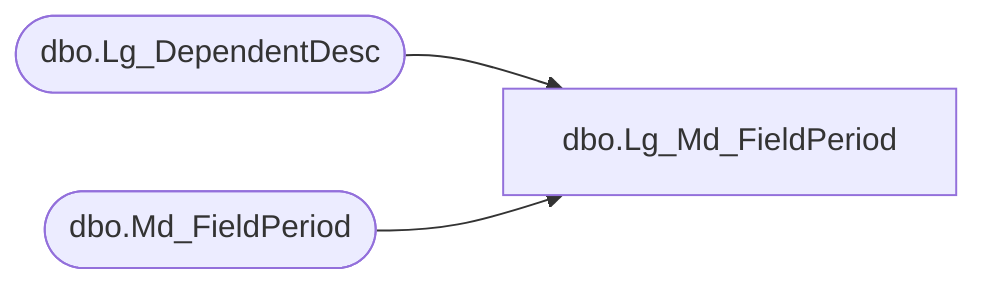

# dbo.Lg_Md_FieldPeriod

**Database:** smartlook_01  
**Server:** bedrockdb02  

## Architecture Diagram



## Table Dependencies

| Referenced Table |
|---|
| dbo.Lg_DependentDesc |
| dbo.Md_FieldPeriod |

## View Code

```sql
create view dbo.Lg_Md_FieldPeriod  AS
	SELECT a.field_period_id, a.sql_template_id, a.topic_id, 
	       a.label_1, a.label_2, ISNULL(b.first_pair_text, a.label_1) as label_3,
	       a.description_1, a.description_2, ISNULL(b.second_pair_text, a.description_1) as description_3,
	       a.range, a.time_unit, a.validate_proc, a.txtarg_1, a.txtarg_2, 
	       a.heading_label_1, a.heading_label_2, ISNULL(c.first_pair_text, a.heading_label_1) as heading_label_3,
	       a.lblinput_1, a.lblinput_2, ISNULL(c.second_pair_text, a.lblinput_1) as lblinput_3,
	       a.summed, a.range_sql, a.period_id, a.where_sql_template_id, 
	       a.resource_id_1, a.resource_id_2, c.language_id
	  FROM Md_FieldPeriod a LEFT OUTER JOIN Lg_DependentDesc b ON a.resource_id_1 = b.resource_id
                                                   LEFT OUTER JOIN Lg_DependentDesc c ON a.resource_id_2 = c.resource_id
```

