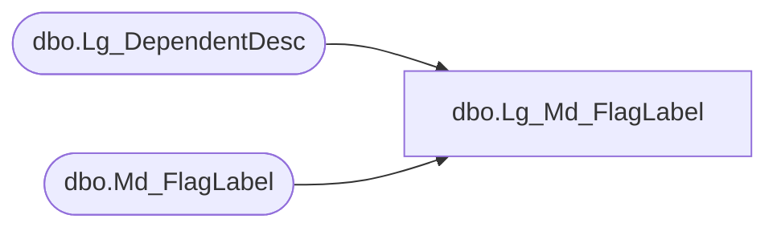

# dbo.Lg_Md_FlagLabel

**Database:** smartlook_01  
**Server:** bedrockdb02  

## Architecture Diagram



## Table Dependencies

| Referenced Table |
|---|
| dbo.Lg_DependentDesc |
| dbo.Md_FlagLabel |

## View Code

```sql
create view dbo.Lg_Md_FlagLabel  AS
	SELECT a.flag_label_id, a.flag_yes_label_1, a.flag_yes_label_2, ISNULL(b.first_pair_text, a.flag_yes_label_1) as flag_yes_label_3,
	       a.flag_no_label_1, a.flag_no_label_2, ISNULL(b.second_pair_text, a.flag_no_label_1) as flag_no_label_3,
	       a.resource_id, b.language_id
	  FROM Md_FlagLabel a LEFT OUTER JOIN Lg_DependentDesc b ON a.resource_id = b.resource_id
```

