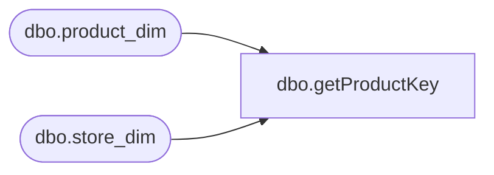

# dbo.getProductKey

**Database:** DWStaging  
**Server:** papamart  
**Function Type:** Scalar Function  
**Returns:** int(4)  

## Architecture Diagram



## Parameters

| Parameter | Data Type | Max Length | Is Output |
|---|---|---|---|
| @lineObject | smallint | 2 | NO |
| @referenceNo | varchar | 80 | NO |
| @storeNo | int | 4 | NO |

## Table Dependencies

| Referenced Table |
|---|
| dbo.product_dim |
| dbo.store_dim |

## Function Code

```sql
-- G Murrish	2/14/2013   Changed numeric length to 17 from 18
-- G Murrish	2/13/2013	Changed numeric check for sku

CREATE FUNCTION [dbo].[getProductKey] (
	@lineObject smallint,
	@referenceNo varchar(80),
	@storeNo int)
RETURNS int
AS
BEGIN
	DECLARE	@country varchar(3),
			@productKey1 int,
			@productDept varchar(10),
			@productJurisdiction varchar(10),
			@productKey2 int,
			@productKey3 int

	IF (@lineObject IN (290, 1103))
	BEGIN
		--SET @productKey1 = 0
		--SET @productDept = ''
		--SET @productJurisdiction = 'US'
		--SET @productKey2 = 0
		SET @productKey3 = 0
	END
	ELSE
	IF (@lineObject >= 200 AND @lineObject < 300) OR (@lineObject >= 400 AND @lineObject < 500)
	BEGIN
		SET @productKey1 =
			CASE
				WHEN @lineObject = 200 THEN -7
				WHEN @lineObject = 202 THEN -8
				WHEN @lineObject = 203 THEN -9
				WHEN @lineObject = 204 THEN -10
				WHEN @lineObject = 205 THEN -11
				WHEN @lineObject = 206 THEN -12
				WHEN @lineObject = 250 THEN -13
				WHEN @lineObject = 291 THEN -15
				WHEN @lineObject = 292 THEN -16
				WHEN @lineObject = 293 THEN -17
				WHEN @lineObject = 294 THEN -1
				WHEN @lineObject = 400 THEN -2
				WHEN @lineObject = 401 THEN -3
				WHEN @lineObject = 402 THEN -4
				WHEN @lineObject = 403 THEN -5
				WHEN @lineObject = 404 THEN -6 ELSE 0
			END
		SET @productDept = ''
		SET @productJurisdiction = 'US'
		SELECT
			@productKey2 = [product_key]
		FROM
			[dw].[dbo].[product_dim]
		WHERE
			[sku] = @productKey1
			AND [jurisdiction_code] = @productJurisdiction

	END
	ELSE
	BEGIN
		SET @productKey1 = NULL
		IF @referenceNo IS NOT NULL AND PATINDEX('%[^0-9]%', @referenceNo) = 0 AND LEN(@referenceNo) BETWEEN 1 AND 17
		BEGIN
			SELECT
				@country = [country]
			FROM
				[dw].[dbo].[store_dim]
			WHERE
				[store_id] = @storeNo;

			DECLARE @sku AS numeric
			SET @sku = CAST(LEFT(@referenceNo, 17) AS numeric)
			SELECT
				@productDept = SUBSTRING(department_code, 1, 5)
			FROM
				dw.dbo.product_dim
			WHERE
				sku = @sku

			SET @productJurisdiction =
				CASE
					WHEN @productDept = 'R-B-Z' THEN @country ELSE CASE
						WHEN @sku <= 99999 THEN 'US'
						WHEN @sku <= 199999 THEN 'CA'
						WHEN @sku <= 399999 THEN 'US'
						WHEN @sku <= 499999 THEN 'UK' ELSE 'US'
					END
				END
			SELECT
				@productKey2 = [product_key]
			FROM
				[dw].[dbo].[product_dim]
			WHERE
				[sku] = @sku
				AND [jurisdiction_code] = @productJurisdiction
		END
		ELSE
		BEGIN
			SET @productJurisdiction = 'US'
			SET @productDept = ''
			SET @productKey2 = 0
		END
	END


	SET @productKey3 =
		CASE
			WHEN @productKey2 IS NULL THEN CASE
					WHEN @lineObject >= 700 AND @lineObject < 800 THEN -@lineObject ELSE -99
				END ELSE @productKey2
		END


	RETURN @productKey3

--select '@lineObject', @lineObject
--select '@referenceNo', @referenceNo
--select '@productKey1', @productKey1
--select '@productDept', @productDept
--select '@productJurisdiction', @productJurisdiction
--select '@productKey2', @productKey2	
--select '@productKey3', @productKey3    
END
```

