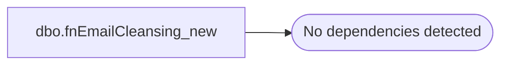

# dbo.fnEmailCleansing_new

**Database:** dw  
**Server:** papamart  
**Function Type:** Scalar Function  
**Returns:** varchar(100)  

## Architecture Diagram



## Parameters

| Parameter | Data Type | Max Length | Is Output |
|---|---|---|---|
| @InEmailAddress | varchar | 100 | NO |

## Table Dependencies

_No table dependencies detected._

## Function Code

```sql
-- =============================================================================================================
-- Name: fnEmailCleansing
--
-- Description:	
--		cleans up an email address.  if it is really dirty, then a null email address is returned.
--
--  no attempt is made to identify or replace extended ascii chars
--
-- Input:
--		@InEmailAddress			varchar(100)	
--			email address to be cleaned
--
-- Output: 
--		@OutEmailAddress		varchar(100)
--			a cleaned up version of @InEmailAddress or a nulled out string if it is really bad/invalid
--
-- Dependencies: 
--
-- EXAMPLE:
--		select dbo.fnEmailCleansing('asdf@asdf.com')
--
-- Revision History
--		Name:			Date:			Comments:
--		Dave Rice		circa 2009		created
--		Dave Rice		12/10/2010		beefed up to include removal of role addresses
-- =============================================================================================================
CREATE function [dbo].[fnEmailCleansing_new](
	@InEmailAddress varchar(100))
returns varchar(100)
as
begin

declare @OutEmailAddress varchar(100)

set @OutEmailAddress = upper(@InEmailAddress)

-- remove obvious bad chars - make two attempts, any more and just assume the address is bad
set @OutEmailAddress = replace(@OutEmailAddress, substring(@OutEmailAddress, patindex('%[^A-Z0-9@._-]%', @OutEmailAddress), 1), '')
set @OutEmailAddress = replace(@OutEmailAddress, substring(@OutEmailAddress, patindex('%[^A-Z0-9@._-]%', @OutEmailAddress), 1), '')

-- double periods
set @OutEmailAddress = replace(@OutEmailAddress, '..', '.')

-- this list came from http://lyrishq.lyris.com/index.php/Email-Marketing-FAQ/Why-Suppress-Role-Account-Email-Addresses.html
select @OutEmailAddress = null
where @OutEmailAddress like 'admin@%'
	or @OutEmailAddress like 'all@%'
	or @OutEmailAddress like 'billing@%'
--	or @OutEmailAddress like 'everyone@%'  -- appears to be used in vanity domains
	or @OutEmailAddress like 'feedback@%'
	or @OutEmailAddress like 'ftp@%'
	or @OutEmailAddress like 'hostmaster@%'
	or @OutEmailAddress like 'info@%'
	or @OutEmailAddress like 'investorrelations@%'
	or @OutEmailAddress like 'ispfeedback@%'
	or @OutEmailAddress like 'ispsupport@%'
	or @OutEmailAddress like 'jobs@%'
	or @OutEmailAddress like 'list-request@%'
	or @OutEmailAddress like 'marketing@%'
	or @OutEmailAddress like 'news@%'
	or @OutEmailAddress like 'nobody@%'
	or @OutEmailAddress like 'postmaster@%'
	or @OutEmailAddress like 'sales@%'
	or @OutEmailAddress like 'subscribe@%'
	or @OutEmailAddress like 'spam@%'
	or @OutEmailAddress like 'support@%'
	or @OutEmailAddress like 'tech@%'
	or @OutEmailAddress like 'trouble@%'
	or @OutEmailAddress like 'undisclosed-recipients@%'
	or @OutEmailAddress like 'unsubscribe@%'
	or @OutEmailAddress like 'usenet@%'
	or @OutEmailAddress like 'uucp@%'
	or @OutEmailAddress like 'webmaster@%'
	or @OutEmailAddress like 'www@%'

	-- these i added 
	or @OutEmailAddress like 'none@%'
	or @OutEmailAddress like 'junk@%'
	or @OutEmailAddress like 'office@%'
	or @OutEmailAddress like 'no@%'
	or @OutEmailAddress like 'contact@%'
	or @OutEmailAddress like '@%'
	or @OutEmailAddress like 'na@%'
	or @OutEmailAddress like 'shop@%'
	or @OutEmailAddress like 'shopping@%'
	or @OutEmailAddress like 'orders@%'
	or @OutEmailAddress like 'bad@%'

-- make sure we have a valid address
select @OutEmailAddress = null
where patindex('%[^A-Z0-9@._-]%', @OutEmailAddress) > 0
--	or @OutEmailAddress in ('bad@email.adr','no@.com','bad@email.com')
	or @OutEmailAddress NOT LIKE '_%@_%._%'
	or @OutEmailAddress LIKE '%@%@%'
	or @OutEmailAddress LIKE '%.'
	or charindex('@.', @OutEmailAddress) > 0 
	or charindex('.@', @OutEmailAddress) > 0
	-- first char must be alphanumeric
	or patindex('%[^A-Z0-9]%', substring(@OutEmailAddress, 1, 1)) > 0
	-- last char must be alphanumeric
	or patindex('%[^A-Z0-9]%', substring(@OutEmailAddress, len(@OutEmailAddress), 1)) > 0

return @OutEmailAddress

end
```

