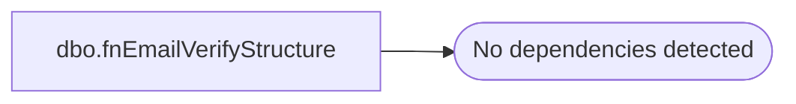

# dbo.fnEmailVerifyStructure

**Database:** dw  
**Server:** papamart  
**Function Type:** Scalar Function  
**Returns:** varchar(5)  

## Architecture Diagram



## Parameters

| Parameter | Data Type | Max Length | Is Output |
|---|---|---|---|
| @email | varchar | 100 | NO |

## Table Dependencies

_No table dependencies detected._

## Function Code

```sql
CREATE FUNCTION fnEmailVerifyStructure 
	(@email varchar(100) )
RETURNS varchar(5)
AS
BEGIN
--Test that the email address conforms to the structure:
--local@domain.top
DECLARE @ValidateEmail varchar(5)
DECLARE @UserName varchar(100)
DECLARE @Domain varchar(100)
DECLARE @Top varchar(10)
SET @UserName=null
SET @Domain=null
SET @Top=null
SET @ValidateEmail='TRUE'
 
IF left(@email,1)='@' or PATINDEX('%@%',@email)=0
BEGIN
    RETURN 'FALSE'
END
IF PATINDEX('%.%',reverse(@email))=0
BEGIN 
 RETURN 'FALSE'
END
IF PATINDEX('%.%',reverse(@email))> PATINDEX('%@%',reverse(@email))
BEGIN 
 RETURN 'FALSE'
END
SET 	@UserName=substring(@email,1, PATINDEX('%@%',@email)-1)
SET  @Domain= substring(substring(@email,PATINDEX('%@%',@email)+1,len(@email)),
1,len(substring(@email,PATINDEX('%@%',@email)+1,len(@email)))-PATINDEX('%.%',reverse(@email)))
SET  @Top=reverse(substring(reverse(@email),1,PATINDEX('%.%',reverse(@email))-1))
IF @UserName is null or len(rtrim(@UserName))<1
or @Domain is null or len(rtrim(@Domain))<1
or @Top is null or len(rtrim(@Top))<1
BEGIN
     RETURN 'FALSE'
END
RETURN @ValidateEmail
END
```

