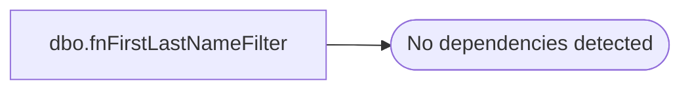

# dbo.fnFirstLastNameFilter

**Database:** dw  
**Server:** papamart  
**Function Type:** Scalar Function  
**Returns:** varchar(1)  

## Architecture Diagram



## Parameters

| Parameter | Data Type | Max Length | Is Output |
|---|---|---|---|
| @FirstName | varchar | 100 | NO |
| @LastName | varchar | 100 | NO |

## Table Dependencies

_No table dependencies detected._

## Function Code

```sql
CREATE function [dbo].[fnFirstLastNameFilter](
	@FirstName varchar(100), @LastName varchar(100))
returns varchar(1)
as
begin

/*
You can get tied down in the details here, but the current thrust is that we want to get down
to the guest/individual level.  "Grandma & Grandpa Smith" or "from the Class of '98" are not individuals.

The naughty name portion below is obvious.  We don't want to propagate porn even though at 
this time, 10/08/2008, we are mainly mailing from CRM/loyalty.  This function could also be used
to flag those names though.

The main thought in this function is that if we can't trust the lastname, then we also can't trust
the firstname.  There is no attempt to remove the offending characters.  In some instances, we could do that,
e.g., "Grandma Betty" could become "Betty" or "Lucy!" could be "Lucy".  I'll leave that to a future author 
because you can quickly hit a point of diminishing returns.  If they can't enter their name correctly, what
are the odds that any other data they entered is accurate?

*/

declare @ErrCode varchar(1)

set @LastName = rtrim(ltrim(@LastName))
set @FirstName = rtrim(ltrim(@FirstName))

declare @i int
set @i = 0

while (@i < 10)
begin
	set @LastName = replace(@LastName, '  ',' ') 
	set @FirstName = replace(@FirstName, '  ',' ')
	set @i = @i + 1
end

set @LastName = replace(@LastName, ''' ','''')
set @LastName = replace(@LastName, ' ''','''')
set @LastName = replace(@LastName, ' -','-')
set @LastName = replace(@LastName, '- ','-')

set @FirstName = replace(@FirstName, ''' ','''')
set @FirstName = replace(@FirstName, ' ''','''')
set @FirstName = replace(@FirstName, ' -','-')
set @FirstName = replace(@FirstName, '- ','-')

set @LastName = 
	case when 
			@LastName like '%, jr'
			or @LastName like '%, jr.'
			or @LastName like '%, sr' 
			or @LastName like '%, sr.' 
			or @LastName like '%, ii%' 
			or @LastName like '%, iv' 
			then replace(@LastName, ', ', ' ')
		else @LastName
	end

set @FirstName = 
	case when 
			@FirstName like '%, jr'
			or @FirstName like '%, jr.'
			or @FirstName like '%, sr' 
			or @FirstName like '%, sr.' 
			or @FirstName like '%, ii%' 
			or @FirstName like '%, iv' 
			then replace(@FirstName, ', ', ' ')
		else @FirstName
	end

-- set @LastName = replace(@LastName, 'st. ','st ') where @LastName like 'st. %'
-- set @LastName = replace(@LastName, 'jr.','jr') where @LastName like '%jr.%'

-- select * from #@LastNames where @LastName like '% sr'
-- select * from #@LastNames where @LastName like '% jr'
-- select * from #@LastNames where @LastName like '% iii'
-- select * from #@LastNames where @LastName like '% iv'
-- select * from #@LastNames where @LastName like '% v'
-- select * from #@LastNames where @LastName like '% vi'

-- -- mc names
-- set @LastName = replace(@LastName, 'Mc ','Mc') where @LastName like 'mc %'
-- set @LastName = replace(@LastName, '-Mc ','-Mc') where @LastName like '%-mc %'
-- set @LastName = replace(@LastName, 'Mac ','Mac') where @LastName like 'Mac %'


-- naughty names
if
		@FirstName like '%penis %' or @LastName like '%penis %' 
	or @FirstName like '% penis%' or @LastName like '% penis%'
	or @FirstName like '% slut%' or @LastName like '% slut%'
	or @FirstName like '%slut %' or @LastName like '%slut %'
	or @FirstName like '%sluts %' or @LastName like '%sluts %'
	or @FirstName like '% sluts%' or @LastName like '% sluts%'
	or @FirstName like '%whore %' or @LastName like '%whore %'
	or @FirstName like '% whore%' or @LastName like '% whore%'
	or @FirstName like '%whores %' or @LastName like '%whores %'
	or @FirstName like '% whores%' or @LastName like '% whores%'
	or @FirstName like '%faggot %' or @LastName like '%faggot %'
	or @FirstName like '% faggot%' or @LastName like '% faggot%'
	or @FirstName like '%cunt %' or @LastName like '%cunt %'
	or @FirstName like '% cunt%' or @LastName like '% cunt%'	--DE CUNTO
	-- or @FirstName like '%cock %' or @LastName like '%cock %'	-- hancock?
	-- or @FirstName like '% cock%' or @LastName like '% cock%'	-- cockwell
	or @FirstName like '%pussy %' or @LastName like '%pussy %'
	or @FirstName like '% pussy%' or @LastName like '% pussy%'
	-- or @FirstName like '%ass %' or @LastName like '%ass %' -- lot's of hits on class which we will get below
	-- or @FirstName like '% ass%' or @LastName like '% ass%'
	or @FirstName like '%asshole %' or @LastName like '%asshole %'
	or @FirstName like '% asshole%' or @LastName like '% asshole%'
	or @FirstName like '%asshole%' or @LastName like '%asshole%'
	or @FirstName like '%shit %' or @LastName like '%shit %'
	or @FirstName like '% shit%' or @LastName like '% shit%'
	or @FirstName like '%douche %' or @LastName like '%douche %'
	or @FirstName like '% douche%' or @LastName like '% douche%'
	or @FirstName like '%vagina %' or @LastName like '%vagina %'
	or @FirstName like '% vagina%' or @LastName like '% vagina%'
	or @FirstName like '%fuck %' or @LastName like '%fuck %'
	or @FirstName like '% fuck%' or @LastName like '% fuck%'
	or @FirstName like '%fucker %' or @LastName like '%fucker %'
	or @FirstName like '% fucker%' or @LastName like '% fucker%'
	or @FirstName like '%fuuck %' or @LastName like '%fuuck %'
	or @FirstName like '% fuuck%' or @LastName like '% fuuck%'
	or @FirstName like '%fukin %' or @LastName like '%fukin %' 
	or @FirstName like '% fukin%' or @LastName like '% fukin%'
	or @FirstName like '%motherfucker %' or @LastName like '%motherfucker %' 
	or @FirstName like '% motherfucker%' or @LastName like '% motherfucker%'
	or @FirstName like '%motherfucka %' or @LastName like '%motherfucka %' 
	or @FirstName like '% motherfuck%' or @LastName like '% motherfucka%'
	or @FirstName like '%niggah %' or @LastName like '%niggah %'
	or @FirstName like '% niggah%' or @LastName like '% niggah%'
	or @FirstName like '%nigger %' or @LastName like '%nigger %'
	or @FirstName like '% nigger%' or @LastName like '% nigger%'
	or @FirstName like '%nigga %' or @LastName like '%nigga %'
	or @FirstName like '% nigga%' or @LastName like '% nigga%'
	or @FirstName like '%sex %' or @LastName like '%sex %'
	or @FirstName like '% sex%' or @LastName like '% sex%'
	or @FirstName like '%sexy %' or @LastName like '%sexy %'
	or @FirstName like '% sexy%' or @LastName like '% sexy%'
	or @FirstName like '%prick %' or @LastName like '%prick %'
	or @FirstName like '% prick%' or @LastName like '% prick%'
	or @FirstName like '%damn %' or @LastName like '%damn %'
	or @FirstName like '% damn%' or @LastName like '% damn%'
	-- or @FirstName like '%hell %' or @LastName like '%hell %'  -- too problematic, mitchell, shell
	-- or @FirstName like '% hell%' or @LastName like '% hell%'  -- too problematic
	or @FirstName like '%bitch %' or @LastName like '%bitch %'
	or @FirstName like '% bitch%' or @LastName like '% bitch%'
	or @FirstName like '%bitches %' or @LastName like '%bitches %'
	or @FirstName like '% bitches%' or @LastName like '% bitches%'
	or @FirstName like '%breasts %' or @LastName like '%breasts %'
	or @FirstName like '% breasts%' or @LastName like '% breasts%'
	or @FirstName like '%Dr Love%' or @LastName like '%Dr Love%'
	or @FirstName like '%jackass%' or @LastName like '%jackass%'

-- uk - don't seem to get many hits, maybe they are more polite
	or @FirstName like '%wanker %' or @LastName like '%wanker %'
	or @FirstName like '% wanker%' or @LastName like '% wanker%'
	or @FirstName like '%knobend %' or @LastName like '%knobend %'
	or @FirstName like '% knobend%' or @LastName like '% knobend%'
	or @FirstName like '%Toss%pot %' or @LastName like '%Toss%pot %'
	or @FirstName like '% Toss pot%' or @LastName like '% Toss pot%'
	or @FirstName like '%fucktard %' or @LastName like '%fucktard %'
	or @FirstName like '% fucktard%' or @LastName like '% fucktard%'
	or @FirstName like '%bell-end %' or @LastName like '%bell-end %'
	or @FirstName like '% bell-end%' or @LastName like '% bell-end%'
	or @FirstName like '%bellend %' or @LastName like '%bellend %'
	or @FirstName like '% bellend%' or @LastName like '% bellend%'
	or @FirstName like '%knobhead %' or @LastName like '%knobhead %'
	or @FirstName like '% knobhead%' or @LastName like '% knobhead%'
	or @FirstName like '%bugger %' or @LastName like '%bugger %'
	or @FirstName like '% bugger%' or @LastName like '% bugger%'
	or @FirstName like '%bloody %' or @LastName like '%bloody %'
	or @FirstName like '% bloody%' or @LastName like '% bloody%'
	-- or @FirstName like '%bloody%' or @LastName like '%bloody%'
	or @FirstName like '%piss %' or @LastName like '%piss %'
	or @FirstName like '% piss%' or @LastName like '% piss%'
	or @FirstName like '%shite %' or @LastName like '%shite %'
	or @FirstName like '% shite%' or @LastName like '% shite%'
	or @FirstName like '%arse %' or @LastName like '%arse %'
	or @FirstName like '% arse%' or @LastName like '% arse%'
	or @FirstName like '%bollocks %' or @LastName like '%bollocks %'
	or @FirstName like '% bollocks%' or @LastName like '% bollocks%'
	or @FirstName like '%bollocks%' or @LastName like '%bollocks%'
--	or @FirstName like '%arsehole %' or @LastName like '%arsehole %'
--	or @FirstName like '% arsehole%' or @LastName like '% arsehole%'
	or @FirstName like '%arsehole%' or @LastName like '%arsehole%'  -- this should cover it

	set @ErrCode = 'X' -- porn

-- innocent names, but too generic
else if
	@FirstName like '%xxx%' or @LastName like '%xxx%' -- hugs
	or @FirstName like '%ooo%' or @LastName like '%ooo%' -- kisses
	or @FirstName like '%girls%' or @LastName like '%girls%'
	or @FirstName like 'from %' or @LastName like 'from %'
	or @FirstName like '% class%' or @LastName like '% class%'
--	or @FirstName like '%mom %' or @LastName like '%mom %'
--	or @FirstName like '%mommy%' or @LastName like '%mommy%'
--	or @FirstName like '%mummy%' or @LastName like '%mummy%'
--	or @FirstName like '%daddy%' or @LastName like '%daddy%'
--	or @FirstName like '%pappy%' or @LastName like '%pappy%'
	or @FirstName like '%love %' or @LastName like '%love %'
	or @FirstName like '%loves%' or @LastName like '%loves%'
	or @FirstName like '%lovers%' or @LastName like '%lovers%'
	or @FirstName like '%love you%' or @LastName like '%love you%'
	or @FirstName like '% of %' or @LastName like '% of %'
	or @FirstName like '% are %' or @LastName like '% are %'
	or @FirstName like 'are %' or @LastName like 'are %'
--	or @FirstName like 'grammy%' or @LastName like 'grammy%'
--	or @FirstName like 'grandma%' or @LastName like 'grandma%'
--	or @FirstName like 'grand ma%' or @LastName like 'grand ma%'
--	or @FirstName like 'grandmo%' or @LastName like 'grandmo%'
--	or @FirstName like 'granddad%' or @LastName like 'granddad%'
--	or @FirstName like 'grandad%' or @LastName like 'grandad%'
--	or @FirstName like 'grandpa%' or @LastName like 'grandpa%'
--	or @FirstName like 'grand pa%' or @LastName like 'grand pa%'
	or @FirstName like 'grandchildren%' or @LastName like 'grandchildren%'
	or @FirstName like 'grandkids%' or @LastName like 'grandkids%'
	or @FirstName like 'grand kids%' or @LastName like 'grand kids%'
--	or @FirstName like 'aunt%' or @LastName like 'aunt%'
--	or @FirstName like '%uncle%' or @LastName like '%uncle%'
	or @FirstName like '%with %' or @LastName like '%with %'
	or @FirstName like '% and %' or @LastName like '% and %'
	or @FirstName like '% y %' or @LastName like '% y %'
	or @FirstName like '% and'
	or @LastName like 'and %'

-- new 2008/10/31
	or @FirstName like '%school %' or @LastName like '%school %'
	or @FirstName like '% school%' or @LastName like '% school%'
	or @FirstName like '%church %' or @LastName like '%church %'
	or @FirstName like '% church%' or @LastName like '% church%'
	or @FirstName like '%troop %' or @LastName like '%troop %'
	or @FirstName like '% troop%' or @LastName like '% troop%'
	or @FirstName like '%center %' or @LastName like '%center %'
	or @FirstName like '% center%' or @LastName like '% center%'

	or @FirstName like '% en %' or @LastName like '% en %'
	or @FirstName like '% & %' or @LastName like '% & %'
	or @FirstName like '%&%' -- looks like they continue on to the lastname field
	-- allow commas if they just appear at the end
	or (@FirstName like '%,%' and charindex(',',@FirstName) != len(@FirstName)) or (@LastName like '%,%' and charindex(',',@LastName) != len(@LastName))
	or @FirstName like '%/%' 

-- added 2009/03/12
	or @FirstName like 'the %' or @LastName like 'the %'
	or @FirstName like '% clan' or @LastName like '% clan'
	or @LastName like '% fam'
	or @FirstName like 'the'
	or @FirstName like '% family%' or @LastName like '% family%'  or @LastName = 'family'

	or @FirstName like 'your%'
	or @FirstName like 'big%'
	or @FirstName like 'lil %'
	or @FirstName like 'little %'
	or @FirstName like 'little %'
	or @FirstName like '%boys%'

	or @LastName like 'big %'
	or @LastName like 'lil %'
	or @LastName like 'little %'
	or len(@LastName) = 1
	or (len(@LastName) = 2 and patindex('%[^a-z]%', @LastName) > 0)

		set @ErrCode = 'P' -- general problem

-- special characters or numbers that aren't hypens, ticks, spaces, or periods (initials)
-- if there is only one special char, then remove it?
	else if
 		(patindex('%[^ a-z]%', @LastName) > 0 and substring(@LastName, patindex('%[^ a-z]%', @LastName),1) not in ('-','''','.'))
		or (patindex('%[^ a-z]%', @FirstName) > 0 and substring(@FirstName, patindex('%[^ a-z]%', @FirstName),1) not in ('-','''','.'))

		set @ErrCode = 'S' -- special characters

	else
		set @ErrCode = '' -- lookin' good
		
RETURN @ErrCode
END
```

