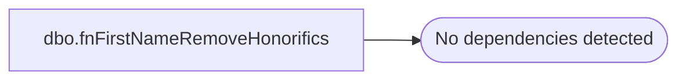

# dbo.fnFirstNameRemoveHonorifics

**Database:** dw  
**Server:** papamart  
**Function Type:** Scalar Function  
**Returns:** varchar(50)  

## Architecture Diagram



## Parameters

| Parameter | Data Type | Max Length | Is Output |
|---|---|---|---|
| @FirstName | varchar | 50 | NO |

## Table Dependencies

_No table dependencies detected._

## Function Code

```sql
CREATE function [dbo].[fnFirstNameRemoveHonorifics](@FirstName varchar(50))
returns varchar(50)
as
begin

-- select dw.dbo.fnFirstNameRemoveHonorifics ('ma ma      jones')
--declare @FirstName varchar(50)
--set @FirstName = 'ma ma      jones'
/*
in order to match better, remove the honorifics off of the front of the name.
*/

declare @new_FirstName varchar(50)

set @new_FirstName = 
	case 
		when @FirstName like 'Aunt %' then substring(@FirstName, len('Aunt ')+2,999) when @FirstName = 'Aunt' then null
		when @FirstName like 'Aunte %' then substring(@FirstName, len('Aunte ')+2,999) when @FirstName = 'Aunte' then null
		when @FirstName like 'Auntie %' then substring(@FirstName, len('Auntie ')+2,999) when @FirstName = 'Auntie' then null
		when @FirstName like 'Aunty %' then substring(@FirstName, len('Aunty ')+2,999) when @FirstName = 'Aunty' then null

		when @FirstName like 'Uncle %' then substring(@FirstName, len('Uncle ')+2,999) when @FirstName = 'Uncle' then null
		when @FirstName like 'Unkie %' then substring(@FirstName, len('Unkie ')+2,999) when @FirstName = 'Unkie' then null

		when @FirstName like 'Ma Ma %' then substring(@FirstName, len('Ma Ma ')+2,999) when @FirstName = 'Ma Ma' then null
		when @FirstName like 'Mom %' then substring(@FirstName, len('Mom ')+2,999) when @FirstName = 'Mom' then null
		when @FirstName like 'Momma %' then substring(@FirstName, len('Momma ')+2,999) when @FirstName = 'Momma' then null
		when @FirstName like 'Mommy %' then substring(@FirstName, len('Mommy ')+2,999) when @FirstName = 'Mommy' then null
		when @FirstName like 'Ma %' then substring(@FirstName, len('Ma ')+2,999) when @FirstName = 'Ma' then null
		when @FirstName like 'Mommie %' then substring(@FirstName, len('Mommie ')+2,999) when @FirstName = 'Mommie' then null
		when @FirstName like 'Mamaw %' then substring(@FirstName, len('Mamaw ')+2,999) when @FirstName = 'Mamaw' then null
		when @FirstName like 'Mum %' then substring(@FirstName, len('Mum ')+2,999) when @FirstName = 'Mum' then null
		when @FirstName like 'Mummie %' then substring(@FirstName, len('Mummie ')+2,999) when @FirstName = 'Mummie' then null
		when @FirstName like 'mother %' then substring(@FirstName, len('mother ')+2,999) when @FirstName = 'mother' then null

		when @FirstName like 'Dad %' then substring(@FirstName, len('Dad ')+2,999) when @FirstName = 'Dad' then null
		when @FirstName like 'Daddy %' then substring(@FirstName, len('Daddy ')+2,999) when @FirstName = 'Daddy' then null
		when @FirstName like 'Papa %' then substring(@FirstName, len('Papa ')+2,999) when @FirstName = 'Papa' then null
		when @FirstName like 'Dad %' then substring(@FirstName, len('Dad ')+2,999) when @FirstName = 'Dad' then null
		when @FirstName like 'Pops %' then substring(@FirstName, len('Pops ')+2,999) when @FirstName = 'Pops' then null
		when @FirstName like 'father %' then substring(@FirstName, len('father ')+2,999) when @FirstName = 'father' then null

		when @FirstName like 'Grandma %' then substring(@FirstName, len('Grandma ')+2,999) when @FirstName = 'Grandma' then null
		when @FirstName like 'Grandpa %' then substring(@FirstName, len('Grandpa ')+2,999) when @FirstName = 'Grandpa' then null
		when @FirstName like 'Granny %' then substring(@FirstName, len('Granny ')+2,999) when @FirstName = 'Granny' then null
		when @FirstName like 'Grammy %' then substring(@FirstName, len('Grammy ')+2,999) when @FirstName = 'Grammy' then null
		when @FirstName like 'Grand %' then substring(@FirstName, len('Grand ')+2,999) when @FirstName = 'Grand' then null
		when @FirstName like 'Grammie %' then substring(@FirstName, len('Grammie ')+2,999) when @FirstName = 'Grammie' then null
		when @FirstName like 'Gram %' then substring(@FirstName, len('Gram ')+2,999) when @FirstName = 'Gram' then null
		when @FirstName like 'Gramma %' then substring(@FirstName, len('Gramma ')+2,999) when @FirstName = 'Gramma' then null

		when @FirstName like 'Grama %' then substring(@FirstName, len('Grama ')+2,999) when @FirstName = 'Grama' then null
		when @FirstName like 'Gramma %' then substring(@FirstName, len('Gramma ')+2,999) when @FirstName = 'Gramma' then null
		when @FirstName like 'Grammie %' then substring(@FirstName, len('Grammie ')+2,999) when @FirstName = 'Grammie' then null
		when @FirstName like 'Grammy %' then substring(@FirstName, len('Grammy ')+2,999) when @FirstName = 'Grammy' then null
		when @FirstName like 'Grampa %' then substring(@FirstName, len('Grampa ')+2,999) when @FirstName = 'Grampa' then null

		when @FirstName like 'Grana %' then substring(@FirstName, len('Grana ')+2,999) when @FirstName = 'Grana' then null
		when @FirstName like 'Grand %' then substring(@FirstName, len('Grand ')+2,999) when @FirstName = 'Grand' then null
		when @FirstName like 'Grandama %' then substring(@FirstName, len('Grandama ')+2,999) when @FirstName = 'Grandama' then null
		when @FirstName like 'Grandma %' then substring(@FirstName, len('Grandma ')+2,999) when @FirstName = 'Grandma' then null
		when @FirstName like 'Grandmaand %' then substring(@FirstName, len('Grandmaand ')+2,999) when @FirstName = 'Grandmaand' then null

		when @FirstName like 'Grandmama %' then substring(@FirstName, len('Grandmama ')+2,999) when @FirstName = 'Grandmama' then null
		when @FirstName like 'Grandmom %' then substring(@FirstName, len('Grandmom ')+2,999) when @FirstName = 'Grandmom' then null
		when @FirstName like 'Grandmommy %' then substring(@FirstName, len('Grandmommy ')+2,999) when @FirstName = 'Grandmommy' then null
		when @FirstName like 'Grandmother %' then substring(@FirstName, len('Grandmother ')+2,999) when @FirstName = 'Grandmother' then null
		when @FirstName like 'Grandpa %' then substring(@FirstName, len('Grandpa ')+2,999) when @FirstName = 'Grandpa' then null

		when @FirstName like 'Grandpop %' then substring(@FirstName, len('Grandpop ')+2,999) when @FirstName = 'Grandpop' then null
		when @FirstName like 'Grannie %' then substring(@FirstName, len('Grannie ')+2,999) when @FirstName = 'Grannie' then null
		when @FirstName like 'Granny %' then substring(@FirstName, len('Granny ')+2,999) when @FirstName = 'Granny' then null
		when @FirstName like 'G''ma %' then substring(@FirstName, len('G''ma ')+2,999) when @FirstName = 'G''ma' then null
		when @FirstName like 'G-Ma %' then substring(@FirstName, len('G-Ma ')+2,999) when @FirstName = 'G-Ma' then null
		when @FirstName like 'G-Mommie %' then substring(@FirstName, len('G-Mommie ')+2,999) when @FirstName = 'G-Mommie' then null

		when @FirstName like 'Mr %' then substring(@FirstName, len('Mr ')+2,999) when @FirstName = 'Mr' then null
		when @FirstName like 'Mr. %' then substring(@FirstName, len('Mr. ')+2,999) when @FirstName = 'Mr.' then null
		when @FirstName like 'Mrs %' then substring(@FirstName, len('Mrs ')+2,999) when @FirstName = 'Mrs' then null
		when @FirstName like 'Mrs. %' then substring(@FirstName, len('Mrs. ')+2,999) when @FirstName = 'Mrs.' then null
		when @FirstName like 'Ms %' then substring(@FirstName, len('Ms ')+2,999) when @FirstName = 'Ms' then null
		when @FirstName like 'Ms. %' then substring(@FirstName, len('Ms. ')+2,999) when @FirstName = 'Ms.' then null
		when @FirstName like 'Miss %' then substring(@FirstName, len('Miss ')+2,999) when @FirstName = 'Miss' then null
		when @FirstName like 'Miss. %' then substring(@FirstName, len('Miss. ')+2,999) when @FirstName = 'Miss.' then null
		when @FirstName like 'Dr %' then substring(@FirstName, len('Dr ')+2,999) when @FirstName = 'Dr' then null
		when @FirstName like 'Dr. %' then substring(@FirstName, len('Dr. ')+2,999) when @FirstName = 'Dr.' then null
		when @FirstName like 'Doctor %' then substring(@FirstName, len('Doctor ')+2,999) when @FirstName = 'Doctor' then null
		when @FirstName like 'doc %' then substring(@FirstName, len('doc ')+2,999) when @FirstName = 'doc' then null
		when @FirstName like 'general %' then substring(@FirstName, len('general ')+2,999) when @FirstName = 'general' then null
		when @FirstName like 'gen %' then substring(@FirstName, len('gen ')+2,999) when @FirstName = 'gen' then null
		when @FirstName like 'lady %' then substring(@FirstName, len('lady ')+2,999) when @FirstName = 'lady' then null

		-- qas has problems with honorifics in cleansing.  it will not do the match if they are there
		-- it also has problems with initials, are is it just when there is one character - need to test
		-- it also has problems with nulls in the first name, might have to fake it out by inserting nonsense
		when @FirstName like 'jr %' then substring(@FirstName, len('jr ')+2,999) when @FirstName = 'jr' then null
		when @FirstName like 'sr %' then substring(@FirstName, len('sr ')+2,999) when @FirstName = 'sr' then null
		when @FirstName like 'junior %' then substring(@FirstName, len('junior ')+2,999) when @FirstName = 'junior' then null
		when @FirstName like 'bishop %' then substring(@FirstName, len('bishop ')+2,999) when @FirstName = 'bishop' then null
		when @FirstName like 'gunner %' then substring(@FirstName, len('gunner ')+2,999) when @FirstName = 'gunner' then null
		when @FirstName like 'canon %' then substring(@FirstName, len('canon ')+2,999) when @FirstName = 'canon' then null
		when @FirstName like 'canon %' then substring(@FirstName, len('canon ')+2,999) when @FirstName = 'canon' then null
		when @FirstName like 'saint %' then substring(@FirstName, len('saint ')+2,999) when @FirstName = 'saint' then null
		when @FirstName like 'St. %' then substring(@FirstName, len('St. ')+2,999) when @FirstName = 'St.' then null
		when @FirstName like 'Contessa %' then substring(@FirstName, len('Contessa ')+2,999) when @FirstName = 'Contessa' then null

		when @FirstName like 'Major %' then substring(@FirstName, len('Major ')+2,999) when @FirstName = 'Major' then null
		when @FirstName like 'Marquis %' then substring(@FirstName, len('Marquis ')+2,999) when @FirstName = 'Marquis' then null
		when @FirstName like 'Marquise %' then substring(@FirstName, len('Marquise ')+2,999) when @FirstName = 'Marquise' then null
		when @FirstName like 'sister %' then substring(@FirstName, len('sister ')+2,999) when @FirstName = 'sister' then null

		when @FirstName = 'family' then null

		when len(@FirstName) = 1 or (len(@FirstName) = 2 and patindex('%[^a-z]%', @FirstName) > 0) then null

		else @FirstName
	end
	
RETURN ltrim(@new_FirstName)
END
```

