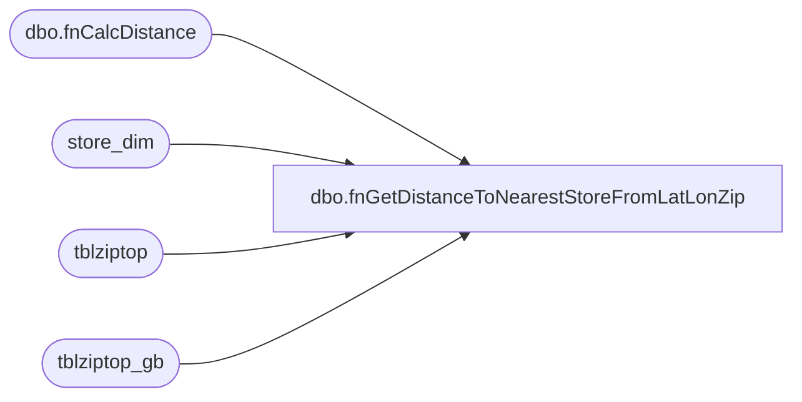

# dbo.fnGetDistanceToNearestStoreFromLatLonZip

**Database:** dw  
**Server:** papamart  
**Function Type:** Scalar Function  
**Returns:** float(8)  

## Architecture Diagram



## Parameters

| Parameter | Data Type | Max Length | Is Output |
|---|---|---|---|
| @Lat | real | 4 | NO |
| @Lon | real | 4 | NO |
| @Date | datetime | 8 | NO |
| @Zip | varchar | 10 | NO |

## Table Dependencies

| Referenced Table |
|---|
| dbo.fnCalcDistance |
| store_dim |
| tblziptop |
| tblziptop_gb |

## Function Code

```sql
CREATE function [dbo].[fnGetDistanceToNearestStoreFromLatLonZip](
	@Lat float(15), @Lon float(15), @Date datetime, @Zip varchar(10))
	returns float
AS

BEGIN

/*
declare @Lat float(15)
declare @Lon float(15)
declare @Date datetime
declare @Zip varchar(10)

set @Lat = 57.142622000000003
set @Lon = -2.116825
set @Date = getdate()
set @zip = 'AB10 1JS'
*/

DECLARE @dist float

-- US 
IF ISNUMERIC(Substring(@Zip,1,3)) = 1
BEGIN
	select @dist =
	(select top 1 dw.dbo.fnCalcDistance(@Lat, @Lon, s.latitude, s.longitude)
	from store_dim s 
	where s.store_id > 0 and s.store_id < 400 and s.store_id not in (0, 8, 17, 13, 136, 155, 179, 180, 209, 212, 242, 272, 1513)
		and s.Opening_Date <= @Date
		and (s.Closing_date > @Date or s.Closing_date is NULL)
		and store_id in (select istore from tblziptop where szip = @Zip)
	order by dw.dbo.fnCalcDistance(@Lat, @Lon, s.latitude, s.longitude) asc
	)
END

-- CA
-- the last char in the zip should be numeric.
ELSE IF isnumeric(substring(@Zip,len(@Zip),1)) = 1
BEGIN
	SET @Zip = Substring(@Zip,1,3)  --will get top 3 stores based on FSA
	
	select @dist =
	(select top 1 dw.dbo.fnCalcDistance(@Lat, @Lon, s.latitude, s.longitude)
	from store_dim s 
	where s.store_id > 0 and s.store_id < 400 and s.store_id not in (0, 8, 17, 13, 136, 155, 179, 180, 209, 212, 242, 272, 1513)
		and s.Opening_Date <= @Date
		and (s.Closing_date > @Date or s.Closing_date is NULL)
		and store_id in (select istore from tblziptop where szip=@Zip)
	order by dw.dbo.fnCalcDistance(@Lat, @Lon, s.latitude, s.longitude) asc
	)
END	

-- UK/GB
-- the last char in the zip should always be alphabetic
ELSE IF isnumeric(substring(@Zip,len(@Zip),1)) = 0 and charindex(' ',@Zip) > 0
BEGIN
	SET @Zip = substring(@Zip, 1, charindex(' ',@Zip)-1)
	
	select @dist =
	(select top 1 dw.dbo.fnCalcDistance(@Lat, @Lon, s.latitude, s.longitude)
	from store_dim s 
	where s.store_id between 2000 and 2199 and s.store_id not in (2013)
		and s.Opening_Date <= @Date
		and (s.Closing_date > @Date or s.Closing_date is NULL)
		and store_id in (select istore from tblziptop_gb where szip=@Zip)
	order by dw.dbo.fnCalcDistance(@Lat, @Lon, s.latitude, s.longitude) asc
	)
END	
ELSE 
BEGIN
	set @dist = null
END

RETURN @dist
END
/*


CREATE         function [dbo].[fnGetDistanceToNearestStoreFromLatLonZip](
@Lat float(15), @Lon float(15), @Date datetime, @Zip varchar(10))
returns float
AS

BEGIN
DECLARE @dist float

IF ISNUMERIC(Substring(@Zip,1,3))=1 --US Zip

  BEGIN
	select @dist =
	(select 
	top 1
	dw.dbo.fnCalcDistance(@Lat, @Lon, s.latitude, s.longitude)
	from store_dim s 
	where s.store_id > 0 and s.store_id < 400 and s.store_id not in (0, 8, 17, 13, 136, 155, 179, 180, 209, 212, 242, 272,1513)
-- changed 	04/14/2007 	dlr
--	where s.store_id > 0 and s.store_id < 2000 and s.store_id not in (0, 8, 17, 13, 136, 155, 179, 180, 209, 212, 242, 470, 471, 473, 480, 482, 485, 486, 489, 950, 960, 975, 980, 990)
		and s.Opening_Date <= @Date
		and (s.Closing_date > @Date or s.Closing_date is NULL)
		and store_id in (select istore from tblziptop where szip=@Zip)
	order by dw.dbo.fnCalcDistance(@Lat, @Lon, s.latitude, s.longitude) asc
	
	)
	
  END
ELSE  --Canada Postal Code
  BEGIN
	SET @Zip = Substring(@Zip,1,3)  --will get top 3 stores based on FSA

	select @dist =
	(select 
	top 1
	dw.dbo.fnCalcDistance(@Lat, @Lon, s.latitude, s.longitude)
	from store_dim s 
	where s.store_id > 0 and s.store_id < 400 and s.store_id not in (0, 8, 17, 13, 136, 155, 179, 180, 209, 212, 242, 272,1513)
-- changed 	04/14/2007 	dlr
--	where s.store_id > 0 and s.store_id < 2000 and s.store_id not in (0, 8, 17, 13, 136, 155, 179, 180, 209, 212, 242, 470, 471, 473, 480, 482, 485, 486, 489, 950, 960, 975, 980, 990)
		and s.Opening_Date <= @Date
		and (s.Closing_date > @Date or s.Closing_date is NULL)
		and store_id in (select istore from tblziptop where szip=@Zip)
	order by dw.dbo.fnCalcDistance(@Lat, @Lon, s.latitude, s.longitude) asc
	
	)
  END	
RETURN @dist
END
---------------------------------------------------------------------------------------------------------------------------------------------------
*/
```

