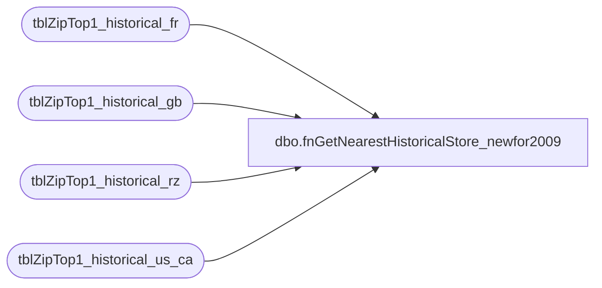

# dbo.fnGetNearestHistoricalStore_newfor2009

**Database:** dw  
**Server:** papamart  
**Function Type:** Scalar Function  
**Returns:** int(4)  

## Architecture Diagram



## Parameters

| Parameter | Data Type | Max Length | Is Output |
|---|---|---|---|
| @Country | char | 2 | NO |
| @postal_code | varchar | 10 | NO |
| @date_key | int | 4 | NO |
| @RZ | bit | 1 | NO |

## Table Dependencies

| Referenced Table |
|---|
| tblZipTop1_historical_fr |
| tblZipTop1_historical_gb |
| tblZipTop1_historical_rz |
| tblZipTop1_historical_us_ca |

## Function Code

```sql
create function [dbo].[fnGetNearestHistoricalStore_newfor2009](@Country char(2), @postal_code varchar(10), @date_key int, @RZ bit)
returns int
AS
BEGIN

declare @store_key int
--declare @historical_date_key int

--declare @country char(2)
--declare @postal_code char(10)
--declare @date_key int
--declare @RZ bit
--
--set @country='US'
--set @postal_code='62220'
--set @date_key=4000
--set @RZ=1

-- US
if @RZ = 0
begin
	if @country in ('US', 'USA', 'PR')
	begin
		set @postal_code = substring(@postal_code,1,5)  -- had a problem with the process including the plus4 on the zip in address_dim, especially, Puerto Rico

		select @store_key = (
			select top 1 store_key
			from tblZipTop1_historical_us_ca
			where date_key < @date_key
				and postal_code = @postal_code
			order by date_key desc
		)
		
--		set @historical_date_key = (
--			select max(date_key) from tblZipTop1_historical_us_ca
--			where date_key <= @date_key
--		)
--
--		select @store_key = store_Key
--		from tblZipTop1_historical_us_ca
--		where date_key = @historical_date_key
--			and postal_code = @postal_code

	end

	--Canada
	else if @country in ('CA', 'CAN')
	begin

		set @postal_code = substring(@postal_code,1,3)  --based on FSA

		select @store_key = (
			select top 1 store_key
			from tblZipTop1_historical_us_ca
			where date_key < @date_key
				and postal_code = @postal_code
			order by date_key desc
		)

--		set @historical_date_key = (
--			select max(date_key) from tblZipTop1_historical_us_ca
--			where date_key <= @date_key
--		)
--
--		select @store_key = store_Key
--		from tblZipTop1_historical_us_ca
--		where date_key = @historical_date_key
--			and postal_code = @postal_code
	end


	-- UK/GB
	else if @country in ('GB', 'GBR')
	begin
		if charindex(' ',@postal_code) > 0 
		begin
			set @postal_code = substring(@postal_code, 1, charindex(' ',@postal_code)-1)
		end

		select @store_key = (
			select top 1 store_key
			from tblZipTop1_historical_gb
			where date_key < @date_key
				and postal_code = @postal_code
			order by date_key desc
		)

--		set @historical_date_key = (
--			select max(date_key) from tblZipTop1_historical_gb
--			where date_key <= @date_key
--		)
--
--		select @store_key = store_Key
--		from tblZipTop1_historical_gb
--		where date_key = @historical_date_key
--			and postal_code = @postal_code
	end

	-- France
	else if @country in ('FR', 'FRA')
	begin
		select @store_key = (
			select top 1 store_key
			from tblZipTop1_historical_fr
			where date_key < @date_key
				and postal_code = @postal_code
			order by date_key desc
		)

--		set @historical_date_key = (
--			select max(date_key) from tblZipTop1_historical_fr
--			where date_key <= @date_key
--		)
--
--		select @store_key = store_Key
--		from tblZipTop1_historical_fr
--		where date_key = @historical_date_key
--			and postal_code = @postal_code

	end
	else
	begin
		select @store_key=null
	end
end
else
begin
	if @country in ('US', 'USA', 'PR')
	begin
		set @postal_code = substring(@postal_code,1,5)  -- had a problem with the process including the plus4 on the zip in address_dim, especially, Puerto Rico
		
		select @store_key = (
			select top 1 store_key
			from tblZipTop1_historical_rz
			where date_key < @date_key
				and postal_code = @postal_code
			order by date_key desc
		)

--		set @historical_date_key = (
--			select max(date_key) from tblZipTop1_historical_rz
--			where date_key <= @date_key
--		)
--
--		select @store_key = store_Key
--		from tblZipTop1_historical_rz
--		where date_key = @historical_date_key
--			and postal_code = @postal_code

	end

	--Canada
	else if @country in ('CA', 'CAN')
	begin
		set @postal_code = substring(@postal_code,1,3)  --based on FSA

		select @store_key = (
			select top 1 store_key
			from tblZipTop1_historical_rz
			where date_key < @date_key
				and postal_code = @postal_code
			order by date_key desc
		)

--		set @historical_date_key = (
--			select max(date_key) from tblZipTop1_historical_rz
--			where date_key <= @date_key
--		)
--
--		select @store_key = store_Key
--		from tblZipTop1_historical_rz
--		where date_key = @historical_date_key
--			and postal_code = @postal_code

	end
	else
	begin
		select @store_key=null
	end
end

RETURN @store_key
END
```

