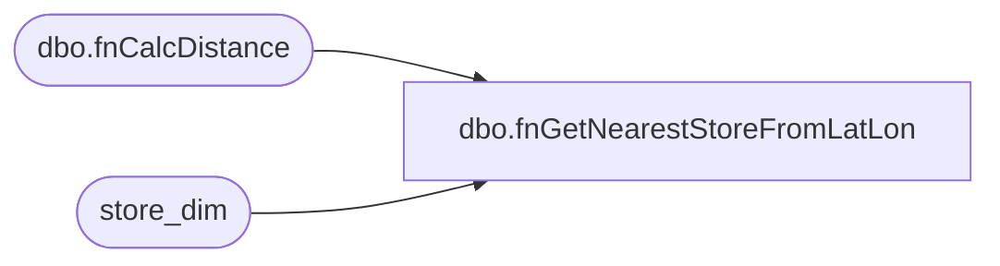

# dbo.fnGetNearestStoreFromLatLon

**Database:** dw  
**Server:** papamart  
**Function Type:** Scalar Function  
**Returns:** int(4)  

## Architecture Diagram



## Parameters

| Parameter | Data Type | Max Length | Is Output |
|---|---|---|---|
| @Lat | real | 4 | NO |
| @Lon | real | 4 | NO |
| @Today | datetime | 8 | NO |

## Table Dependencies

| Referenced Table |
|---|
| dbo.fnCalcDistance |
| store_dim |

## Function Code

```sql
CREATE function [dbo].[fnGetNearestStoreFromLatLon](
	@Lat float(15), @Lon float(15), @Today datetime)
returns int
AS
BEGIN

DECLARE @Store int
/*
declare @Lat float(15)
declare @Lon float(15)
declare @Today datetime

set @Lat = 57.142622000000003
set @Lon = -2.116825
set @Today = getdate()
*/

-- US/CA
if @lon not between -10 and 2
begin
	select @Store=s.store_Key
	from store_dim s 
	where 	s.store_id > 0 
		and s.store_id < 400 
		and s.store_id not in (0, 8, 17, 13, 136, 155, 179, 180, 209, 212, 242, 272, 1513)
		and s.Opening_Date <= @Today
		and (s.Closing_date > @Today or s.Closing_date is NULL)
		and abs((dw.dbo.fnCalcDistance(@Lat, @Lon, s.latitude, s.longitude)-
		    (select min(dw.dbo.fnCalcDistance(@Lat, @Lon, s.latitude, s.longitude))
			from store_dim s 
			where s.store_id > 0 and s.store_id < 400 and s.store_id not in (0, 8, 17, 13, 136, 155, 179, 180, 209, 212, 242, 272, 1513)
			    and s.Opening_Date <= @Today
				and (s.Closing_date > @Today or s.Closing_date is NULL)
			))) < 0.1
end
-- UK/GB
else
begin
	select @Store=s.store_Key
	from store_dim s 
	where s.store_id between 2000 and 2199 and s.store_id not in (2013)
		and s.Opening_Date <= @Today
		and (s.Closing_date > @Today or s.Closing_date is NULL)
		and abs((dw.dbo.fnCalcDistance(@Lat, @Lon, s.latitude, s.longitude)-
		    (select min(dw.dbo.fnCalcDistance(@Lat, @Lon, s.latitude, s.longitude))
			from store_dim s 
			where s.store_id between 2000 and 2199 and s.store_id not in (2013)
			    and s.Opening_Date <= @Today
				and (s.Closing_date > @Today or s.Closing_date is NULL)
			))) < 0.1
end

RETURN @Store
END
/*

CREATE        function [dbo].[fnGetNearestStoreFromLatLon](
@Lat float(15), @Lon float(15), @Today datetime)
returns int
AS
BEGIN
DECLARE @Store int


	select @Store=s.store_Key
	from store_dim s 
	where 	s.store_id > 0 
		and s.store_id < 400 
		and s.store_id not in (0, 8, 17, 13, 136, 155, 179, 180, 209, 212, 242, 272, 1513)
	-- changed 	04/14/2007 	dlr
	--where s.store_id > 0 and s.store_id < 2000 and s.store_id not in (0, 8, 17, 13, 136, 155, 179, 180, 209, 212, 242, 470, 471, 473, 480, 482, 485, 486, 489, 950, 960, 975, 980, 990)
		and s.Opening_Date <= @Today
		and (s.Closing_date > @Today or s.Closing_date is NULL)
		and abs((dw.dbo.fnCalcDistance(@Lat, @Lon, s.latitude, s.longitude)-
		    (select min(dw.dbo.fnCalcDistance(@Lat, @Lon, s.latitude, s.longitude))
			from store_dim s 
			where s.store_id > 0 and s.store_id < 400 and s.store_id not in (0, 8, 17, 13, 136, 155, 179, 180, 209, 212, 242, 272, 1513)
	-- changed 	04/14/2007 	dlr
	--		where s.store_id > 0 and s.store_id < 2000 and s.store_id not in (0, 8, 17, 13, 136, 155, 179, 180, 209, 212, 242, 470, 471, 473, 480, 482, 485, 486, 489, 950, 960, 975, 980, 990)
			    and s.Opening_Date <= @Today
				and (s.Closing_date > @Today or s.Closing_date is NULL)
			))) < 0.1

RETURN @Store
END
*/
```

