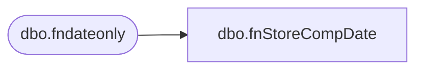

# dbo.fnStoreCompDate

**Database:** dw  
**Server:** papamart  
**Function Type:** Scalar Function  
**Returns:** datetime(8)  

## Architecture Diagram



## Parameters

| Parameter | Data Type | Max Length | Is Output |
|---|---|---|---|
| @StoreOpenDate | datetime | 8 | NO |

## Table Dependencies

| Referenced Table |
|---|
| dbo.fndateonly |

## Function Code

```sql
create function dbo.fnStoreCompDate (@StoreOpenDate datetime)
/*******************************************************
author: Funmi Agbebi
Date: 7/1/2008
Purpose: function to calculate Comp Date of a store 
---***************************************************/

RETURNS datetime
BEGIN
declare @compdate datetime
set @compdate = 
cast(cast(month(dateadd(mm,13,dbo.fndateonly(@StoreOpenDate))) as varchar(2)) + '/01/' + 
cast(year(dateadd(mm,13,dbo.fndateonly(@StoreOpenDate))) as varchar(4)) as datetime)
Return @compdate
End

dbo,fnRemoveASCIIChar,SQL_SCALAR_FUNCTION,-- =============================================
-- Author:		<Author,,Name>
-- Create date: <Create Date, ,>
-- Description:	<Description, ,>
-- =============================================
CREATE FUNCTION [dbo].[fnRemoveASCIIChar] (
	@in_string varchar(100),
	@flag bit)
returns varchar(100)
as
begin

/*
@flag
	0 - normal addresses
	1 - email addresses - do not remove the @ sign


*/

-- 
-- http://www.ascii-code.com/

-- slight risk on string lengths because some replacements will increase the lengths.
-- but, i decided not to risk it.  extending the length of the incoming string would be very very bad

-- not sure how to use the flag, initial thoughts were to use this to scrub emails also, so we would have to allow ampersands


--declare @in_string varchar(100)
--set @in_string = '125 Lantana DriveŠ`'
--
--select dbo.fnRemoveExtendedASCIICharacters ('125 ' + char(09) + 'Lantana DriveŠ`', 0)
--select charindex('Š', @in_string)

--select *
--from raw_addr_dim


--
--select PATINDEX('%[^a-z0-9. ]%', @in_string)
--
--
--select top 1000 PATINDEX('%[^a-z0-9. ]%', addr_ln_1_txt), *
----select count(*)
--from raw_addr_dim
--where PATINDEX('%[^a-z0-9.,"''-&?_# ]%', addr_ln_1_txt)>0
--	and drvd_cntry_abbrv = 'ca' and st_prvnc_txt in ('qc', 'quebec')
--	and (charindex('Š', addr_ln_2_txt) > 0
--		or charindex('š', addr_ln_2_txt) > 0
--		or charindex('Ÿ', addr_ln_2_txt) > 0
--		or charindex('Ý', addr_ln_2_txt) > 0
--		or charindex('ý', addr_ln_2_txt) > 0
--		or charindex('ÿ', addr_ln_2_txt) > 0)
----52257528
----1669296
----764965

--select PATINDEX('%[^!a-z0-9-.,&?_# ]%', '309-A  BOLT*ON  ŠDR')
--
---- only work on the string if there is something to do
--select PATINDEX('%[^!a-z0-9,&*''?._# ]%', '309.''   -A  B''OLT*ON  ŠDR')

--drop table fnRemoveASCIIChar_tbl
--CREATE TABLE fnRemoveASCIIChar_tbl (
--   LatinCol varchar(100) collate latin1_general_cs_as
--)

--insert into fnRemoveASCIIChar_tbl values (@in_string)


--DECLARE @ProductTotals TABLE 
--(  LatinCol varchar(100) collate latin1_general_cs_as)
--
--INSERT INTO @ProductTotals (LatinCol)
--SELECT @in_string


if (@in_string is not null and @in_string != '' and PATINDEX('%[^!abcdefghijklmnopqrstuvwxyz0123456789.,"''&_# ]%', @in_string) > 0)
begin 
	set @in_string = replace(@in_string, char(09), '') -- Horizontal Tab 
	set @in_string = replace(@in_string, char(10), '') -- Line feed 

	set @in_string = replace(@in_string, char(11), '') -- Vertical Tab 
	set @in_string = replace(@in_string, char(12), '') -- Form Feed 
	set @in_string = replace(@in_string, char(13), '') -- Carriage Return 

	if @flag != 1
	begin
		set @in_string = replace(@in_string, char(64), '') --@ At-sign 
	end

	set @in_string = replace(@in_string, char(92), '') --\ Backslash 
	set @in_string = replace(@in_string, char(94), '') --^ Caret - circumflex
	set @in_string = replace(@in_string, char(96), '') --` Grave accent

	set @in_string = replace(@in_string, char(127), '') -- Not defined  
	set @in_string = replace(@in_string, char(128), '') --€ Euro 
	set @in_string = replace(@in_string, char(129), '') --? Unknown 

	set @in_string = replace(@in_string, char(130), '') --‚ Single low-quote 
	set @in_string = replace(@in_string, char(131), '') --ƒ Function symbol (lowercase f with hook) 
	set @in_string = replace(@in_string, char(132), '') --„ Double low-quote 
	set @in_string = replace(@in_string, char(133), '') --… Elipsis 
	set @in_string = replace(@in_string, char(134), '') --† Dagger 
	set @in_string = replace(@in_string, char(135), '') --‡ Double dagger 
	set @in_string = replace(@in_string, char(136), '') --ˆ   Hatchek 
	set @in_string = replace(@in_string, char(137), '') --‰ Per million symbol 
	set @in_string = replace(@in_string, char(138), 'S') --Š Capital esh 
	set @in_string = replace(@in_string, char(139), '') --‹ Left single angle quote 

	--set @in_string = replace(@in_string, char(140), 'OE') --ΠOE ligature 
	set @in_string = replace(@in_string, char(140), '') --ΠOE ligature 
	set @in_string = replace(@in_string, char(141), '') --? Unknown 
	set @in_string = replace(@in_string, char(142), '') --Ž Capital ž 
	set @in_string = replace(@in_string, char(143), '') --? Unknown 
	set @in_string = replace(@in_string, char(144), '') --? Unknown 
	set @in_string = replace(@in_string, char(145), '') --‘ Left single-quote 
	set @in_string = replace(@in_string, char(146), '') --’ Right single-quote 
	set @in_string = replace(@in_string, char(147), '') --“ Left double-quote 
	set @in_string = replace(@in_string, char(148), '') --” Right double-quote 
	set @in_string = replace(@in_string, char(149), '') --• Small bullet 

	set @in_string = replace(@in_string, char(150), '') --– En dash 
	set @in_string = replace(@in_string, char(151), '') --— Em dash 
	set @in_string = replace(@in_string, char(152), '') --˜ Tilde 
	set @in_string = replace(@in_string, char(153), '') --™ Trademark 
	set @in_string = replace(@in_string, char(154), 's') --š Lowercase esh 
	set @in_string = replace(@in_string, char(155), '') --› Right single angle quote 
	set @in_string = replace(@in_string, char(156), '') --œ oe ligature 
	--set @in_string = replace(@in_string, char(156), 'oe') --œ oe ligature 
	set @in_string = replace(@in_string, char(157), '') --? Unknown 
	set @in_string = replace(@in_string, char(158), '') --ž Lowercase ž 
	set @in_string = replace(@in_string, char(159), 'Y') --Ÿ Uppercase y-umlaut 

	set @in_string = replace(@in_string, char(160), '') --  Non-breaking space 
	set @in_string = replace(@in_string, char(161), '!') --¡ Inverted exclamation point 
	set @in_string = replace(@in_string, char(162), '') --¢ Cent 
	set @in_string = replace(@in_string, char(163), 'L') --£ Pound currency sign 
	set @in_string = replace(@in_string, char(164), '') --¤ Currency sign 
	set @in_string = replace(@in_string, char(165), 'Y') --¥ Yen currency sign 
	set @in_string = replace(@in_string, char(166), '') --¦ Broken vertical bar 
	set @in_string = replace(@in_string, char(167), '') --§ Section symbol 
	set @in_string = replace(@in_string, char(168), '') --¨ Umlaut (Diaeresis) 
	set @in_string = replace(@in_string, char(169), 'C') --© Copyright 

	set @in_string = replace(@in_string, char(170), 'a') --ª Feminine ordinal indicator (superscript lowercase a) 
	--set @in_string = replace(@in_string, char(171), '<<') --« Left angle quote 
	set @in_string = replace(@in_string, char(171), '<') --« Left angle quote 
	set @in_string = replace(@in_string, char(172), '') --¬ Not sign 
	set @in_string = replace(@in_string, char(173), '') --­ Soft hyphen 
	set @in_string = replace(@in_string, char(174), '') --® Registered sign 
	set @in_string = replace(@in_string, char(175), '') --¯ Macron 
	set @in_string = replace(@in_string, char(176), '') --° Degree sign 
	set @in_string = replace(@in_string, char(177), '') --± Plus/minus sign 
	set @in_string = replace(@in_string, char(178), '2') --² Superscript 2 
	set @in_string = replace(@in_string, char(179), '3') --³ B3 Superscript 3 

	set @in_string = replace(@in_string, char(180), '') --´ Acute accent 
	set @in_string = replace(@in_string, char(181), 'u') --µ Micro sign 
	set @in_string = replace(@in_string, char(182), '') --¶ Pilcrow sign (paragraph) 
	set @in_string = replace(@in_string, char(183), '') --· Middle dot 
	set @in_string = replace(@in_string, char(184), '') --¸ Cedilla 
	set @in_string = replace(@in_string, char(185), '1') --¹ Superscript 1 
	set @in_string = replace(@in_string, char(186), '') --º Masculine ordinal indicator (superscript o) 
	--set @in_string = replace(@in_string, char(187), '>>') --» Right angle quote 
	set @in_string = replace(@in_string, char(187), '>') --» Right angle quote 
	--set @in_string = replace(@in_string, char(188), '1/4') --¼ One quarter fraction 
	set @in_string = replace(@in_string, char(188), '') --¼ One quarter fraction 
	--set @in_string = replace(@in_string, char(189), '1/2') --½ One half fraction 
	set @in_string = replace(@in_string, char(189), '') --½ One half fraction 


	set @in_string = replace(@in_string, char(222), '') --Þ DE Thorn 
	--set @in_string = replace(@in_string, char(223), 'ss') --ß DF SZ ligature 
	set @in_string = replace(@in_string, char(223), 's') --ß DF SZ ligature 
	set @in_string = replace(@in_string, char(224), 'a') --à E0 a grave 
	set @in_string = replace(@in_string, char(225), 'a') --á E1 a acute 
	set @in_string = replace(@in_string, char(226), 'a') --â E2 a circumflex 
	set @in_string = replace(@in_string, char(227), 'a') --ã E3 a tilde 
	set @in_string = replace(@in_string, char(228), 'a') --ä E4 a umlaut 
	set @in_string = replace(@in_string, char(229), 'a') --å E5 a ring 

	set @in_string = replace(@in_string, char(230), ' ') --æ E6 ae ligature 
	--set @in_string = replace(@in_string, char(230), 'ae') --æ E6 ae ligature 
	set @in_string = replace(@in_string, char(231), 'c') --ç E7 c cedilla 
	set @in_string = replace(@in_string, char(232), 'e') --è E8 e grave 
	set @in_string = replace(@in_string, char(233), 'e') --é E9 e acute 
	set @in_string = replace(@in_string, char(234), 'e') --ê EA e circumflex 
	set @in_string = replace(@in_string, char(235), 'e') --ë EB e umlaut 
	set @in_string = replace(@in_string, char(236), 'i') --ì EC i grave 
	set @in_string = replace(@in_string, char(237), 'i') --í ED i acute 
	set @in_string = replace(@in_string, char(238), 'i') --î EE i circumflex 
	set @in_string = replace(@in_string, char(239), 'i') --ï EF i umlaut 

	set @in_string = replace(@in_string, char(240), '') --ð F0 eth 
	set @in_string = replace(@in_string, char(241), 'n') --ñ F1 n tilde 
	set @in_string = replace(@in_string, char(242), 'o') --ò F2 o grave 
	set @in_string = replace(@in_string, char(243), 'o') --ó F3 o acute 
	set @in_string = replace(@in_string, char(244), 'o') --ô F4 o circumflex 
	set @in_string = replace(@in_string, char(245), 'o') --õ F5 o tilde 
	set @in_string = replace(@in_string, char(246), 'o') --ö F6 o umlaut 
	set @in_string = replace(@in_string, char(247), '/') --÷ F7 Division symbol 
	set @in_string = replace(@in_string, char(248), 'o') --ø F8 o slash 
	set @in_string = replace(@in_string, char(249), 'u') --ù F9 u grave 

	set @in_string = replace(@in_string, char(250), 'u') --ú FA u acute 
	set @in_string = replace(@in_string, char(251), 'u') --û FB u circumflex 
	set @in_string = replace(@in_string, char(252), 'u') --ü FC u umlaut 
	set @in_string = replace(@in_string, char(253), 'y') --ý FD y acute 
	set @in_string = replace(@in_string, char(254), '') --þ FE thorn 
	set @in_string = replace(@in_string, char(255), 'y') --ÿ FF y umlaut 


-- due to case issues, make sure the lower-case ones get applied first

	--set @in_string = replace(@in_string, char(188), '3/4') --¾ Three quarters fraction 
	set @in_string = replace(@in_string, char(188), '') --¾ Three quarters fraction 
	set @in_string = replace(@in_string, char(191), '?') --¿ Inverted question mark 
	set @in_string = replace(@in_string, char(192), 'A') --À A grave accent 
	set @in_string = replace(@in_string, char(193), 'A') --Á A accute accent 
	set @in_string = replace(@in_string, char(194), 'A') --Â A circumflex 
	set @in_string = replace(@in_string, char(195), 'A') --Ã A tilde 
	set @in_string = replace(@in_string, char(196), 'A') --Ä A umlaut 
	set @in_string = replace(@in_string, char(197), 'A') --Å A ring 
	--set @in_string = replace(@in_string, char(198), 'AE') --Æ AE ligature 
	set @in_string = replace(@in_string, char(198), '') --Æ AE ligature 
	set @in_string = replace(@in_string, char(199), 'C') --Ç C cedilla 

	set @in_string = replace(@in_string, char(200), 'E') --È C8 E grave 
	set @in_string = replace(@in_string, char(201), 'E') --É C9 E acute 
	set @in_string = replace(@in_string, char(202), 'E') --Ê CA E circumflex 
	set @in_string = replace(@in_string, char(203), 'E') --Ë CB E umlaut 
	set @in_string = replace(@in_string, char(204), 'I') --Ì CC I grave 
	set @in_string = replace(@in_string, char(205), 'I') --Í CD I acute 
	set @in_string = replace(@in_string, char(206), 'I') --Î CE I circumflex 
	set @in_string = replace(@in_string, char(207), 'I') --Ï CF I umlaut 
	set @in_string = replace(@in_string, char(208), 'D') --Ð D0 Eth 
	set @in_string = replace(@in_string, char(209), 'n') --Ñ D1 N tilde (enye) 

	set @in_string = replace(@in_string, char(210), 'O') --Ò D2 O grave 
	set @in_string = replace(@in_string, char(211), 'O') --Ó D3 O acute 
	set @in_string = replace(@in_string, char(212), 'O') --Ô D4 O circumflex 
	set @in_string = replace(@in_string, char(213), 'O') --Õ D5 O tilde 
	set @in_string = replace(@in_string, char(214), 'O') --Ö D6 O umlaut 
	set @in_string = replace(@in_string, char(215), '*') --× D7 Multiplication sign 
	set @in_string = replace(@in_string, char(216), 'O') --Ø D8 O slash 
	set @in_string = replace(@in_string, char(217), 'U') --Ù D9 U grave 
	set @in_string = replace(@in_string, char(218), 'U') --Ú DA U acute 
	set @in_string = replace(@in_string, char(219), 'U') --Û DB U circumflex 

	set @in_string = replace(@in_string, char(220), 'U') --Ü DC U umlaut 
	set @in_string = replace(@in_string, char(221), 'Y') --Ý DD Y acute 


--	set @in_string = replace(@in_string, '  ', ' ')
--	set @in_string = replace(@in_string, '  ', ' ')
--	set @in_string = replace(@in_string, '  ', ' ')

	--textToFix = textToFix.Replace(" in.", " in");       //  Inches abbreviation
	--textToFix = textToFix.Replace(" pc.", " in");       //  Inches abbreviation
	--textToFix = textToFix.Replace('-'), ' ');            //- Dash
	--textToFix = textToFix.Replace('\''), ' ');           //' Single Quote
	--textToFix = textToFix.Replace('/'), ' ');            /// Forward slash
	--textToFix = textToFix.Replace(','), ' ');            //, Comma
end

return @in_string


END
```

