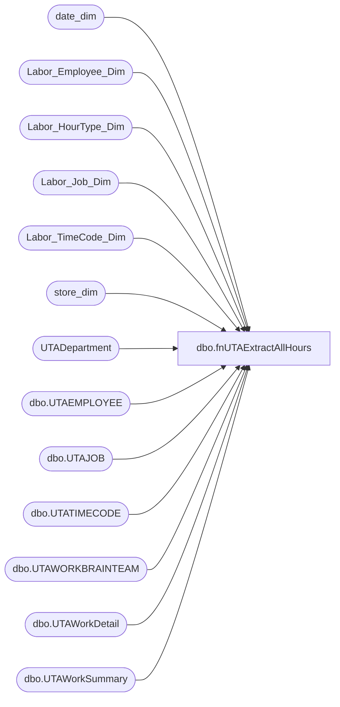

# dbo.fnUTAExtractAllHours

**Database:** dw  
**Server:** papamart  
**Function Type:** Table-Valued Function  

## Architecture Diagram



## Parameters

| Parameter | Data Type | Max Length | Is Output |
|---|---|---|---|
| @startDate | datetime | 8 | NO |
| @endDate | datetime | 8 | NO |

## Table Dependencies

| Referenced Table |
|---|
| date_dim |
| Labor_Employee_Dim |
| Labor_HourType_Dim |
| Labor_Job_Dim |
| Labor_TimeCode_Dim |
| store_dim |
| UTADepartment |
| dbo.UTAEMPLOYEE |
| dbo.UTAJOB |
| dbo.UTATIMECODE |
| dbo.UTAWORKBRAINTEAM |
| dbo.UTAWorkDetail |
| dbo.UTAWorkSummary |

## Function Code

```sql
-----------------------------------------------------------------------------------------------------------
--	Dan Tweedie	2019-01-24	Created function  
--							SQL was previously a stored proc on workbrain server (labordb01.workbrainprod.dbo.sp_DW_ExtractAllHours) --> I just turned it into a function
---							select * from fnUTAExtractAllHours(getdate()-30, getdate())
--							2023-03-09 replaced department name filter with new line because we found this was suppressing clock entries from store departments with a letter suffix liek "1068A"
-----------------------------------------------------------------------------------------------------------


CREATE function [dbo].[fnUTAExtractAllHours]
	(
		@startDate as datetime,
		@endDate as datetime
	)
Returns @HoursTable table
	(
		WRKD_ID int,
		workDate datetime,
		start_time datetime,
		end_time datetime,
		WRKD_MINUTES int,
		store_id int,
		TCODE_NAME varchar(40),
		JOB_NAME varchar(40),
		EMP_ID int,
		EMP_FULLNAME varchar(80),
		HourType varchar(8),
		store_key int,
		job_key int,
		hourtype_key int,
		timecode_key int,
		date_key int,
		emp_key int,
		dept_name varchar(40),
		dept_desc varchar(100)
	)

AS


BEGIN

	insert @HoursTable
	SELECT
		WRKD_ID,
		workDate
		-- The following calculations are used to handle the cases where the employee has punched in and out after midnight
		--		This is based on the fact that any time after 4:00 AM correlates to the next work day.
		,
		CASE
			WHEN a.start_time = '1/1/1900 00:00' AND
			a.end_time = '1/1/1900 00:00' THEN CAST('1/1/1900 04:00' AS datetime)
			WHEN start_time < '1/1/1900 04:00AM' THEN DATEADD(DAY, 1, start_time)
			ELSE start_time
		END AS start_time,
		CASE
			WHEN a.start_time = '1/1/1900 00:00' AND
			a.end_time = '1/1/1900 00:00' THEN CAST('1/1/1900 04:00' AS datetime)
			WHEN start_time < '1/1/1900 04:00AM' THEN DATEADD(DAY, 1, end_time)
			ELSE end_time
		END AS end_time,
		--start_time,
		--end_time,
		WRKD_MINUTES,
		store_id,
		TCODE_NAME,
		JOB_NAME,
		EMP_ID,
		EMP_FULLNAME,
		HourType,
		store_key,
		job_key,
		hourtype_key,
		timecode_key,
		date_key,
		emp_key,
		dept_name,
		dept_desc
	FROM
		(SELECT
				dtl.WRKD_ID,
				ws.WRKS_WORK_DATE AS workDate
				-- The following calculations are used to get a relative time to the work date
				-- If the employee works after midnight, then the 'day' portion of the date will be +1
				--	We are using the Start Time as the base because there are lots of records where the date of the start time
				--		is not even close to the work date
				,
				dtl.WRKD_START_TIME - CONVERT(datetime, CONVERT(varchar(8), dtl.WRKD_START_TIME, 112)) AS start_time,
				dtl.WRKD_END_TIME - CONVERT(datetime, CONVERT(varchar(8), dtl.WRKD_START_TIME, 112)) AS end_time,
				dtl.WRKD_MINUTES,
				--cast(LEFT(wt.WBT_NAME, 5) as int) AS store_id,
				--case 
				--	when left(wt.WBT_NAME,1) = '2'
				--		then cast(LEFT(wt.WBT_NAME, 4) as int) 
				--		else cast(right(LEFT(wt.WBT_NAME, 4),3) as int)
				--end as store_id,
				case --changing to use department, as this appears to be where they actually clocked the data
					when left(d.dept_NAME,1) = '2'
						then cast(LEFT(d.dept_NAME, 4) as int) 
						else cast(right(LEFT(d.dept_NAME, 4),3) as int)
				end as store_id,
				tc.TCODE_NAME,
				jb.JOB_NAME,
				ws.EMP_ID,
				emp.EMP_FULLNAME,
				CASE dtl.HTYPE_ID
					WHEN 0 THEN 'UNPAID'
					WHEN 1 THEN 'REG'
					WHEN 2 THEN 'OT2'
					WHEN 10002 THEN 'OT1.5'
					WHEN 10032 THEN 'SUNOT1.5'
					when 10010 then 'OHL'
					when 10008 then 'PRM OT'
					when 10007 then 'PRM'
					when 10006 then 'OTM1'
					when 10005 then 'OTM2'
					when 10004 then 'OTM3'
					when 10003 then 'OTM4'
					when 5 then 'OTS'
					ELSE 'OTHER'
				END HourType,
				isnull(sd.store_key,-1) store_key,
				isnull(ld.job_key,-1) job_key,
				isnull(lhd.hourtype_key,-1) hourtype_key,
				isnull(ltd.timecode_key,-1) timecode_key,
				isnull(dd.date_key,-1) date_key,
				isnull(led.emp_key,-1) emp_key,
				d.dept_name,
				d.dept_desc
			FROM
				dbo.UTAWorkSummary ws WITH (NOLOCK)
				INNER JOIN dbo.UTAWorkDetail dtl WITH (NOLOCK)
					ON ws.WRKS_ID = dtl.WRKS_ID
				INNER JOIN dbo.UTAWORKBRAINTEAM wt WITH (NOLOCK)
					ON dtl.WBT_ID = wt.WBT_ID
				INNER JOIN dbo.UTATIMECODE tc WITH (NOLOCK)
					ON tc.TCODE_ID = dtl.TCODE_ID
				INNER JOIN dbo.UTAJOB jb WITH (NOLOCK)
					ON dtl.JOB_ID = jb.JOB_ID
				INNER JOIN dbo.UTAEMPLOYEE emp WITH (NOLOCK)
					ON ws.EMP_ID = emp.EMP_ID
				--left join store_dim sd with (nolock) 
				--	on 
				--		case 
				--			when left(wt.WBT_NAME,1) = '2'
				--				then cast(LEFT(wt.WBT_NAME, 4) as int) 
				--				else cast(right(LEFT(wt.WBT_NAME, 4),3) as int)
				--		end = sd.store_id
				
				left join Labor_Job_Dim ld with (nolock) on jb.Job_Name = ld.wb_cd
				left join Labor_HourType_Dim lhd with (nolock) 
					on 
						CASE dtl.HTYPE_ID
							WHEN 0 THEN 'UNPAID'
							WHEN 1 THEN 'REG'
							WHEN 2 THEN 'OT2'
							WHEN 10002 THEN 'OT1.5'
							WHEN 10032 THEN 'SUNOT1.5'
							when 10010 then 'OHL'
							when 10008 then 'PRM OT'
							when 10007 then 'PRM'
							when 10006 then 'OTM1'
							when 10005 then 'OTM2'
							when 10004 then 'OTM3'
							when 10003 then 'OTM4'
							when 5 then 'OTS'
							ELSE 'OTHER'
						END = lhd.wb_cd
				left join Labor_TimeCode_Dim ltd with (nolock) on tc.TCODE_NAME = ltd.wb_cd
				left join date_dim dd with (nolock) on ws.WRKS_WORK_DATE = dd.actual_date
				join UTADepartment d on dtl.dept_id = d.dept_id
				left join store_dim sd with (nolock) 
					on 
						case 
							when left(d.dept_name,1) = '2'
								then cast(LEFT(d.dept_name, 4) as int) 
								else cast(right(LEFT(d.dept_name, 4),3) as int)
						end = sd.store_id
				left join Labor_Employee_Dim led with (nolock) 
					on ws.EMP_ID = led.emp_id 
					and sd.store_key = led.store_key
			WHERE
				ws.WRKS_WORK_DATE BETWEEN @startDate AND @endDate
				--AND ISNUMERIC(LEFT(wt.WBT_NAME, 5)) = 1
				--and isnumeric(d.dept_name) = 1
				and isnumeric(left(d.dept_name,4)) = 1  
				AND dtl.TCODE_ID NOT IN (10055) --UPD_LEAVE
			
			--UNION
			--SELECT
			--	dtl.WRKD_ID,
			--	ws.WRKS_WORK_DATE AS workDate
			--	-- The following calculations are used to get a relative time to the work date
			--	-- If the employee works after midnight, then the 'day' portion of the date will be +1
			--	--	We are using the Start Time as the base because there are lots of records where the date of the start time
			--	--		is not even close to the work date
			--	,
			--	dtl.WRKD_START_TIME - CONVERT(datetime, CONVERT(varchar(8), dtl.WRKD_START_TIME, 112)) AS start_time,
			--	dtl.WRKD_END_TIME - CONVERT(datetime, CONVERT(varchar(8), dtl.WRKD_START_TIME, 112)) AS end_time,
			--	dtl.WRKD_MINUTES,
			--	--cast(LEFT(wt.WBT_NAME, 5) as int) AS store_id,
			--	--case 
			--	--	when left(wt.WBT_NAME,1) = '2'
			--	--		then cast(LEFT(wt.WBT_NAME, 4) as int) 
			--	--		else cast(right(LEFT(wt.WBT_NAME, 4),3) as int)
			--	--end as store_id,
			--	sd.store_id,
			--	tc.TCODE_NAME,
			--	jb.JOB_NAME,
			--	ws.EMP_ID,
			--	emp.EMP_FULLNAME,
			--	CASE dtl.HTYPE_ID
			--		WHEN 0 THEN 'UNPAID'
			--		WHEN 1 THEN 'REG'
			--		WHEN 2 THEN 'OT2'
			--		WHEN 10002 THEN 'OT1.5'
			--		WHEN 10032 THEN 'SUNOT1.5'
			--		when 10010 then 'OHL'
			--		when 10008 then 'PRM OT'
			--		when 10007 then 'PRM'
			--		when 10006 then 'OTM1'
			--		when 10005 then 'OTM2'
			--		when 10004 then 'OTM3'
			--		when 10003 then 'OTM4'
			--		when 5 then 'OTS'
			--		ELSE 'OTHER'
			--	END HourType,
			--	isnull(sd.store_key,-1) store_key,
			--	isnull(ld.job_key,-1) job_key,
			--	isnull(lhd.hourtype_key,-1) hourtype_key,
			--	isnull(ltd.timecode_key,-1) timecode_key,
			--	isnull(dd.date_key,-1) date_key,
			--	isnull(led.emp_key,-1) emp_key,
			--	NULL as dept_name,
			--	NULL as dept_desc
			--FROM
			--	dbo.UTAWorkSummary ws WITH (NOLOCK)
			--	INNER JOIN dbo.UTAWorkDetail dtl WITH (NOLOCK)
			--		ON ws.WRKS_ID = dtl.WRKS_ID
			--	INNER JOIN dbo.UTAWORKBRAINTEAM wt WITH (NOLOCK)
			--		ON dtl.WBT_ID = wt.WBT_ID
			--	INNER JOIN dbo.UTATIMECODE tc WITH (NOLOCK)
			--		ON tc.TCODE_ID = dtl.TCODE_ID
			--	INNER JOIN dbo.UTAJOB jb WITH (NOLOCK)
			--		ON dtl.JOB_ID = jb.JOB_ID
			--	INNER JOIN dbo.UTAEMPLOYEE emp WITH (NOLOCK)
			--		ON ws.EMP_ID = emp.EMP_ID
			--	--left join store_dim sd with (nolock) 
			--	--	on 
			--	--		case 
			--	--			when left(wt.WBT_NAME,1) = '2'
			--	--				then cast(LEFT(wt.WBT_NAME, 4) as int) 
			--	--				else cast(right(LEFT(wt.WBT_NAME, 4),3) as int)
			--	--		end = sd.store_id
			--	join 
			--		(
			--			select 
			--				e.EepEEID, 
			--				e.EecLocation, 
			--				case 
			--					when left(e.EecLocation,1) = '2'
			--						then cast(LEFT(e.EecLocation, 4) as int) 
			--						else cast(right(LEFT(e.EecLocation, 4),3) as int)
			--				end as store_id
			--			from UHCMEmp e with (nolock)
			--				left join store_dim sd with (nolock) 
			--					on case 
			--					when left(e.EecLocation,1) = '2'
			--						then cast(LEFT(e.EecLocation, 4) as int) 
			--						else cast(right(LEFT(e.EecLocation, 4),3) as int)
			--				end = sd.store_id
			--			where  ISNUMERIC(LEFT(e.EecLocation, 5)) = 1
			--		) as CWM 
			--		on CWM.EepEEID = emp.emp_name 
			--	join store_dim sd with (nolock) on cwm.store_id = sd.store_id
			--	left join Labor_Job_Dim ld with (nolock) on jb.Job_Name = ld.wb_cd
			--	left join Labor_HourType_Dim lhd with (nolock) 
			--		on 
			--			CASE dtl.HTYPE_ID
			--				WHEN 0 THEN 'UNPAID'
			--				WHEN 1 THEN 'REG'
			--				WHEN 2 THEN 'OT2'
			--				WHEN 10002 THEN 'OT1.5'
			--				WHEN 10032 THEN 'SUNOT1.5'
			--				when 10010 then 'OHL'
			--				when 10008 then 'PRM OT'
			--				when 10007 then 'PRM'
			--				when 10006 then 'OTM1'
			--				when 10005 then 'OTM2'
			--				when 10004 then 'OTM3'
			--				when 10003 then 'OTM4'
			--				when 5 then 'OTS'
			--				ELSE 'OTHER'
			--			END = lhd.wb_cd
			--	left join Labor_TimeCode_Dim ltd with (nolock) on tc.TCODE_NAME = ltd.wb_cd
			--	left join date_dim dd with (nolock) on ws.WRKS_WORK_DATE = dd.actual_date

			--	left join Labor_Employee_Dim led with (nolock) 
			--		on ws.EMP_ID = led.emp_id 
			--		and sd.store_key = led.store_key
			--	--join UTADepartment d on dtl.dept_id = d.dept_id
			--WHERE 1=1
			--	and ws.WRKS_WORK_DATE BETWEEN @startDate AND @endDate
			--	AND ISNUMERIC(LEFT(wt.WBT_NAME, 5)) <> 1
			--	AND dtl.TCODE_ID NOT IN (10055) --UPD_LEAVE
			--	--and emp.emp_name = '0010552'

		) a
	ORDER BY a.WRKD_ID;
Return
END;
```

