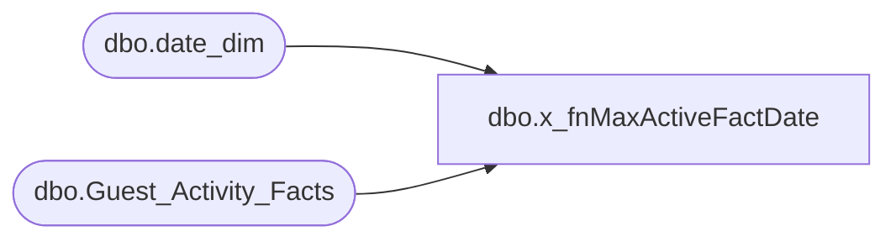

# dbo.x_fnMaxActiveFactDate

**Database:** dw  
**Server:** papamart  
**Function Type:** Scalar Function  
**Returns:** smalldatetime(4)  

## Architecture Diagram



## Parameters

| Parameter | Data Type | Max Length | Is Output |
|---|---|---|---|
| @customer_key | int | 4 | NO |
| @activity_id | int | 4 | NO |

## Table Dependencies

| Referenced Table |
|---|
| dbo.date_dim |
| dbo.Guest_Activity_Facts |

## Function Code

```sql
CREATE FUNCTION fnMaxActiveFactDate 
	(@customer_key int, 
	  @activity_id int)
RETURNS smalldatetime
AS
BEGIN

DECLARE @maxdate smalldatetime
	SELECT @maxdate=MAX(d.actual_date)
	FROM  dbo.Guest_Activity_Facts g 
	
	INNER JOIN PapaMart.dw.dbo.date_dim  d
	ON d.date_key=g.guest_activity_date_key
	
	WHERE 
		g.Customer_key=@customer_key and
		guest_activity_key=@activity_id
	RETURN @maxdate 
END
```

