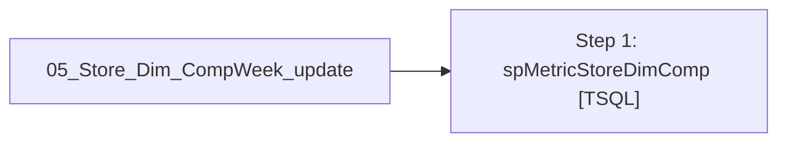

# Job: 05_Store_Dim_CompWeek_update

**Enabled:** Yes  
**Server:** papamart  
**Description:** No description available.  

## Architecture Diagram



## Steps

### Step 1: spMetricStoreDimComp
**Subsystem:** TSQL  

```sql
exec spMetricStoreDimComp
```

