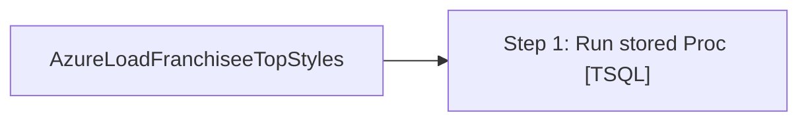

# Job: AzureLoadFranchiseeTopStyles

**Enabled:** Yes  
**Server:** papamart  
**Description:** No description available.  

## Architecture Diagram



## Steps

### Step 1: Run stored Proc
**Subsystem:** TSQL  

```sql
Execute azure.spGetFranchiseeTopStylesandAvailability
```

