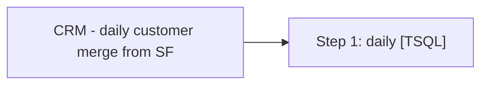

# Job: CRM - daily customer merge from SF

**Enabled:** Yes  
**Server:** papamart  
**Description:** No description available.  

## Architecture Diagram



## Steps

### Step 1: daily
**Subsystem:** TSQL  

```sql
exec [dbo].[spMergeCRMCustomerDimFromSalesForce]
```

