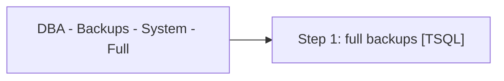

# Job: DBA - Backups - System - Full

**Enabled:** Yes  
**Server:** papamart  
**Description:** Backup system and user databases. SET @Revision = '05/22/2012'  

## Architecture Diagram



## Steps

### Step 1: full backups
**Subsystem:** TSQL  

```sql
EXECUTE dbo.spDBA_DatabaseBackup
@Databases = 'SYSTEM_DATABASES', 
@Directory =  '\\stl-esxbak-p-32\sqlbackups\',
@BackupType = 'FULL',
@Verify = 'N',
@CheckSum = 'Y', 
@LogToTable = 'Y', 
@CleanupTime = 72,
@BufferCount = 8,
@NumberOfFiles = 8
```

