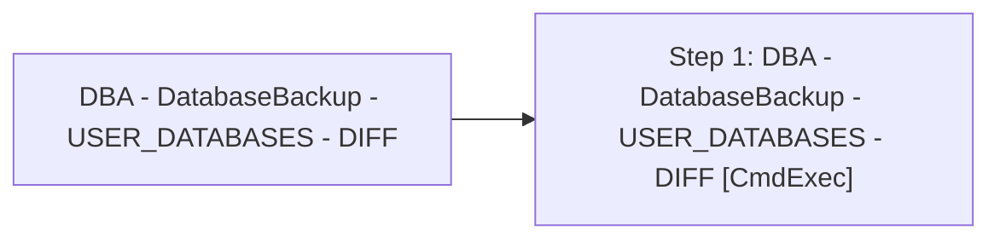

# Job: DBA - DatabaseBackup - USER_DATABASES - DIFF

**Enabled:** No  
**Server:** papamart  
**Description:** Source: https://ola.hallengren.com  

## Architecture Diagram



## Steps

### Step 1: DBA - DatabaseBackup - USER_DATABASES - DIFF
**Subsystem:** CmdExec  

```sql
sqlcmd -E -S $(ESCAPE_SQUOTE(SRVR)) -d DBAUtility -Q "EXECUTE dbo.spDBA_DatabaseBackup @Databases = 'USER_DATABASES', @Directory = N'\\stl-esxbak-p-32\sqlbackups', @BackupType = 'DIFF', @Verify = 'Y', @CleanupTime = 192, @CheckSum = 'Y', @LogToTable = 'Y'" -b
```

