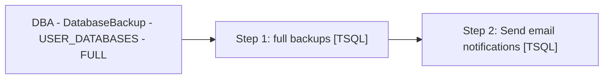

# Job: DBA - DatabaseBackup - USER_DATABASES - FULL

**Enabled:** Yes  
**Server:** papamart  
**Description:** Backup system and user databases. SET @Revision = '05/22/2012'  

## Architecture Diagram



## Steps

### Step 1: full backups
**Subsystem:** TSQL  

```sql
EXECUTE dbo.spDBA_DatabaseBackup
@Databases = 'USER_DATABASES', 
@Directory =  '\\stl-esxbak-p-32\sqlbackups',
@BackupType = 'FULL',
@Verify = 'N',
@CheckSum = 'Y', 
@LogToTable = 'Y', 
@CleanupTime = 192,
@BufferCount = 8,
@NumberOfFiles = 8
```

### Step 2: Send email notifications
**Subsystem:** TSQL  

```sql
exec DBAUtility.dbo.spDBA_SendEmail @recipients = 'Databears@buildabear.com', @subject = 'ERROR: Job failure of backups on PAPAMART', @MessageTxt = 'The SQL backup job DBA_Backups_Full had an error.  Check the job history for more information'
```

