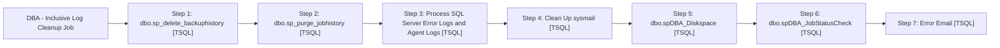

# Job: DBA - Inclusive Log Cleanup Job

**Enabled:** Yes  
**Server:** papamart  
**Description:** This backup job cleans different logs. SET @Revision = '12/30/2013'  

## Architecture Diagram



## Steps

### Step 1: dbo.sp_delete_backuphistory
**Subsystem:** TSQL  

```sql
DECLARE @CleanupDate datetime 
SET @CleanupDate = DATEADD(dd,-30,GETDATE()) 
EXECUTE dbo.sp_delete_backuphistory @oldest_date = @CleanupDate
```

### Step 2: dbo.sp_purge_jobhistory
**Subsystem:** TSQL  

```sql
EXEC DBAUtility.dbo.[spDBA_Delete_JobHistory]
```

### Step 3: Process SQL Server Error Logs and Agent Logs
**Subsystem:** TSQL  

```sql
EXEC dbo.spDBA_ReadErrorLog @ResultsToTable = 'Y'
```

### Step 4: Clean Up sysmail
**Subsystem:** TSQL  

```sql
DECLARE @CleanupDate datetime 
SET @CleanupDate = DATEADD(dd,-30,GETDATE()) 

EXEC msdb.dbo.sysmail_delete_mailitems_sp @sent_before = @CleanupDate
EXEC msdb.dbo.sysmail_delete_log_sp @logged_before = @CleanupDate
```

### Step 5: dbo.spDBA_Diskspace
**Subsystem:** TSQL  

```sql
EXECUTE spDBA_Diskspace
```

### Step 6: dbo.spDBA_JobStatusCheck
**Subsystem:** TSQL  

```sql
EXEC spDBA_JobStatusCheck @DaysBack = 7 , @SQLVersion = 'SQL2005', @ResultsToTable = 'Y'
```

### Step 7: Error Email
**Subsystem:** TSQL  

```sql
DECLARE @sbj VARCHAR(100)
SET @sbj = 'ERROR: Job failure of [DBA - Inclusive Log Cleanup Job] on ' + @@SERVERNAME
exec DBAUtility.dbo.spDBA_SendEmail @recipients = 'Databears@buildabear.com', @subject = @sbj, @MessageTxt = 'The SQL job [DBA - Inclusive Log Cleanup Job] had an error.  Check the job history for more information'
```

