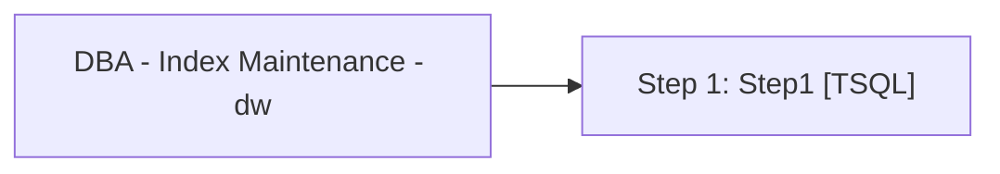

# Job: DBA - Index Maintenance - dw

**Enabled:** No  
**Server:** papamart  
**Description:** Maintain indexes in dw database for tables owned by dbo.  

## Architecture Diagram



## Steps

### Step 1: Step1
**Subsystem:** TSQL  

```sql
EXECUTE [dbo].[IndexOptimize] @Databases = 'USER_DATABASES', @LogToTable = 'Y', @FragmentationLow = NULL,@FragmentationMedium = 'INDEX_REORGANIZE,INDEX_REBUILD_ONLINE,INDEX_REBUILD_OFFLINE',@FragmentationHigh = 'INDEX_REBUILD_ONLINE,INDEX_REBUILD_OFFLINE',@FragmentationLevel1 = 5,@FragmentationLevel2 = 30,@UpdateStatistics = 'ALL',@OnlyModifiedStatistics = 'Y'
```

