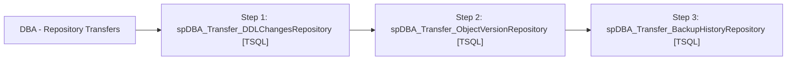

# Job: DBA - Repository Transfers

**Enabled:** Yes  
**Server:** papamart  
**Description:** Job to transfer all DBAUtility log tables to Central Repository tables SET @Revision = '06/28/2012'  

## Architecture Diagram



## Steps

### Step 1: spDBA_Transfer_DDLChangesRepository
**Subsystem:** TSQL  

```sql
EXEC dbo.spDBA_Transfer_DDLChangesRepository
```

### Step 2: spDBA_Transfer_ObjectVersionRepository
**Subsystem:** TSQL  

```sql
EXEC dbo.spDBA_ObjectVersionLog 
EXEC dbo.spDBA_Transfer_ObjectVersionRepository
```

### Step 3: spDBA_Transfer_BackupHistoryRepository
**Subsystem:** TSQL  

```sql
EXEC DBAUtility.dbo.spDBA_Transfer_BackupHistoryRepository
```

