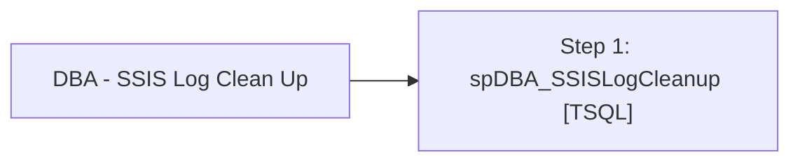

# Job: DBA - SSIS Log Clean Up

**Enabled:** Yes  
**Server:** papamart  
**Description:** Fire Proc to clean up SSIS Logging.  

## Architecture Diagram



## Steps

### Step 1: spDBA_SSISLogCleanup
**Subsystem:** TSQL  

```sql
EXEC DBAUtility.dbo.spDBA_SSISLogCleanup
```

