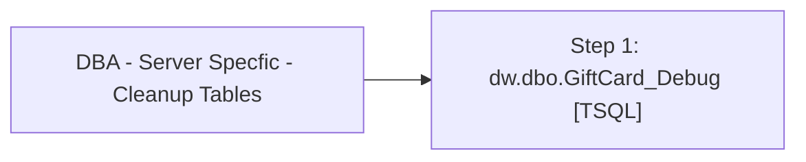

# Job: DBA - Server Specfic - Cleanup Tables

**Enabled:** Yes  
**Server:** papamart  
**Description:** This job cleans up log tables on the server  

## Architecture Diagram



## Steps

### Step 1: dw.dbo.GiftCard_Debug
**Subsystem:** TSQL  

```sql
--dw
Delete
FROM dw.dbo.GiftCard_Debug
WHERE DateStamp<dateadd(dd,-30,getdate())
```

