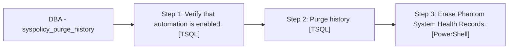

# Job: DBA - syspolicy_purge_history

**Enabled:** Yes  
**Server:** papamart  
**Description:** No description available.  

## Architecture Diagram



## Steps

### Step 1: Verify that automation is enabled.
**Subsystem:** TSQL  

```sql
IF (msdb.dbo.fn_syspolicy_is_automation_enabled() != 1)
        BEGIN
            RAISERROR(34022, 16, 1)
        END
```

### Step 2: Purge history.
**Subsystem:** TSQL  

```sql
EXEC msdb.dbo.sp_syspolicy_purge_history
```

### Step 3: Erase Phantom System Health Records.
**Subsystem:** PowerShell  

```sql
if ('$(ESCAPE_SQUOTE(INST))' -eq 'MSSQLSERVER') {$a = '\DEFAULT'} ELSE {$a = ''};
(Get-Item SQLSERVER:\SQLPolicy\$(ESCAPE_NONE(SRVR))$a).EraseSystemHealthPhantomRecords()
```

