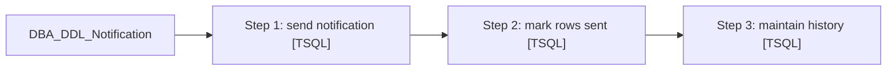

# Job: DBA_DDL_Notification

**Enabled:** Yes  
**Server:** papamart  
**Description:** No description available.  

## Architecture Diagram



## Steps

### Step 1: send notification
**Subsystem:** TSQL  

```sql
---send email notification
DECLARE @Subject VARCHAR(100), @Body VARCHAR(200)

SET @Subject = 'DDL Changes on ' + @@SERVERNAME
SET @Body = 'The attachment shows the latest DDL changes recorded on ' + @@SERVERNAME + '.  For more information on the change, query ' + @@SERVERNAME + '.DBAUtility.dbo.MONITOR_CHG.'

EXEC msdb.dbo.sp_send_dbmail
    @recipients = 'Databears@BuildABear.com',
    @body = @Body,
    @query = 
	'SELECT
	SUBSTRING(SERVER_NM, 1, 10) AS SERVER
	, CAST(EVENT_TYPE AS NVARCHAR(25)) AS ''EVENT TYPE''
	, CAST(OBJECT_NM AS NVARCHAR(25)) AS ''OBJECT  NAME''
	, CAST(OBJECT_TYPE AS NVARCHAR(25)) AS ''OBJECT TYPE''
	, CONVERT(datetime, EVENT_DT, 101) AS ''DATE''
	, CAST(ORIGINALUSER AS VARCHAR(40)) AS ''ORIGINAL USER''
	, CAST(DATABASE_NM AS VARCHAR(25)) AS ''DATABASE'' 
	FROM DBAUtility.dbo.MONITOR_CHG
	WHERE ISNULL(EMAILSENT, ''False'') <> ''True''
	AND OBJECT_NM NOT IN (''tmp_sent_emid'')
	',
	@subject = @Subject,
    @attach_query_result_as_file = 1 ;
```

### Step 2: mark rows sent
**Subsystem:** TSQL  

```sql
--flag rows that have been sent
UPDATE DBAUtility.dbo.MONITOR_CHG 
SET EMAILSENT = 'True'
WHERE ISNULL(EMAILSENT, 'False') <> 'True'
```

### Step 3: maintain history
**Subsystem:** TSQL  

```sql
--Remove history
DELETE DBAUtility.dbo.MONITOR_CHG 
WHERE ISNULL(EMAILSENT, 'False') = 'True'
AND DATEDIFF(DAY,  EVENT_DT, GETDATE()) > 30
```

