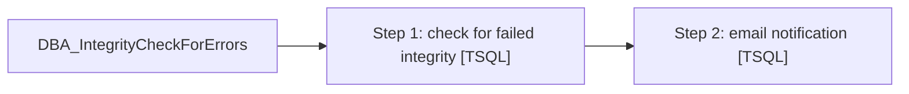

# Job: DBA_IntegrityCheckForErrors

**Enabled:** Yes  
**Server:** papamart  
**Description:** Queries table for failed integrity checks  

## Architecture Diagram



## Steps

### Step 1: check for failed integrity
**Subsystem:** TSQL  

```sql
IF (
SELECT
COUNT(*)
FROM dbo.INTEGRITY_HIST
WHERE SUBSTRING(MESSAGE_TXT, 1, 58) <> 'CHECKDB found 0 allocation errors and 0 consistency errors') <> 0
BEGIN
	RAISERROR ('CHECK papamart.DBAUtility.INTEGRITY_HIST.MESSAGE_TXT for a database with errors', 16, 1) WITH LOG
END
```

### Step 2: email notification
**Subsystem:** TSQL  

```sql
exec DBAUtility.dbo.spDBA_SendEmail @recipients = 'Databears@buildabear.com', @subject = 'INFORMATIONAL: Job failure of backups on papamart', @MessageTxt = 'The SQL backup job DBA_IntegrityCheck had an error.  Check the job history for more information'
```

