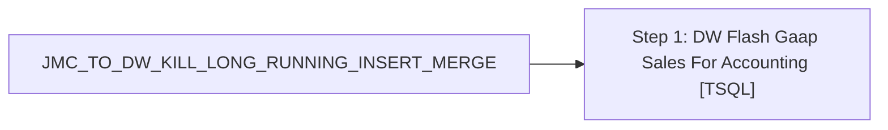

# Job: JMC_TO_DW_KILL_LONG_RUNNING_INSERT_MERGE

**Enabled:** Yes  
**Server:** papamart  
**Description:** No description available.  

## Architecture Diagram



## Steps

### Step 1: DW Flash Gaap Sales For Accounting
**Subsystem:** TSQL  

```sql
declare @spid int

select @spid= r.session_id
FROM sys.dm_exec_requests AS r
     CROSS APPLY sys.dm_exec_sql_text(r.sql_handle) AS st
     CROSS APPLY sys.dm_exec_query_plan(r.plan_handle) AS qp
WHERE 
	(
		st.TEXT like '%vwPOSJumpMindSalesForAccounting%'
	)
and datediff(mi,r.start_time, getdate()) >=45

declare @SQL varchar(100)
select @SQL = 'kill ' + cast(@spid as varchar)

exec (@SQL)
```

