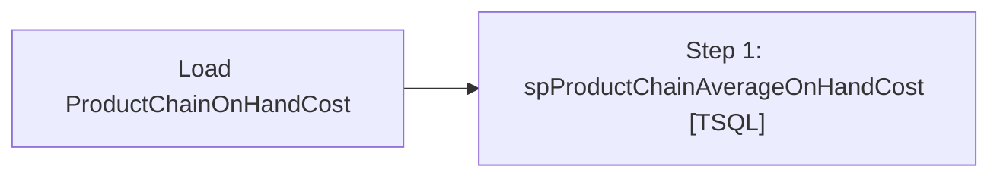

# Job: Load ProductChainOnHandCost

**Enabled:** Yes  
**Server:** papamart  
**Description:** Currently gets executed via stl-ssis-p-01 sql agent UKLoyaltyLoad which runs the loyalty load, Merch Data Load, then starts this job. This data is only needed for power bi product dim to have most recent unit cost that is > 0  

## Architecture Diagram



## Steps

### Step 1: spProductChainAverageOnHandCost
**Subsystem:** TSQL  

```sql
exec azure.spProductChainAverageOnHandCost
```

