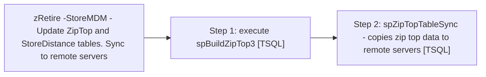

# Job: zRetire -StoreMDM - Update ZipTop and StoreDistance tables. Sync to remote servers

**Enabled:** No  
**Server:** papamart  
**Description:** This job updates the ZipTop table, syncs them to remote servers and reloads the StoreDistance table. This uses StoreMDM as the basis for the Open/Close dates.  

## Architecture Diagram



## Steps

### Step 1: execute spBuildZipTop3
**Subsystem:** TSQL  

```sql
exec spBuildZipTop3
```

### Step 2: spZipTopTableSync - copies zip top data to remote servers
**Subsystem:** TSQL  

```sql
EXEC spZipTopTableSync
```

