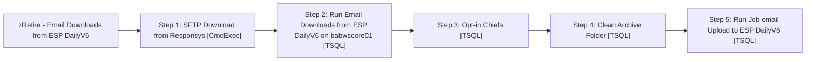

# Job: zRetire - Email Downloads from ESP DailyV6

**Enabled:** No  
**Server:** papamart  
**Description:** Downloads bounces, opt-outs, spam complaints, and invalids from ESP and updates email tables in data warehouse  

## Architecture Diagram



## Steps

### Step 1: SFTP Download from Responsys
**Subsystem:** CmdExec  

```sql
"C:\Program Files\WinSCP\winscp.com" /console /script=\\kermode\FileRepository\Responsys\WinSCP\winscp_downloadscriptV6.txt
```

### Step 2: Run Email Downloads from ESP DailyV6 on babwscore01
**Subsystem:** TSQL  

```sql
EXEC babwscore01.msdb.dbo.sp_start_job @job_name='Email Downloads from ESP DailyV6'
```

### Step 3: Opt-in Chiefs
**Subsystem:** TSQL  

```sql
--exec dw.dbo.spEmail_Update_ManualStatus 'teresak@buildabear.com', 'VALID','Y','DBA',-2,0
exec dw.dbo.spEmail_Update_ManualStatus 'maxine@buildabear.com', 'VALID','Y','DBA',-2,0
exec dw.dbo.spEmail_Update_ManualStatus 'maxinec@buildabear.com', 'VALID','Y','DBA',-2,0
exec dw.dbo.spEmail_Update_ManualStatus 'nancys@buildabear.com', 'VALID','Y','DBA',-2,0
exec dw.dbo.spEmail_Update_ManualStatus 'jenniferd@buildabear.com', 'VALID','Y','DBA',-2,0
exec dw.dbo.spEmail_Update_ManualStatus 'debbyb@buildabear.com', 'VALID','Y','DBA',-2,0
```

### Step 4: Clean Archive Folder
**Subsystem:** TSQL  

```sql
EXEC dw.dbo.usp_delete_old_files @path = '\\kermode\FileRepository\Responsys\Download\archive\', @filemask = '*.zip', @retention = 21
```

### Step 5: Run Job email Upload to ESP DailyV6
**Subsystem:** TSQL  

```sql
EXEC msdb.dbo.sp_start_job @job_name='Email Upload to ESP DailyV6'
```

