# Job: zRetire - Email Upload to ExactTarget Daily

**Enabled:** No  
**Server:** papamart  
**Description:** No description available.  

## Architecture Diagram

```mermaid
flowchart LR
    JOB["zRetire - Email Upload to ExactTarget Daily"]
    JOB --> S1["Step 1: Execute papamart.dw.dbo.spEmail_Insert_FromWebPrefCtr [TSQL]"]
    S1 --> S2["Step 2: Exec papamart.dw.dbo.spEmail_Update_FromWebPrefCtr [TSQL]"]
    S2 --> S3["Step 3: StoreDim [TSQL]"]
    S3 --> S4["Step 4: OSAT Survey [TSQL]"]
    S4 --> S5["Step 5: Party data [TSQL]"]
    S5 --> S6["Step 6: sFTP Upload from Kermode [TSQL]"]
    S6 --> S7["Step 7: Cleanup ARCHIVE folders [TSQL]"]
```



## Steps

### Step 1: Execute papamart.dw.dbo.spEmail_Insert_FromWebPrefCtr
**Subsystem:** TSQL  

```sql
DECLARE @date datetime
SET @date = CONVERT(varchar, DATEADD(day, -1, getdate()), 101)
Exec dw.dbo.spEmail_Insert_FromWebPrefCtr @date
```

### Step 2: Exec papamart.dw.dbo.spEmail_Update_FromWebPrefCtr
**Subsystem:** TSQL  

```sql
DECLARE @date datetime
SET @date = CONVERT(varchar, DATEADD(day, -1, getdate()), 101)
Exec dw.dbo.spEmail_Update_FromWebPrefCtr @date,dw
zRetire - Email Upload to ExactTarget Daily,No description available.,0,Email, Guest & Address Data,TSQL,DECLARE @date datetime
SET @date = CONVERT(VARCHAR, DATEADD(DAY, -3, GETDATE()), 101)
Exec spEmail_ET_Upload_Master @ad_date = @date,  @reload = 0
```

### Step 3: StoreDim
**Subsystem:** TSQL  

```sql
Exec spEmail_ET_Upload_StoreDim
```

### Step 4: OSAT Survey
**Subsystem:** TSQL  

```sql
declare @indate datetime
set @indate = dateadd(day, -3, getdate())
exec spEmail_ET_Upload_GuestSurvey_Reminder @ad_date = @indate
```

### Step 5: Party data
**Subsystem:** TSQL  

```sql
DECLARE @date datetime
SET @date = CONVERT(VARCHAR, DATEADD(DAY, -7, GETDATE()), 101)
Exec spEmail_ET_Upload_Parties @ad_date = @date,  @reload = 0
```

### Step 6: sFTP Upload from Kermode
**Subsystem:** TSQL  

```sql
EXEC kermode.msdb.dbo.sp_start_job @job_name='Exact Target UPLOAD files'
```

### Step 7: Cleanup ARCHIVE folders
**Subsystem:** TSQL  

```sql
EXEC dw.dbo.usp_delete_old_files @path = '\\kermode\FileRepository\Responsys\ExactTarget\Archive\', @filemask = '*.zip', @retention = 30;
EXEC dw.dbo.usp_delete_old_files @path = '\\kermode\FileRepository\Responsys\ExactTarget\Download\Archive\', @filemask = '*.zip', @retention = 30;
EXEC dw.dbo.usp_delete_old_files @path = '\\kermode\FileRepository\Responsys\ExactTarget\RejectedEmails\Archive\', @filemask = '*.txt', @retention = 30;
```

